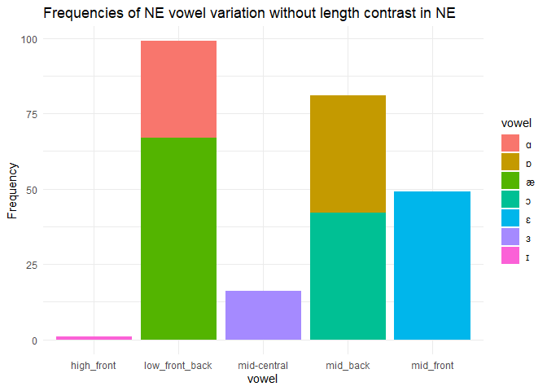
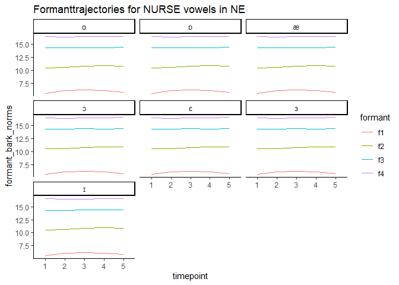
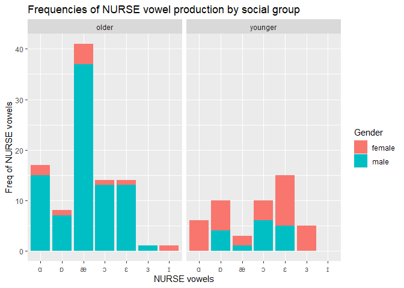
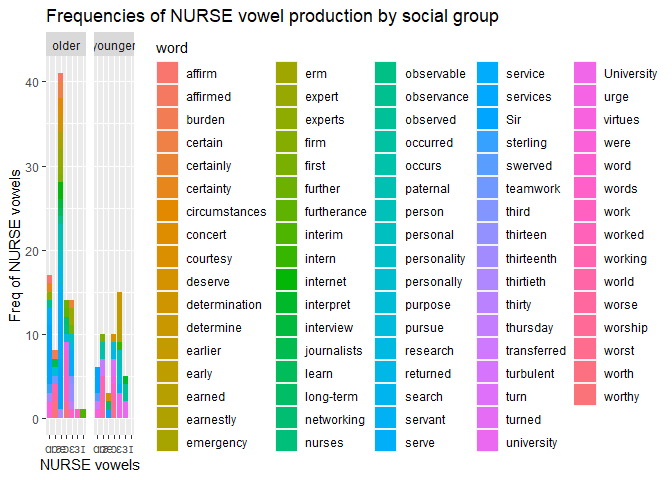
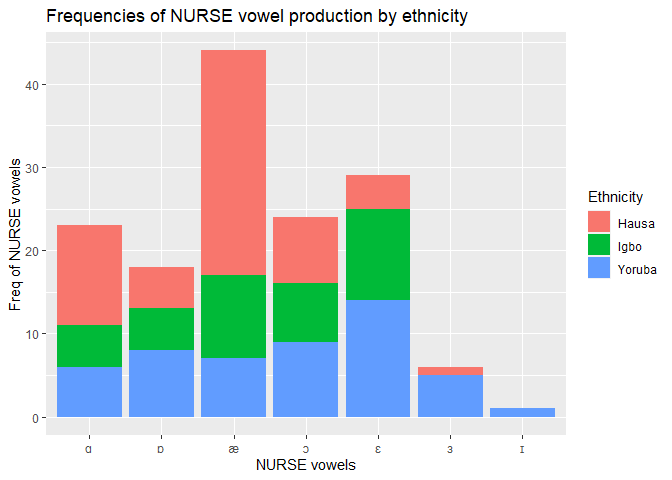
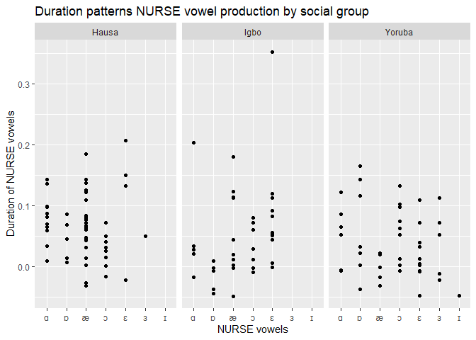

NURSE Analysis
================
Oluwasegun Amoniyan
04/06/2024

- [Analysis of NURSE vowels in Nigerian English
  (NE)](#analysis-of-nurse-vowels-in-nigerian-english-ne)
  - [NURSE vowel production in NE](#nurse-vowel-production-in-ne)
    - [Variation in NURSE vowel](#variation-in-nurse-vowel)
    - [NURSE vowel variation without length
      contrast](#nurse-vowel-variation-without-length-contrast)
    - [NURSE vowel variation by
      `backness`](#nurse-vowel-variation-by-backness)
  - [Duration patterns for NURSE vowels in
    NE](#duration-patterns-for-nurse-vowels-in-ne)
    - [NURSE vowel duration by length](#nurse-vowel-duration-by-length)
    - [NURSE vowel duration by vowel
      space](#nurse-vowel-duration-by-vowel-space)
    - [Regression analysis of
      duration](#regression-analysis-of-duration)
  - [Effect of phonological environment on the production of NURSE
    vowels in
    NE](#effect-of-phonological-environment-on-the-production-of-nurse-vowels-in-ne)
    - [Account for the phonological effect in
      NE](#account-for-the-phonological-effect-in-ne)
    - [Regression analysis for nurse determinant by phonological
      environment](#regression-analysis-for-nurse-determinant-by-phonological-environment)
    - [Visualization of phological effect in NURSE vowel
      production](#visualization-of-phological-effect-in-nurse-vowel-production)
  - [What information does the variation in NE NURSE vowel
    explain?](#what-information-does-the-variation-in-ne-nurse-vowel-explain)
  - [Formant description of NURSE vowels in
    NE](#formant-description-of-nurse-vowels-in-ne)
    - [Regression analysis of formant features and
      trajectories](#regression-analysis-of-formant-features-and-trajectories)
  - [Do social factors determine production of NURSE vowels in
    NE?](#do-social-factors-determine-production-of-nurse-vowels-in-ne)
    - [NURSE vowel production in NE by age and
      gender](#nurse-vowel-production-in-ne-by-age-and-gender)
    - [Duration patterns of NURSE vowel production in NE by age and
      gender](#duration-patterns-of-nurse-vowel-production-in-ne-by-age-and-gender)
  - [NURSE vowel production by `ethnicity` (Geographical location of the
    speakers)](#nurse-vowel-production-by-ethnicity-geographical-location-of-the-speakers)
  - [NURSE vowel determinant by
    ethinicity](#nurse-vowel-determinant-by-ethinicity)
- [Session info](#session-info)

``` r
##Set knitr options (show both code and output, show output w/o leading #)
knitr::opts_chunk$set(echo = TRUE, include = TRUE, comment=NA)

#load packages
library(tidyverse)
```

    ## ── Attaching core tidyverse packages ──────────────────────── tidyverse 2.0.0 ──
    ## ✔ dplyr     1.1.4     ✔ readr     2.1.5
    ## ✔ forcats   1.0.0     ✔ stringr   1.5.1
    ## ✔ ggplot2   3.4.4     ✔ tibble    3.2.1
    ## ✔ lubridate 1.9.3     ✔ tidyr     1.3.1
    ## ✔ purrr     1.0.2     
    ## ── Conflicts ────────────────────────────────────────── tidyverse_conflicts() ──
    ## ✖ dplyr::filter() masks stats::filter()
    ## ✖ dplyr::lag()    masks stats::lag()
    ## ℹ Use the conflicted package (<http://conflicted.r-lib.org/>) to force all conflicts to become errors

``` r
library(ggplot2)
#library(reshape2)
library(misty)
```

    ## |-------------------------------------|
    ## | misty 0.6.1 (2024-01-19)            |
    ## | Miscellaneous Functions T. Yanagida |
    ## |-------------------------------------|

``` r
library(lme4)
```

    ## Loading required package: Matrix
    ## 
    ## Attaching package: 'Matrix'
    ## 
    ## The following objects are masked from 'package:tidyr':
    ## 
    ##     expand, pack, unpack

``` r
library(lmerTest) 
```

    ## 
    ## Attaching package: 'lmerTest'
    ## 
    ## The following object is masked from 'package:lme4':
    ## 
    ##     lmer
    ## 
    ## The following object is masked from 'package:stats':
    ## 
    ##     step

``` r
library(performance)
```

# Analysis of NURSE vowels in Nigerian English (NE)

``` r
#load `csv` that has segment information
nurse_segment <- read_csv("C:/Users/oamon/Oluwasegun DS Project/Sociophonetic-study-of-NURSE-vowels-in-NE/Analysis/tidy_csv_files/nurse_segment_info.csv",
                                     na=c("", "Na", "NA", "N/A", "n/a", "na", "-", "undefined"))
```

    Rows: 246 Columns: 14
    ── Column specification ────────────────────────────────────────────────────────
    Delimiter: ","
    chr (6): inputfile, file_name, vowel, word, previous_word, next_word
    dbl (8): ...1, interval, duration, start, end, word_interval, word_start, wo...

    ℹ Use `spec()` to retrieve the full column specification for this data.
    ℹ Specify the column types or set `show_col_types = FALSE` to quiet this message.

``` r
#rename `outputfile` and `inputfile` as `file_name` and `id` respectively
#nurse_segment <- 
 # nurse_segment %>%
 #rename(
  #  file_name = contains("outputfile"),
   # id = contains("inputfile"))
```

## NURSE vowel production in NE

### Variation in NURSE vowel

1a. What are the distinct NURSE vowel production (any variation) in NE?
(**which** variant is the most frequent in NE variety and does the
variance describe how NURSE vowels in NE differs from other English
varieties (such as British or American English?)

Here, we identify variant phonemes that are produced as NURSE vowel in
NE. This variation identifies the difference in phoneme by length to get
specific NURSE vowel production.

``` r
#number of NURSE vowels extracted
NURSE_vowel <- nurse_segment%>%
  select(vowel)%>%
  count()%>%
  print
```

    # A tibble: 1 × 1
          n
      <int>
    1   246

``` r
NURSE_vowel <- nurse_segment%>%
  select(vowel)%>%
  table()/246*100
#freq/overall sum*100 to estimate the percentages
head(NURSE_vowel)
```

    vowel
            ɑ         ɒ         æ         ɔ         ɛ         ɜ 
    13.008130 15.853659 27.235772 17.073171 19.918699  6.504065 

The total number of NURSE vowels extracted 246 tokens (too small to
generalize). Describution:

`[ɜ]` is realized as `[nɜs]` by 6.4%, as `[na:s]` by 13%, as `[nas]` by
27%, as `[nɔs]` by 17%, as `[nɔ:s]` by 16%, as `[nɛs]` by 20%, and as
`[ɪ]` by 0.4%. The overall results show that the variants with shorter
duration are more favored than the longer ones in NE variety. Each of
these productions has segment info
[here](https://github.com/ClassOrg-Data-Sci-2024/Sociophonetic-study-of-NURSE-vowels-in-Nigerian-English/blob/main/tidy_csv_files/segment_info.csv)
and each segment has predicted and winning formants
[here](https://github.com/ClassOrg-Data-Sci-2024/Sociophonetic-study-of-NURSE-vowels-in-Nigerian-English/tree/main/file_images/images_file_comparisons).

### NURSE vowel variation without length contrast

Here, we identify variant phonemes that are produced as NURSE vowel in
the variety. This variation does not first consider the difference in
phoneme by length to get the general overview.

Before analyzing the variation in NURSE vowel in NE, let’s create a
column (`vowel_variation`) that does not differentiate NURSE vowels by
length.

``` r
#create a column that has the frequency of the variant form
nurse_segment <- nurse_segment %>% 
  mutate(vowel_variation = case_when(
    vowel %in% c("ɒ", "ɔ") ~ "mid_back",
    vowel %in% c("æ", "ɑ") ~ "low_front_back",
    vowel %in% "ɛ" ~ "mid_front",
    vowel %in% "ɪ" ~ "high_front",
    vowel %in% "ɜ" ~ "mid-central",
    TRUE ~ "Other"
  ))

vowel_variation <- nurse_segment%>%
  select(vowel_variation)%>%
  table()/246*100
head(vowel_variation)
```

    vowel_variation
        high_front low_front_back    mid-central       mid_back      mid_front 
         0.4065041     40.2439024      6.5040650     32.9268293     19.9186992 

``` r
ggplot(nurse_segment, aes(x = vowel_variation)) +
  geom_bar() +
  labs(x = "vowel", y = "Frequency") +
  ggtitle("NURSE vowel distinction in NE") +
  theme_minimal()
```

<!-- -->
Unlike Li et al. (2021) who discovered three-way distinction in Scottish
NURSE vowel, the findings revealed that there were five(5) NURSE vowel
distinction in NE. The frequency distribution revealed open vowel
\[e.g., a\] as the most frequent variant. Also, this analysis supported
Collins & Mees (1990) who asserted that NURSE vowel could vary by vowel
space. The distribution of Figure 1 revealed low front and back as the
most frequent variant of NURSE, followed by mid-back and mid-front. This
result could inform us that NE speakers often produced NURSE vowels as
low (front/back), mid_back or mid_front vowels with different frequency.

As Penhallurick (2008) suggests that duration plays a role in
determining the degree of mouth openness and lip-rounding.

The results show that `[ɜ]` in NURSE for BrE, AmE, CanE and New Zealand
English is often realization as `[a]` with 99 (40%), `[ɔ]` with 81
(32%), `[ɜ]` with 16 (6.5%), and `[ɛ]` with 49 (19%). This shows that
similar variant with the inner circle English is 6.5% possible in NE
variety; however, it’s more produced as \[nas\], \[nɔs\] and \[nɛs\].
The frequent production of \[nɜs\] as \[nas\], \[nɔs\] and \[nɛs\] in NE
reveals that the variation of NURSE vowel is beyond presence or absence
of rhotics. If we shift our focus rhotics of NURSE vowel in NE, we will
eventually be discussing variant form that is 10% present in NE.

### NURSE vowel variation by `backness`

Here, we classified NURSE vowel variant that are produced as NURSE vowel
in NE as **front**, **central**, and **backness**. This classification
does not consider length contrast but identify.

Before analyzing the variation in NURSE vowel in NE, let’s create a
column (`vowel_variation`) that does not differentiate NURSE vowels by
length.

``` r
nurse_segment <- nurse_segment %>% 
  mutate(nurse_vowel_space = case_when(
    vowel %in% c("ɒ", "ɔ", "ɑ") ~ "back_vowel",
    vowel %in% c("æ", "ɛ", "ɪ") ~ "front_vowel",
    vowel %in% "ɜ" ~ "central_vowel",
    TRUE ~ "Other"
  ))

nurse_segment%>%
  select(nurse_vowel_space)%>%
  table()/246*100
```

    nurse_vowel_space
       back_vowel central_vowel   front_vowel 
        45.934959      6.504065     47.560976 

``` r
ggplot(nurse_segment, aes(x = nurse_vowel_space)) +
  geom_bar() +
  labs(x = "vowel", y = "Frequency") +
  ggtitle("NURSE vowel distinction NE by vowel position") +
  theme_minimal()
```

<!-- --> The
results show the distribution of vowel production in Nigerian English
across front, central and back vowel space. Back vowels are frequent,
accounting for 45.93% of overall vowel production, whereas front vowels
were 47.56%, while the central vowel were the least common, 6.50% in NE.
This distribution implies that Nigerian English has a somewhat equal
proportion of back and front vowels, with back vowels being less common.

## Duration patterns for NURSE vowels in NE

``` r
#check the duration patterns for NURSE vowels in the data
NURSE_vowel_dur <- nurse_segment%>%
  group_by(vowel)%>%
  summarize(mean_dur_vowel = mean(duration))

NURSE_vowel_var <- nurse_segment%>%
  group_by(vowel_variation)%>%
  summarize(mean_vowel_var = mean(duration))

head(NURSE_vowel_dur)
```

    # A tibble: 6 × 2
      vowel mean_dur_vowel
      <chr>          <dbl>
    1 æ              0.126
    2 ɑ              0.141
    3 ɒ              0.125
    4 ɔ              0.113
    5 ɛ              0.130
    6 ɜ              0.125

``` r
head(NURSE_vowel_var)
```

    # A tibble: 5 × 2
      vowel_variation mean_vowel_var
      <chr>                    <dbl>
    1 high_front              0.0400
    2 low_front_back          0.131 
    3 mid-central             0.125 
    4 mid_back                0.119 
    5 mid_front               0.130 

### NURSE vowel duration by length

The duration distinguishes tense from lax vowels. The average duration
of vowel production in a NURSE context in Nigerian English is 13ms
(0.126) for `[æ]` and 14ms (0.14) for `[ɑ]`. Similarly, the mean
duration of the vowels \[ɒ\]`,`\[ɔ\]`,`\[ɛ\]\`, and \[ɜ\] range from
11ms (0.113) to 13ms (0.130). [Segment
info](https://github.com/ClassOrg-Data-Sci-2024/Sociophonetic-study-of-NURSE-vowels-in-Nigerian-English/blob/main/tidy_csv_files/segment_info.csv)
(Is duration therefore significant?)

### NURSE vowel duration by vowel space

Each category of `vowel space` represents a unique articulatory position
within the vowel space. For example, the **high_front** category has a
relatively modest mean vowel duration of 0.04 (4ms), indicating a more
limited articulatory range for high front vowels in Nigerian English. In
contrast, categories such as `low_front_back`, `mid-central`,
`mid_back`, and mid_front\` have higher average duration ranging from
0.118 (12ms) to 0.131 (13ms), implying a wider range of articulatory
positions for these vowels. Overall, the variability of vowel production
in NURSE production in Nigerian English across various vowel categories,
shedding light on the phonetic characteristics of this linguistic
context and indicating variations not only in vowels but also in
duration.

### Regression analysis of duration

Duration **does not seem** to significantly determine the variance in
NURSE vowel production in NE. The model, the results show that the
realization of NURSE vowel as low back vowel (`[ɑ]`) was statistically
significantly differ in `duration` from other other NURSE vowels
(intercept = 0.13, 95%, t(237) = 12.54, p \< .001). Meanwhile, the
average duration for `[æ]` was 8ms longer than \[a:\], though the
relationship was not statistically significant (p\>0.05). This may
insights that duration is not reliable to differentiate vowels for NURSE
production in NE. Rather, vowel height may help to differentiate NURSE
vowel phoneme.

``` r
#normalization duration around the mean before checking for the effect of duration
nurse_segment <- nurse_segment %>%
  mutate(duration.cen = center(duration, value=min(duration)))

#regression model for duration
duration_model <- lmer(duration.cen ~ 1 + vowel + (1|word), data = nurse_segment)
duration_model %>% summary()
```

    Linear mixed model fit by REML. t-tests use Satterthwaite's method [
    lmerModLmerTest]
    Formula: duration.cen ~ 1 + vowel + (1 | word)
       Data: nurse_segment

    REML criterion at convergence: -744.5

    Scaled residuals: 
        Min      1Q  Median      3Q     Max 
    -1.7734 -0.4911 -0.0898  0.4415  4.4086 

    Random effects:
     Groups   Name        Variance Std.Dev.
     word     (Intercept) 0.001740 0.04171 
     Residual             0.001439 0.03793 
    Number of obs: 246, groups:  word, 109

    Fixed effects:
                  Estimate Std. Error         df t value Pr(>|t|)    
    (Intercept)  4.248e-02  1.026e-02  2.259e+02   4.139 4.92e-05 ***
    vowelɒ      -1.260e-02  1.410e-02  2.227e+02  -0.894    0.372    
    vowelæ       8.343e-04  1.066e-02  2.307e+02   0.078    0.938    
    vowelɔ      -1.968e-02  1.401e-02  2.265e+02  -1.405    0.162    
    vowelɛ      -7.791e-04  1.221e-02  2.367e+02  -0.064    0.949    
    vowelɜ      -7.966e-03  1.528e-02  2.188e+02  -0.521    0.603    
    vowelɪ      -8.973e-02  5.730e-02  1.553e+02  -1.566    0.119    
    ---
    Signif. codes:  0 '***' 0.001 '**' 0.01 '*' 0.05 '.' 0.1 ' ' 1

    Correlation of Fixed Effects:
           (Intr) vowelɒ vowelæ vowelɔ vowelɛ vowelɜ
    vowelɒ -0.713                                   
    vowelæ -0.756  0.560                            
    vowelɔ -0.714  0.659  0.561                     
    vowelɛ -0.744  0.582  0.697  0.581              
    vowelɜ -0.575  0.450  0.530  0.492  0.572       
    vowelɪ -0.179  0.128  0.135  0.128  0.133  0.103

``` r
library(sjPlot)
```

    Learn more about sjPlot with 'browseVignettes("sjPlot")'.

``` r
duration_model %>% tab_model()
```

<table style="border-collapse:collapse; border:none;">
<tr>
<th style="border-top: double; text-align:center; font-style:normal; font-weight:bold; padding:0.2cm;  text-align:left; ">
 
</th>
<th colspan="3" style="border-top: double; text-align:center; font-style:normal; font-weight:bold; padding:0.2cm; ">
duration cen
</th>
</tr>
<tr>
<td style=" text-align:center; border-bottom:1px solid; font-style:italic; font-weight:normal;  text-align:left; ">
Predictors
</td>
<td style=" text-align:center; border-bottom:1px solid; font-style:italic; font-weight:normal;  ">
Estimates
</td>
<td style=" text-align:center; border-bottom:1px solid; font-style:italic; font-weight:normal;  ">
CI
</td>
<td style=" text-align:center; border-bottom:1px solid; font-style:italic; font-weight:normal;  ">
p
</td>
</tr>
<tr>
<td style=" padding:0.2cm; text-align:left; vertical-align:top; text-align:left; ">
(Intercept)
</td>
<td style=" padding:0.2cm; text-align:left; vertical-align:top; text-align:center;  ">
0.04
</td>
<td style=" padding:0.2cm; text-align:left; vertical-align:top; text-align:center;  ">
0.02 – 0.06
</td>
<td style=" padding:0.2cm; text-align:left; vertical-align:top; text-align:center;  ">
<strong>\<0.001</strong>
</td>
</tr>
<tr>
<td style=" padding:0.2cm; text-align:left; vertical-align:top; text-align:left; ">
vowel \[ɒ\]
</td>
<td style=" padding:0.2cm; text-align:left; vertical-align:top; text-align:center;  ">
-0.01
</td>
<td style=" padding:0.2cm; text-align:left; vertical-align:top; text-align:center;  ">
-0.04 – 0.02
</td>
<td style=" padding:0.2cm; text-align:left; vertical-align:top; text-align:center;  ">
0.372
</td>
</tr>
<tr>
<td style=" padding:0.2cm; text-align:left; vertical-align:top; text-align:left; ">
vowel \[æ\]
</td>
<td style=" padding:0.2cm; text-align:left; vertical-align:top; text-align:center;  ">
0.00
</td>
<td style=" padding:0.2cm; text-align:left; vertical-align:top; text-align:center;  ">
-0.02 – 0.02
</td>
<td style=" padding:0.2cm; text-align:left; vertical-align:top; text-align:center;  ">
0.938
</td>
</tr>
<tr>
<td style=" padding:0.2cm; text-align:left; vertical-align:top; text-align:left; ">
vowel \[ɔ\]
</td>
<td style=" padding:0.2cm; text-align:left; vertical-align:top; text-align:center;  ">
-0.02
</td>
<td style=" padding:0.2cm; text-align:left; vertical-align:top; text-align:center;  ">
-0.05 – 0.01
</td>
<td style=" padding:0.2cm; text-align:left; vertical-align:top; text-align:center;  ">
0.161
</td>
</tr>
<tr>
<td style=" padding:0.2cm; text-align:left; vertical-align:top; text-align:left; ">
vowel \[ɛ\]
</td>
<td style=" padding:0.2cm; text-align:left; vertical-align:top; text-align:center;  ">
-0.00
</td>
<td style=" padding:0.2cm; text-align:left; vertical-align:top; text-align:center;  ">
-0.02 – 0.02
</td>
<td style=" padding:0.2cm; text-align:left; vertical-align:top; text-align:center;  ">
0.949
</td>
</tr>
<tr>
<td style=" padding:0.2cm; text-align:left; vertical-align:top; text-align:left; ">
vowel \[ɜ\]
</td>
<td style=" padding:0.2cm; text-align:left; vertical-align:top; text-align:center;  ">
-0.01
</td>
<td style=" padding:0.2cm; text-align:left; vertical-align:top; text-align:center;  ">
-0.04 – 0.02
</td>
<td style=" padding:0.2cm; text-align:left; vertical-align:top; text-align:center;  ">
0.603
</td>
</tr>
<tr>
<td style=" padding:0.2cm; text-align:left; vertical-align:top; text-align:left; ">
vowel \[ɪ\]
</td>
<td style=" padding:0.2cm; text-align:left; vertical-align:top; text-align:center;  ">
-0.09
</td>
<td style=" padding:0.2cm; text-align:left; vertical-align:top; text-align:center;  ">
-0.20 – 0.02
</td>
<td style=" padding:0.2cm; text-align:left; vertical-align:top; text-align:center;  ">
0.119
</td>
</tr>
<tr>
<td colspan="4" style="font-weight:bold; text-align:left; padding-top:.8em;">
Random Effects
</td>
</tr>
<tr>
<td style=" padding:0.2cm; text-align:left; vertical-align:top; text-align:left; padding-top:0.1cm; padding-bottom:0.1cm;">
σ<sup>2</sup>
</td>
<td style=" padding:0.2cm; text-align:left; vertical-align:top; padding-top:0.1cm; padding-bottom:0.1cm; text-align:left;" colspan="3">
0.00
</td>
</tr>
<tr>
<td style=" padding:0.2cm; text-align:left; vertical-align:top; text-align:left; padding-top:0.1cm; padding-bottom:0.1cm;">
τ<sub>00</sub> <sub>word</sub>
</td>
<td style=" padding:0.2cm; text-align:left; vertical-align:top; padding-top:0.1cm; padding-bottom:0.1cm; text-align:left;" colspan="3">
0.00
</td>
<tr>
<td style=" padding:0.2cm; text-align:left; vertical-align:top; text-align:left; padding-top:0.1cm; padding-bottom:0.1cm;">
ICC
</td>
<td style=" padding:0.2cm; text-align:left; vertical-align:top; padding-top:0.1cm; padding-bottom:0.1cm; text-align:left;" colspan="3">
0.55
</td>
<tr>
<td style=" padding:0.2cm; text-align:left; vertical-align:top; text-align:left; padding-top:0.1cm; padding-bottom:0.1cm;">
N <sub>word</sub>
</td>
<td style=" padding:0.2cm; text-align:left; vertical-align:top; padding-top:0.1cm; padding-bottom:0.1cm; text-align:left;" colspan="3">
109
</td>
<tr>
<td style=" padding:0.2cm; text-align:left; vertical-align:top; text-align:left; padding-top:0.1cm; padding-bottom:0.1cm; border-top:1px solid;">
Observations
</td>
<td style=" padding:0.2cm; text-align:left; vertical-align:top; padding-top:0.1cm; padding-bottom:0.1cm; text-align:left; border-top:1px solid;" colspan="3">
246
</td>
</tr>
<tr>
<td style=" padding:0.2cm; text-align:left; vertical-align:top; text-align:left; padding-top:0.1cm; padding-bottom:0.1cm;">
Marginal R<sup>2</sup> / Conditional R<sup>2</sup>
</td>
<td style=" padding:0.2cm; text-align:left; vertical-align:top; padding-top:0.1cm; padding-bottom:0.1cm; text-align:left;" colspan="3">
0.028 / 0.560
</td>
</tr>
</table>

``` r
duration_model %>% plot_model()
```

<!-- -->

``` r
NURSE_context_dur <- coef(duration_model)%>%
  pluck('word')%>%
  rownames_to_column('NURSE_tokens')
  

#load the coefplot package
library(coefplot)
```

    Warning: package 'coefplot' was built under R version 4.3.3

``` r
# Create the coefficient plot
coefplot(duration_model)
```

<!-- -->

``` r
#alternative plotting
duration_m <- data.frame(
  vowel = c("[ɒ]", "[æ]", "[ɔ]", "[ɛ]", "[ɜ]", "[ɪ]"),
  Estimates = c(-0.01, 0.00, -0.02, -0.00, -0.01, -0.09),
  CI_Lower = c(-0.04, -0.02, -0.05, -0.02, -0.04, -0.20),
  CI_Upper = c(0.02, 0.02, 0.01, 0.02, 0.02, 0.02),
  p_value = c(0.372, 0.938, 0.161, 0.949, 0.603, 0.119)
)

ggplot(duration_m, aes(x = vowel, y = Estimates, ymin = CI_Lower, ymax = CI_Upper)) +
  geom_point(size = 3, color = "blue") +
  geom_errorbar(width = 0.2, color = "blue") +
  geom_hline(yintercept = 0, linetype = "dashed", color = "red") +
  labs(title = "Effect of Vowels on Duration (cen)",
       x = "Vowel",
       y = "Estimates") +
  theme_minimal()
```

<!-- -->
Similarly, I fitted the second level with `word` (as level 2) and model
did not reveal any significant relationship therefore I dropped it from
the model. The residual revealed variation across `word` and `vowel`
production as 4ms (for `word`) and 3ms (for `vowel`). It means that
duration of NURSE vowel in the variety is more variant across `word`
than `NURSE vowel`

## Effect of phonological environment on the production of NURSE vowels in NE

One of the
[hypotheses](https://github.com/ClassOrg-Data-Sci-2024/Sociophonetic-study-of-NURSE-vowels-in-Nigerian-English/blob/main/research%20hypothesis.md)
for the study identifies the effect of phonological environment on NURSE
vowel production in NE. To attempt this task, we need to create a column
`nurse_determinant` where we assign numeric to each level of the
`nurse_vowel_space` for `poisson analysis`. The column has three levels:
NURSE vowels realized as `front_vowel`, `back_vowel` and
`central_vowel`. The numeric \[`front_vowel = 0`; `back_vowel = 1`,
`central_vowel = 2`\]. This model will reveal whether there is any
relationship between `vowel space` and `words` in NE.

``` r
#Do `words` (and or `speech`) determine NURSE vowel in NE?
nurse_segment <- nurse_segment %>% 
  mutate(nurse_determinant = case_when(
    nurse_vowel_space %in% "front_vowel" ~ "0",
    nurse_vowel_space %in% "back_vowel" ~ "1",
    nurse_vowel_space %in% "central_vowel" ~ "2",
      TRUE ~ "Other"
  ))
```

### Account for the phonological effect in NE

Create a new column to account account for the phonological effect in NE
NURSE

``` r
# Define a function to check if a word ends with any of the specified endings
check_segment <- function(word, endings) {
  for (ending in endings) {
    if (endsWith(word, ending)) {
      return(TRUE)
    }
  }
  return(FALSE)
}

# List of consonant sounds
consonant_letter <- c("w", "r", "j", "k", "s", "p", "n", "f", "t", "v", "th", "b", "m", "l", "g", "d", "ch", "sh", "c")

# List of vowels
vowels <- c("a", "e", "i", "o", "u")

# List of endings
endings <- c("_er_", "_ur_", "_ir_", "_or_", "_ear_", "_our_",
             "_l", "_g", "_ur", "_ir")

# Create a new column for phonological environment
nurse_segment <- nurse_segment

# Loop through each word in the 'word' column
for (word in nurse_segment$word) {
  # Check if the word ends with a consonant sound
  if (substring(word, nchar(word)) %in% consonant_letter) {
    # Check if the word ends with any of the specified endings
    if (check_segment(word, endings)) {
      nurse_segment$phonological_environment[nurse_segment$word == word] <- "After consonant"
    } else {
      nurse_segment$phonological_environment[nurse_segment$word == word] <- "After consonant (no specified endings)"
    }
  } else {
    nurse_segment$phonological_environment[nurse_segment$word == word] <- "Not after consonant"
  }
}
```

    Warning: Unknown or uninitialised column: `phonological_environment`.

``` r
# Print the updated dataframe
head(nurse_segment)
```

    # A tibble: 6 × 19
       ...1 inputfile file_name    vowel interval duration start   end word    
      <dbl> <chr>     <chr>        <chr>    <dbl>    <dbl> <dbl> <dbl> <chr>   
    1     1 bnew_01   bnew_01_0001 ɔ            2   0.0782  37.1  37.2 worse   
    2     2 bnew_01   bnew_01_0002 ɔ            4   0.0994  91.4  91.5 urge    
    3     3 bnew_01   bnew_01_0003 ɒ            6   0.0855 159.  159.  thursday
    4     4 bnew_01   bnew_01_0004 ɒ            8   0.0800 161.  161.  occurred
    5     5 bnew_01   bnew_01_0005 ɑ           10   0.109  183.  183.  swerved 
    6     6 bnew_01   bnew_01_0006 ɒ           12   0.0964 220.  220.  working 
    # ℹ 10 more variables: word_interval <dbl>, word_start <dbl>, word_end <dbl>,
    #   previous_word <chr>, next_word <chr>, vowel_variation <chr>,
    #   nurse_vowel_space <chr>, duration.cen <dbl>, nurse_determinant <chr>,
    #   phonological_environment <chr>

### Regression analysis for nurse determinant by phonological environment

``` r
#make the categorical column numeric to satisfy poisson assumption
nurse_segment <- nurse_segment %>%
  mutate(nurse_determinant = as.numeric(nurse_determinant))

#regression analysis for the `phonological effect` on NURSE vowel production
model_nurse_determinant <- glmer(nurse_determinant ~ 1 + phonological_environment + (1|inputfile) + (1|word), data = nurse_segment, family = poisson)
summary(model_nurse_determinant)
```

    Generalized linear mixed model fit by maximum likelihood (Laplace
      Approximation) [glmerMod]
     Family: poisson  ( log )
    Formula: nurse_determinant ~ 1 + phonological_environment + (1 | inputfile) +  
        (1 | word)
       Data: nurse_segment

         AIC      BIC   logLik deviance df.resid 
       471.3    485.3   -231.7    463.3      242 

    Scaled residuals: 
        Min      1Q  Median      3Q     Max 
    -0.8232 -0.7237  0.3123  0.4978  2.1200 

    Random effects:
     Groups    Name        Variance Std.Dev.
     word      (Intercept) 0.05172  0.2274  
     inputfile (Intercept) 0.02758  0.1661  
    Number of obs: 246, groups:  word, 109; inputfile, 16

    Fixed effects:
                                                Estimate Std. Error z value
    (Intercept)                                  -0.5207     0.1350  -3.856
    phonological_environmentNot after consonant  -0.1745     0.1960  -0.890
                                                Pr(>|z|)    
    (Intercept)                                 0.000115 ***
    phonological_environmentNot after consonant 0.373363    
    ---
    Signif. codes:  0 '***' 0.001 '**' 0.01 '*' 0.05 '.' 0.1 ' ' 1

    Correlation of Fixed Effects:
                (Intr)
    phnlgcl_Nac -0.522

``` r
library(sjPlot)
#Estimate table that explains the independent and the dependent variables.
#formant_model %>% tab_model()
model_nurse_determinant %>% tab_model()
```

<table style="border-collapse:collapse; border:none;">
<tr>
<th style="border-top: double; text-align:center; font-style:normal; font-weight:bold; padding:0.2cm;  text-align:left; ">
 
</th>
<th colspan="3" style="border-top: double; text-align:center; font-style:normal; font-weight:bold; padding:0.2cm; ">
nurse determinant
</th>
</tr>
<tr>
<td style=" text-align:center; border-bottom:1px solid; font-style:italic; font-weight:normal;  text-align:left; ">
Predictors
</td>
<td style=" text-align:center; border-bottom:1px solid; font-style:italic; font-weight:normal;  ">
Incidence Rate Ratios
</td>
<td style=" text-align:center; border-bottom:1px solid; font-style:italic; font-weight:normal;  ">
CI
</td>
<td style=" text-align:center; border-bottom:1px solid; font-style:italic; font-weight:normal;  ">
p
</td>
</tr>
<tr>
<td style=" padding:0.2cm; text-align:left; vertical-align:top; text-align:left; ">
(Intercept)
</td>
<td style=" padding:0.2cm; text-align:left; vertical-align:top; text-align:center;  ">
0.59
</td>
<td style=" padding:0.2cm; text-align:left; vertical-align:top; text-align:center;  ">
0.46 – 0.77
</td>
<td style=" padding:0.2cm; text-align:left; vertical-align:top; text-align:center;  ">
<strong>\<0.001</strong>
</td>
</tr>
<tr>
<td style=" padding:0.2cm; text-align:left; vertical-align:top; text-align:left; ">
phonological environment<br>\[Not after consonant\]
</td>
<td style=" padding:0.2cm; text-align:left; vertical-align:top; text-align:center;  ">
0.84
</td>
<td style=" padding:0.2cm; text-align:left; vertical-align:top; text-align:center;  ">
0.57 – 1.23
</td>
<td style=" padding:0.2cm; text-align:left; vertical-align:top; text-align:center;  ">
0.373
</td>
</tr>
<tr>
<td colspan="4" style="font-weight:bold; text-align:left; padding-top:.8em;">
Random Effects
</td>
</tr>
<tr>
<td style=" padding:0.2cm; text-align:left; vertical-align:top; text-align:left; padding-top:0.1cm; padding-bottom:0.1cm;">
σ<sup>2</sup>
</td>
<td style=" padding:0.2cm; text-align:left; vertical-align:top; padding-top:0.1cm; padding-bottom:0.1cm; text-align:left;" colspan="3">
1.03
</td>
</tr>
<tr>
<td style=" padding:0.2cm; text-align:left; vertical-align:top; text-align:left; padding-top:0.1cm; padding-bottom:0.1cm;">
τ<sub>00</sub> <sub>word</sub>
</td>
<td style=" padding:0.2cm; text-align:left; vertical-align:top; padding-top:0.1cm; padding-bottom:0.1cm; text-align:left;" colspan="3">
0.05
</td>
<tr>
<td style=" padding:0.2cm; text-align:left; vertical-align:top; text-align:left; padding-top:0.1cm; padding-bottom:0.1cm;">
τ<sub>00</sub> <sub>inputfile</sub>
</td>
<td style=" padding:0.2cm; text-align:left; vertical-align:top; padding-top:0.1cm; padding-bottom:0.1cm; text-align:left;" colspan="3">
0.03
</td>
<tr>
<td style=" padding:0.2cm; text-align:left; vertical-align:top; text-align:left; padding-top:0.1cm; padding-bottom:0.1cm;">
ICC
</td>
<td style=" padding:0.2cm; text-align:left; vertical-align:top; padding-top:0.1cm; padding-bottom:0.1cm; text-align:left;" colspan="3">
0.07
</td>
<tr>
<td style=" padding:0.2cm; text-align:left; vertical-align:top; text-align:left; padding-top:0.1cm; padding-bottom:0.1cm;">
N <sub>inputfile</sub>
</td>
<td style=" padding:0.2cm; text-align:left; vertical-align:top; padding-top:0.1cm; padding-bottom:0.1cm; text-align:left;" colspan="3">
16
</td>
<tr>
<td style=" padding:0.2cm; text-align:left; vertical-align:top; text-align:left; padding-top:0.1cm; padding-bottom:0.1cm;">
N <sub>word</sub>
</td>
<td style=" padding:0.2cm; text-align:left; vertical-align:top; padding-top:0.1cm; padding-bottom:0.1cm; text-align:left;" colspan="3">
109
</td>
<tr>
<td style=" padding:0.2cm; text-align:left; vertical-align:top; text-align:left; padding-top:0.1cm; padding-bottom:0.1cm; border-top:1px solid;">
Observations
</td>
<td style=" padding:0.2cm; text-align:left; vertical-align:top; padding-top:0.1cm; padding-bottom:0.1cm; text-align:left; border-top:1px solid;" colspan="3">
246
</td>
</tr>
<tr>
<td style=" padding:0.2cm; text-align:left; vertical-align:top; text-align:left; padding-top:0.1cm; padding-bottom:0.1cm;">
Marginal R<sup>2</sup> / Conditional R<sup>2</sup>
</td>
<td style=" padding:0.2cm; text-align:left; vertical-align:top; padding-top:0.1cm; padding-bottom:0.1cm; text-align:left;" colspan="3">
0.006 / 0.077
</td>
</tr>
</table>

``` r
plot_model(model_nurse_determinant, type = "pred", terms = c("phonological_environment"))
```

<!-- -->

### Visualization of phological effect in NURSE vowel production

``` r
ggplot(nurse_segment, aes(x = vowel, fill = phonological_environment)) +
  geom_bar() +
  labs(x = "NURSE vowels", y = "Freq of NURSE vowels")+
   ggtitle("Effect of phonological environment on NURSE vowel by social group")
```

<!-- -->

The model determines if `NURSE vowels` are affected by
`phonological environment` and the intercept returned significant. The
random effect for `word` indicates that the influence of `word` on vowel
production varies. The standard deviation (`SD`) for the random effect
(0.2752) estimates the degree of variability among words. Furthermore,
the fixed effect estimate for the intercept (-0.5792) indicates the log
of vowel productions when no word-specific factor is present. This
support the evidence that the production of vowels in Nigerian English
is determined by the `phonological environment` that NE speakers utter,
with various words having variable impacts on vowel formation.

The model was extended to investigate whether vowel production in
Nigerian English is influenced by the specific `word` and the
`speaker's speech style` \[`broadcast interview` vs `broadcast talk`\].
The model adds speaker identification `(id)`, indicating that the
effects on vowel production vary between words and speakers. The model
did not converge and I dropped `id` from the model.

## What information does the variation in NE NURSE vowel explain?

First, the production of NURSE vowel varies in Nigerian English. Unlike
previous studies
[link](https://www.cambridge.org/core/journals/journal-of-the-international-phonetic-association/article/what-exactly-is-a-front-rounded-vowel-an-acoustic-and-articulatory-investigation-of-the-nurse-vowel-in-south-wales-english/96F7CC3AC905D8F3DED8E011394310A3),
[also](https://journals.sagepub.com/doi/full/10.1177/00754242211025586)
in `monolingual context` and these studies explain merger/distinction or
varied rhotics; this study, therefore, shows that the more diverse a
speech community (e.g., `bilingual`, `multilingual`) is, the more
variation in **NURSE vowel** production. Previous studies on NURSE
vowels discussed categorical or gradient rhotacization and their
participants were speakers of English as L1. The production of NURSE
vowel in NE (a multi-lingual speech community) has revealed inherent
variation in the production of NURSE vowel. To this effect, researchers
on inner circle English may have to restrict their generalization that
NURSE vowels have categorical (presence or absence of \[r\]) or gradient
rhoticity. The multi-lingual speech communities have variant forms to
mean the same phoneme (as NURSE vowel) without any pragmatic
implicature.

## Formant description of NURSE vowels in NE

- What are the formant features of NURSE vowels in NE?
- What are the formant trajectories of NURSE vowels in NE?
- What insight does multiple selection of formants across time reveal?

``` r
#`nurse_aggregate.csv` has phonetic features of NURSE vowel production 
nurse_aggregate <- read_csv("C:/Users/oamon/Oluwasegun DS Project/Sociophonetic-study-of-NURSE-vowels-in-NE/Analysis/tidy_csv_files/nurse_raw_aggregated.csv",
                                     na=c("", "Na", "NA", "N/A", "n/a", "na", "-", "undefined"))
```

    Rows: 246 Columns: 29
    ── Column specification ────────────────────────────────────────────────────────
    Delimiter: ","
    chr  (4): file_name, label, color, files
    dbl (25): f0, duration_ms, group, number, cutoff, f11, f21, f31, f41, f12, f...

    ℹ Use `spec()` to retrieve the full column specification for this data.
    ℹ Specify the column types or set `show_col_types = FALSE` to quiet this message.

``` r
#head(nurse_aggregate)

#Another data frame
nurse_segment <- 
  nurse_segment %>%
 rename(
    file_name = contains("outputfile"),
    files = contains("inputfile"))
head(nurse_segment)
```

    # A tibble: 6 × 19
       ...1 files  file_name vowel interval duration start   end word  word_interval
      <dbl> <chr>  <chr>     <chr>    <dbl>    <dbl> <dbl> <dbl> <chr>         <dbl>
    1     1 bnew_… bnew_01_… ɔ            2   0.0782  37.1  37.2 worse            92
    2     2 bnew_… bnew_01_… ɔ            4   0.0994  91.4  91.5 urge            216
    3     3 bnew_… bnew_01_… ɒ            6   0.0855 159.  159.  thur…           353
    4     4 bnew_… bnew_01_… ɒ            8   0.0800 161.  161.  occu…           363
    5     5 bnew_… bnew_01_… ɑ           10   0.109  183.  183.  swer…           417
    6     6 bnew_… bnew_01_… ɒ           12   0.0964 220.  220.  work…           491
    # ℹ 9 more variables: word_start <dbl>, word_end <dbl>, previous_word <chr>,
    #   next_word <chr>, vowel_variation <chr>, nurse_vowel_space <chr>,
    #   duration.cen <dbl>, nurse_determinant <dbl>, phonological_environment <chr>

``` r
#combined the dataframe by `file_name`
segment_aggregate <- merge(nurse_aggregate, nurse_segment %>% select(c("vowel", "word", "file_name", by = "file_name")))

#remove columns that are not needed
segment_aggregate <- segment_aggregate %>%
  select(-c("files", "label", "group", "number", "f0"))

#rename `file_name` as `id` as a concise name for vowel grouping
segment_aggregate <- 
  segment_aggregate %>%
 rename(
    id = contains("file_name"))
```

Vowel normalization and visualization

``` r
#store the new data to `my_nurse_vowel_formant` 
my_nurse_vowel_formant <- segment_aggregate %>%
    # Take the median of each vowel at each timepoint
  summarize(across(starts_with("f"), median, na.rm = TRUE), .by = vowel) %>%
  
  # Convert it into a "very tall" format
  pivot_longer(cols = starts_with("f"), names_to = "formant_percent", values_to = "hz") %>%
 separate_wider_position(formant_percent, 
                          widths=c(formant = 2, timepoint = 1))%>%
  
  # unite the columns and view
  unite(id, formant, vowel, remove = FALSE)
```

    Warning: There was 1 warning in `summarize()`.
    ℹ In argument: `across(starts_with("f"), median, na.rm = TRUE)`.
    ℹ In group 1: `vowel = "ɔ"`.
    Caused by warning:
    ! The `...` argument of `across()` is deprecated as of dplyr 1.1.0.
    Supply arguments directly to `.fns` through an anonymous function instead.

      # Previously
      across(a:b, mean, na.rm = TRUE)

      # Now
      across(a:b, \(x) mean(x, na.rm = TRUE))

``` r
# Define the formula as a function
bark_norm <- function(fi) {
  zi <- 26.81 / (1 + 1960 / fi) - 0.53
  return(zi)
}

my_nurse_vowel_formant <- my_nurse_vowel_formant %>%
  mutate(formant_bark_norms = sapply(hz, bark_norm))
head(my_nurse_vowel_formant)
```

    # A tibble: 6 × 6
      id    vowel formant timepoint    hz formant_bark_norms
      <chr> <chr> <chr>   <chr>     <dbl>              <dbl>
    1 f1_ɔ  ɔ     f1      1          577                5.57
    2 f2_ɔ  ɔ     f2      1         1367               10.5 
    3 f3_ɔ  ɔ     f3      1         2427               14.3 
    4 f4_ɔ  ɔ     f4      1         3422.              16.5 
    5 f1_ɔ  ɔ     f1      2          642.               6.08
    6 f2_ɔ  ɔ     f2      2         1384               10.6 

``` r
#visualization
ggplot(my_nurse_vowel_formant, aes(x = timepoint, y = formant_bark_norms, group = id, color = formant)) +
  geom_line() + 
  facet_wrap(~vowel, nrow=2)+
  ggtitle("Formant trajectories for NURSE vowels in NE")+
  theme_classic()
```

<!-- -->

### Regression analysis of formant features and trajectories

``` r
#formant
formant_model <- lmer(formant_bark_norms ~ 1 + timepoint + (1|formant), data = my_nurse_vowel_formant)
formant_model %>% summary()
```

    Linear mixed model fit by REML. t-tests use Satterthwaite's method [
    lmerModLmerTest]
    Formula: formant_bark_norms ~ 1 + timepoint + (1 | formant)
       Data: my_nurse_vowel_formant

    REML criterion at convergence: -148.6

    Scaled residuals: 
         Min       1Q   Median       3Q      Max 
    -1.79801 -0.68481 -0.06046  0.87111  1.54022 

    Random effects:
     Groups   Name        Variance Std.Dev.
     formant  (Intercept) 21.36682 4.6224  
     Residual              0.01351 0.1162  
    Number of obs: 140, groups:  formant, 4

    Fixed effects:
                 Estimate Std. Error        df t value Pr(>|t|)    
    (Intercept)  11.71768    2.31132   3.00041   5.070   0.0148 *  
    timepoint2    0.12554    0.03106 132.00000   4.041 8.97e-05 ***
    timepoint3    0.23416    0.03106 132.00000   7.538 6.80e-12 ***
    timepoint4    0.23958    0.03106 132.00000   7.713 2.66e-12 ***
    timepoint5    0.17235    0.03106 132.00000   5.548 1.52e-07 ***
    ---
    Signif. codes:  0 '***' 0.001 '**' 0.01 '*' 0.05 '.' 0.1 ' ' 1

    Correlation of Fixed Effects:
               (Intr) tmpnt2 tmpnt3 tmpnt4
    timepoint2 -0.007                     
    timepoint3 -0.007  0.500              
    timepoint4 -0.007  0.500  0.500       
    timepoint5 -0.007  0.500  0.500  0.500

``` r
library(sjPlot)
#Estimate table that explains the independent and the dependent variables.
formant_model %>% tab_model()
```

<table style="border-collapse:collapse; border:none;">
<tr>
<th style="border-top: double; text-align:center; font-style:normal; font-weight:bold; padding:0.2cm;  text-align:left; ">
 
</th>
<th colspan="3" style="border-top: double; text-align:center; font-style:normal; font-weight:bold; padding:0.2cm; ">
formant bark norms
</th>
</tr>
<tr>
<td style=" text-align:center; border-bottom:1px solid; font-style:italic; font-weight:normal;  text-align:left; ">
Predictors
</td>
<td style=" text-align:center; border-bottom:1px solid; font-style:italic; font-weight:normal;  ">
Estimates
</td>
<td style=" text-align:center; border-bottom:1px solid; font-style:italic; font-weight:normal;  ">
CI
</td>
<td style=" text-align:center; border-bottom:1px solid; font-style:italic; font-weight:normal;  ">
p
</td>
</tr>
<tr>
<td style=" padding:0.2cm; text-align:left; vertical-align:top; text-align:left; ">
(Intercept)
</td>
<td style=" padding:0.2cm; text-align:left; vertical-align:top; text-align:center;  ">
11.72
</td>
<td style=" padding:0.2cm; text-align:left; vertical-align:top; text-align:center;  ">
7.15 – 16.29
</td>
<td style=" padding:0.2cm; text-align:left; vertical-align:top; text-align:center;  ">
<strong>\<0.001</strong>
</td>
</tr>
<tr>
<td style=" padding:0.2cm; text-align:left; vertical-align:top; text-align:left; ">
timepoint \[2\]
</td>
<td style=" padding:0.2cm; text-align:left; vertical-align:top; text-align:center;  ">
0.13
</td>
<td style=" padding:0.2cm; text-align:left; vertical-align:top; text-align:center;  ">
0.06 – 0.19
</td>
<td style=" padding:0.2cm; text-align:left; vertical-align:top; text-align:center;  ">
<strong>\<0.001</strong>
</td>
</tr>
<tr>
<td style=" padding:0.2cm; text-align:left; vertical-align:top; text-align:left; ">
timepoint \[3\]
</td>
<td style=" padding:0.2cm; text-align:left; vertical-align:top; text-align:center;  ">
0.23
</td>
<td style=" padding:0.2cm; text-align:left; vertical-align:top; text-align:center;  ">
0.17 – 0.30
</td>
<td style=" padding:0.2cm; text-align:left; vertical-align:top; text-align:center;  ">
<strong>\<0.001</strong>
</td>
</tr>
<tr>
<td style=" padding:0.2cm; text-align:left; vertical-align:top; text-align:left; ">
timepoint \[4\]
</td>
<td style=" padding:0.2cm; text-align:left; vertical-align:top; text-align:center;  ">
0.24
</td>
<td style=" padding:0.2cm; text-align:left; vertical-align:top; text-align:center;  ">
0.18 – 0.30
</td>
<td style=" padding:0.2cm; text-align:left; vertical-align:top; text-align:center;  ">
<strong>\<0.001</strong>
</td>
</tr>
<tr>
<td style=" padding:0.2cm; text-align:left; vertical-align:top; text-align:left; ">
timepoint \[5\]
</td>
<td style=" padding:0.2cm; text-align:left; vertical-align:top; text-align:center;  ">
0.17
</td>
<td style=" padding:0.2cm; text-align:left; vertical-align:top; text-align:center;  ">
0.11 – 0.23
</td>
<td style=" padding:0.2cm; text-align:left; vertical-align:top; text-align:center;  ">
<strong>\<0.001</strong>
</td>
</tr>
<tr>
<td colspan="4" style="font-weight:bold; text-align:left; padding-top:.8em;">
Random Effects
</td>
</tr>
<tr>
<td style=" padding:0.2cm; text-align:left; vertical-align:top; text-align:left; padding-top:0.1cm; padding-bottom:0.1cm;">
σ<sup>2</sup>
</td>
<td style=" padding:0.2cm; text-align:left; vertical-align:top; padding-top:0.1cm; padding-bottom:0.1cm; text-align:left;" colspan="3">
0.01
</td>
</tr>
<tr>
<td style=" padding:0.2cm; text-align:left; vertical-align:top; text-align:left; padding-top:0.1cm; padding-bottom:0.1cm;">
τ<sub>00</sub> <sub>formant</sub>
</td>
<td style=" padding:0.2cm; text-align:left; vertical-align:top; padding-top:0.1cm; padding-bottom:0.1cm; text-align:left;" colspan="3">
21.37
</td>
<tr>
<td style=" padding:0.2cm; text-align:left; vertical-align:top; text-align:left; padding-top:0.1cm; padding-bottom:0.1cm;">
ICC
</td>
<td style=" padding:0.2cm; text-align:left; vertical-align:top; padding-top:0.1cm; padding-bottom:0.1cm; text-align:left;" colspan="3">
1.00
</td>
<tr>
<td style=" padding:0.2cm; text-align:left; vertical-align:top; text-align:left; padding-top:0.1cm; padding-bottom:0.1cm;">
N <sub>formant</sub>
</td>
<td style=" padding:0.2cm; text-align:left; vertical-align:top; padding-top:0.1cm; padding-bottom:0.1cm; text-align:left;" colspan="3">
4
</td>
<tr>
<td style=" padding:0.2cm; text-align:left; vertical-align:top; text-align:left; padding-top:0.1cm; padding-bottom:0.1cm; border-top:1px solid;">
Observations
</td>
<td style=" padding:0.2cm; text-align:left; vertical-align:top; padding-top:0.1cm; padding-bottom:0.1cm; text-align:left; border-top:1px solid;" colspan="3">
140
</td>
</tr>
<tr>
<td style=" padding:0.2cm; text-align:left; vertical-align:top; text-align:left; padding-top:0.1cm; padding-bottom:0.1cm;">
Marginal R<sup>2</sup> / Conditional R<sup>2</sup>
</td>
<td style=" padding:0.2cm; text-align:left; vertical-align:top; padding-top:0.1cm; padding-bottom:0.1cm; text-align:left;" colspan="3">
0.000 / 0.999
</td>
</tr>
</table>

``` r
formant_model %>% plot_model()
```

<!-- -->

``` r
#plot_model(formant_model, type = "pred", terms = c("timepoint", "formant"))
```

This analysis shows the estimates, confidence intervals (CI), and
p-values for `formant` with normalization. The intercept `timepoint 1`
is estimated to be -0.97 with a 95% confidence interval between -0.99
and -0.96, and the p-value is \<0.001, indicating high statistical
significance. The other estimates (f2, f3, and f4) are 0.82, 1.37, and
1.70, respectively, with very narrow confidence intervals and highly
significant p-values (\<0.001). This indicates a strong positive
association between each formant and the formant levels.

The random effects analysis shows minimal variance both within and
between time points, with a variance estimate `σ^2` of 0.01 and a
variance estimate for the intercept across time points (τ00) of 0.01.
The intra-class correlation coefficient (ICC) is estimated to be 0.38,
indicating that time-point differences account for a moderate proportion
of total variance. The model fit is excellent, with a marginal R^2
`0.998` and a conditional R^2 `0.999`. This indicates that the
predictors (i.e., formant) explain a significant proportion of the
variance in the outcome variable (`formant levels`), both independently
and in conjunction with other predictors.

## Do social factors determine production of NURSE vowels in NE?

Apart from the phonetic properties [as stated in the
hypothesis](https://github.com/ClassOrg-Data-Sci-2024/Sociophonetic-study-of-NURSE-vowels-in-Nigerian-English/blob/main/research%20hypothesis.md)
that described variation in Nigerian English NURSE vowels, we expect
social factors such as `age`, `gender` and `profession` to trigger
variation in NURSE vowel production.

``` r
#load csv with social variables
nurse_social <- read_csv("C:/Users/oamon/Oluwasegun DS Project/Sociophonetic-study-of-NURSE-vowels-in-NE/Analysis/tidy_csv_files/nurse_social_var.csv",
                                     na=c("", "Na", "NA", "N/A", "n/a", "na", "-", "undefined"))
```

    Rows: 16 Columns: 7
    ── Column specification ────────────────────────────────────────────────────────
    Delimiter: ","
    chr (6): files, Gender, Ethnicity, Profession, Profession_category, Age_cate...
    dbl (1): Age

    ℹ Use `spec()` to retrieve the full column specification for this data.
    ℹ Specify the column types or set `show_col_types = FALSE` to quiet this message.

``` r
#nurse_social dataframe has only social variables and need to join `nurse_segment` to account for the effect of social variables on NURSE vowels.

#rename `files` in `nurse_social` dataframe as `id` in order to join both dataframe by `id`. 

nurse_social <- nurse_social %>%
  rename(
    id = contains("files"))


#rename `outputfile` and `inputfile` as `file_name` and `id` respectively
nurse_segment <- 
  nurse_segment %>%
 rename(
    file_name = contains("outputfile"),
    id = contains("files"))

#new dataframe as `nurse_social_segment` has both `nurse_social` and `nurse_segment` merged by `id`
nurse_social_segment <- merge(nurse_segment, nurse_social, by = "id")
#to view
head(nurse_social_segment)
```

           id ...1    file_name vowel interval   duration     start       end
    1 bnew_01    1 bnew_01_0001     ɔ        2 0.07815562  37.12740  37.20556
    2 bnew_01    2 bnew_01_0002     ɔ        4 0.09937295  91.41509  91.51446
    3 bnew_01    3 bnew_01_0003     ɒ        6 0.08547874 159.16368 159.24916
    4 bnew_01    4 bnew_01_0004     ɒ        8 0.08000000 161.33000 161.41000
    5 bnew_01    5 bnew_01_0005     ɑ       10 0.10857549 182.96000 183.06858
    6 bnew_01    6 bnew_01_0006     ɒ       12 0.09639157 219.53361 219.63000
          word word_interval word_start  word_end previous_word next_word
    1    worse            92      37.07  38.28000          <NA> according
    2     urge           216      91.43  91.47384          <NA>       the
    3 thursday           353     158.90 159.29000          <NA>        on
    4 occurred           363     161.11 161.48000          <NA>     close
    5  swerved           417     182.83 183.24000      mechanic      <NA>
    6  working           491     219.40 219.91000       already      <NA>
      vowel_variation nurse_vowel_space duration.cen nurse_determinant
    1        mid_back        back_vowel -0.009103096                 1
    2        mid_back        back_vowel  0.012114235                 1
    3        mid_back        back_vowel -0.001779976                 1
    4        mid_back        back_vowel -0.007258719                 1
    5  low_front_back        back_vowel  0.021316770                 1
    6        mid_back        back_vowel  0.009132856                 1
                    phonological_environment Gender Age Ethnicity      Profession
    1                    Not after consonant female  23      Igbo Radio presenter
    2                    Not after consonant female  23      Igbo Radio presenter
    3                    Not after consonant female  23      Igbo Radio presenter
    4 After consonant (no specified endings) female  23      Igbo Radio presenter
    5 After consonant (no specified endings) female  23      Igbo Radio presenter
    6 After consonant (no specified endings) female  23      Igbo Radio presenter
      Profession_category Age_category
    1         Broadcaster      younger
    2         Broadcaster      younger
    3         Broadcaster      younger
    4         Broadcaster      younger
    5         Broadcaster      younger
    6         Broadcaster      younger

### NURSE vowel production in NE by age and gender

The table (r code below) showed the production of NURSE vowels by age
groups (`older` and `younger`). 17 `older` participants produced the
vowel low back vowel while only 6 younger participants produced the same
vowel. 8 older and 10 younger participants produced NURSE vowel as
\[ɒ\]. Notably, older participants produced the vowel “æ” more
frequently than younger participants, with 41 occurrences versus only
three. These findings shed light on differences in the production of
NURSE vowels across age groups, indicating that age may influence the
production of NURSE vowel in Nigerian English.

``` r
#frequency count of the NURSE vowel production by age
nurse_freq_age <- table(nurse_social_segment$vowel, nurse_social_segment$Age_category)
head(nurse_freq_age)
```

       
        older younger
      ɑ    23       9
      ɒ    28      11
      æ    58       9
      ɔ    27      15
      ɛ    30      19
      ɜ    11       5

``` r
#percentage
nurse_age_vowel <- nurse_social_segment %>%
  select(Age_category, Gender, vowel)%>%
  table()/246*100
#head(nurse_age_vowel)

ggplot(nurse_social_segment, aes(x = vowel, fill = Gender)) +
  geom_bar() +
  facet_wrap(vars(Age_category), ncol = 3) +
  labs(x = "NURSE vowels", y = "Freq of NURSE vowels")+
   ggtitle("Frequencies of NURSE vowel production by social group")
```

<!-- -->

By gender, `NURSE vowel` was produced as `[ɑ]` by 8 females and 15
males, as \[ɒ\] by 7 females and 11 males. Males produced the vowel as
\[æ\] 38 times more frequently than females, while females produced “ɛ”
11 times more than males (18). Furthermore, “ɜ” was primarily produced
by females, with 5 instances compared to only one among male speaker.
These findings suggest that there may be gender-related variations in
the production of NURSE vowels in the sample data.

``` r
model_nurse_age_det <- glmer(nurse_determinant ~ 1 + phonological_environment + Gender + Age_category + (1|word), data = nurse_social_segment, family = poisson)
summary(model_nurse_age_det)
```

    Generalized linear mixed model fit by maximum likelihood (Laplace
      Approximation) [glmerMod]
     Family: poisson  ( log )
    Formula: 
    nurse_determinant ~ 1 + phonological_environment + Gender + Age_category +  
        (1 | word)
       Data: nurse_social_segment

         AIC      BIC   logLik deviance df.resid 
       472.3    489.8   -231.1    462.3      241 

    Scaled residuals: 
        Min      1Q  Median      3Q     Max 
    -0.8640 -0.7184  0.2428  0.5231  2.3182 

    Random effects:
     Groups Name        Variance Std.Dev.
     word   (Intercept) 0.06709  0.259   
    Number of obs: 246, groups:  word, 109

    Fixed effects:
                                                Estimate Std. Error z value
    (Intercept)                                 -0.39222    0.24063  -1.630
    phonological_environmentNot after consonant -0.15935    0.19654  -0.811
    Gendermale                                  -0.19449    0.22829  -0.852
    Age_categoryyounger                          0.08161    0.20653   0.395
                                                Pr(>|z|)
    (Intercept)                                    0.103
    phonological_environmentNot after consonant    0.417
    Gendermale                                     0.394
    Age_categoryyounger                            0.693

    Correlation of Fixed Effects:
                (Intr) ph_Nac Gndrml
    phnlgcl_Nac -0.284              
    Gendermale  -0.809 -0.024       
    Ag_ctgryyng -0.592  0.007  0.461

``` r
model_nurse_age_det %>% tab_model()
```

<table style="border-collapse:collapse; border:none;">
<tr>
<th style="border-top: double; text-align:center; font-style:normal; font-weight:bold; padding:0.2cm;  text-align:left; ">
 
</th>
<th colspan="3" style="border-top: double; text-align:center; font-style:normal; font-weight:bold; padding:0.2cm; ">
nurse determinant
</th>
</tr>
<tr>
<td style=" text-align:center; border-bottom:1px solid; font-style:italic; font-weight:normal;  text-align:left; ">
Predictors
</td>
<td style=" text-align:center; border-bottom:1px solid; font-style:italic; font-weight:normal;  ">
Incidence Rate Ratios
</td>
<td style=" text-align:center; border-bottom:1px solid; font-style:italic; font-weight:normal;  ">
CI
</td>
<td style=" text-align:center; border-bottom:1px solid; font-style:italic; font-weight:normal;  ">
p
</td>
</tr>
<tr>
<td style=" padding:0.2cm; text-align:left; vertical-align:top; text-align:left; ">
(Intercept)
</td>
<td style=" padding:0.2cm; text-align:left; vertical-align:top; text-align:center;  ">
0.68
</td>
<td style=" padding:0.2cm; text-align:left; vertical-align:top; text-align:center;  ">
0.42 – 1.08
</td>
<td style=" padding:0.2cm; text-align:left; vertical-align:top; text-align:center;  ">
0.103
</td>
</tr>
<tr>
<td style=" padding:0.2cm; text-align:left; vertical-align:top; text-align:left; ">
phonological environment<br>\[Not after consonant\]
</td>
<td style=" padding:0.2cm; text-align:left; vertical-align:top; text-align:center;  ">
0.85
</td>
<td style=" padding:0.2cm; text-align:left; vertical-align:top; text-align:center;  ">
0.58 – 1.25
</td>
<td style=" padding:0.2cm; text-align:left; vertical-align:top; text-align:center;  ">
0.417
</td>
</tr>
<tr>
<td style=" padding:0.2cm; text-align:left; vertical-align:top; text-align:left; ">
Gender \[male\]
</td>
<td style=" padding:0.2cm; text-align:left; vertical-align:top; text-align:center;  ">
0.82
</td>
<td style=" padding:0.2cm; text-align:left; vertical-align:top; text-align:center;  ">
0.53 – 1.29
</td>
<td style=" padding:0.2cm; text-align:left; vertical-align:top; text-align:center;  ">
0.394
</td>
</tr>
<tr>
<td style=" padding:0.2cm; text-align:left; vertical-align:top; text-align:left; ">
Age category \[younger\]
</td>
<td style=" padding:0.2cm; text-align:left; vertical-align:top; text-align:center;  ">
1.09
</td>
<td style=" padding:0.2cm; text-align:left; vertical-align:top; text-align:center;  ">
0.72 – 1.63
</td>
<td style=" padding:0.2cm; text-align:left; vertical-align:top; text-align:center;  ">
0.693
</td>
</tr>
<tr>
<td colspan="4" style="font-weight:bold; text-align:left; padding-top:.8em;">
Random Effects
</td>
</tr>
<tr>
<td style=" padding:0.2cm; text-align:left; vertical-align:top; text-align:left; padding-top:0.1cm; padding-bottom:0.1cm;">
σ<sup>2</sup>
</td>
<td style=" padding:0.2cm; text-align:left; vertical-align:top; padding-top:0.1cm; padding-bottom:0.1cm; text-align:left;" colspan="3">
1.02
</td>
</tr>
<tr>
<td style=" padding:0.2cm; text-align:left; vertical-align:top; text-align:left; padding-top:0.1cm; padding-bottom:0.1cm;">
τ<sub>00</sub> <sub>word</sub>
</td>
<td style=" padding:0.2cm; text-align:left; vertical-align:top; padding-top:0.1cm; padding-bottom:0.1cm; text-align:left;" colspan="3">
0.07
</td>
<tr>
<td style=" padding:0.2cm; text-align:left; vertical-align:top; text-align:left; padding-top:0.1cm; padding-bottom:0.1cm;">
ICC
</td>
<td style=" padding:0.2cm; text-align:left; vertical-align:top; padding-top:0.1cm; padding-bottom:0.1cm; text-align:left;" colspan="3">
0.06
</td>
<tr>
<td style=" padding:0.2cm; text-align:left; vertical-align:top; text-align:left; padding-top:0.1cm; padding-bottom:0.1cm;">
N <sub>word</sub>
</td>
<td style=" padding:0.2cm; text-align:left; vertical-align:top; padding-top:0.1cm; padding-bottom:0.1cm; text-align:left;" colspan="3">
109
</td>
<tr>
<td style=" padding:0.2cm; text-align:left; vertical-align:top; text-align:left; padding-top:0.1cm; padding-bottom:0.1cm; border-top:1px solid;">
Observations
</td>
<td style=" padding:0.2cm; text-align:left; vertical-align:top; padding-top:0.1cm; padding-bottom:0.1cm; text-align:left; border-top:1px solid;" colspan="3">
246
</td>
</tr>
<tr>
<td style=" padding:0.2cm; text-align:left; vertical-align:top; text-align:left; padding-top:0.1cm; padding-bottom:0.1cm;">
Marginal R<sup>2</sup> / Conditional R<sup>2</sup>
</td>
<td style=" padding:0.2cm; text-align:left; vertical-align:top; padding-top:0.1cm; padding-bottom:0.1cm; text-align:left;" colspan="3">
0.014 / 0.075
</td>
</tr>
</table>

``` r
#model_nurse_age_det %>% plot_model()
plot_model(model_nurse_age_det, type = "pred", terms = c("Gender", "Age_category", "phonological_environment"))
```

<!-- -->

``` r
#cat_plot(poisson.model2, pred = tension, modx = wool, geom = "line", plot.points = TRUE)
#library(jtools)
#cat_plot(model_nurse_age_det, pred = word, modx = nurse_determinant)
```

``` r
#ggplot(nurse_social_segment, aes(x = vowel, fill = word)) +
 # geom_bar() +
  #facet_wrap(vars(Age_category), ncol = 3) +
  #labs(x = "NURSE vowels", y = "Freq of NURSE vowels")+
   #ggtitle("Frequencies of NURSE vowel production by social group")
```

``` r
Nurse_segment <- lmer(nurse_determinant ~ 1 + phonological_environment*Gender + phonological_environment*Age_category + (1|word),  data = nurse_social_segment)
Nurse_segment %>% summary()
```

    Linear mixed model fit by REML. t-tests use Satterthwaite's method [
    lmerModLmerTest]
    Formula: 
    nurse_determinant ~ 1 + phonological_environment * Gender + phonological_environment *  
        Age_category + (1 | word)
       Data: nurse_social_segment

    REML criterion at convergence: 439.9

    Scaled residuals: 
         Min       1Q   Median       3Q      Max 
    -1.68926 -0.70043 -0.04371  0.48197  3.14592 

    Random effects:
     Groups   Name        Variance Std.Dev.
     word     (Intercept) 0.1133   0.3366  
     Residual             0.2578   0.5078  
    Number of obs: 246, groups:  word, 109

    Fixed effects:
                                                                     Estimate
    (Intercept)                                                       0.60655
    phonological_environmentNot after consonant                       0.28307
    Gendermale                                                       -0.08238
    Age_categoryyounger                                               0.13521
    phonological_environmentNot after consonant:Gendermale           -0.29525
    phonological_environmentNot after consonant:Age_categoryyounger  -0.35948
                                                                    Std. Error
    (Intercept)                                                        0.13435
    phonological_environmentNot after consonant                        0.24752
    Gendermale                                                         0.12603
    Age_categoryyounger                                                0.11389
    phonological_environmentNot after consonant:Gendermale             0.23122
    phonological_environmentNot after consonant:Age_categoryyounger    0.20627
                                                                           df
    (Intercept)                                                     221.36761
    phonological_environmentNot after consonant                     227.36562
    Gendermale                                                      239.90915
    Age_categoryyounger                                             238.89980
    phonological_environmentNot after consonant:Gendermale          239.95144
    phonological_environmentNot after consonant:Age_categoryyounger 239.92757
                                                                    t value
    (Intercept)                                                       4.515
    phonological_environmentNot after consonant                       1.144
    Gendermale                                                       -0.654
    Age_categoryyounger                                               1.187
    phonological_environmentNot after consonant:Gendermale           -1.277
    phonological_environmentNot after consonant:Age_categoryyounger  -1.743
                                                                    Pr(>|t|)    
    (Intercept)                                                     1.03e-05 ***
    phonological_environmentNot after consonant                       0.2540    
    Gendermale                                                        0.5140    
    Age_categoryyounger                                               0.2363    
    phonological_environmentNot after consonant:Gendermale            0.2029    
    phonological_environmentNot after consonant:Age_categoryyounger   0.0827 .  
    ---
    Signif. codes:  0 '***' 0.001 '**' 0.01 '*' 0.05 '.' 0.1 ' ' 1

    Correlation of Fixed Effects:
                (Intr) ph_Nac Gndrml Ag_ctg p_Nac:G
    phnlgcl_Nac -0.543                             
    Gendermale  -0.858  0.465                      
    Ag_ctgryyng -0.575  0.312  0.416               
    phnlg_Nac:G  0.467 -0.884 -0.545 -0.227        
    phnl_Nac:A_  0.318 -0.657 -0.230 -0.552  0.552 

``` r
Nurse_segment %>% tab_model()
```

<table style="border-collapse:collapse; border:none;">
<tr>
<th style="border-top: double; text-align:center; font-style:normal; font-weight:bold; padding:0.2cm;  text-align:left; ">
 
</th>
<th colspan="3" style="border-top: double; text-align:center; font-style:normal; font-weight:bold; padding:0.2cm; ">
nurse determinant
</th>
</tr>
<tr>
<td style=" text-align:center; border-bottom:1px solid; font-style:italic; font-weight:normal;  text-align:left; ">
Predictors
</td>
<td style=" text-align:center; border-bottom:1px solid; font-style:italic; font-weight:normal;  ">
Estimates
</td>
<td style=" text-align:center; border-bottom:1px solid; font-style:italic; font-weight:normal;  ">
CI
</td>
<td style=" text-align:center; border-bottom:1px solid; font-style:italic; font-weight:normal;  ">
p
</td>
</tr>
<tr>
<td style=" padding:0.2cm; text-align:left; vertical-align:top; text-align:left; ">
(Intercept)
</td>
<td style=" padding:0.2cm; text-align:left; vertical-align:top; text-align:center;  ">
0.61
</td>
<td style=" padding:0.2cm; text-align:left; vertical-align:top; text-align:center;  ">
0.34 – 0.87
</td>
<td style=" padding:0.2cm; text-align:left; vertical-align:top; text-align:center;  ">
<strong>\<0.001</strong>
</td>
</tr>
<tr>
<td style=" padding:0.2cm; text-align:left; vertical-align:top; text-align:left; ">
phonological environment<br>\[Not after consonant\]
</td>
<td style=" padding:0.2cm; text-align:left; vertical-align:top; text-align:center;  ">
0.28
</td>
<td style=" padding:0.2cm; text-align:left; vertical-align:top; text-align:center;  ">
-0.20 – 0.77
</td>
<td style=" padding:0.2cm; text-align:left; vertical-align:top; text-align:center;  ">
0.254
</td>
</tr>
<tr>
<td style=" padding:0.2cm; text-align:left; vertical-align:top; text-align:left; ">
Gender \[male\]
</td>
<td style=" padding:0.2cm; text-align:left; vertical-align:top; text-align:center;  ">
-0.08
</td>
<td style=" padding:0.2cm; text-align:left; vertical-align:top; text-align:center;  ">
-0.33 – 0.17
</td>
<td style=" padding:0.2cm; text-align:left; vertical-align:top; text-align:center;  ">
0.514
</td>
</tr>
<tr>
<td style=" padding:0.2cm; text-align:left; vertical-align:top; text-align:left; ">
Age category \[younger\]
</td>
<td style=" padding:0.2cm; text-align:left; vertical-align:top; text-align:center;  ">
0.14
</td>
<td style=" padding:0.2cm; text-align:left; vertical-align:top; text-align:center;  ">
-0.09 – 0.36
</td>
<td style=" padding:0.2cm; text-align:left; vertical-align:top; text-align:center;  ">
0.236
</td>
</tr>
<tr>
<td style=" padding:0.2cm; text-align:left; vertical-align:top; text-align:left; ">
phonological environment<br>\[Not after consonant\] ×<br>Gender \[male\]
</td>
<td style=" padding:0.2cm; text-align:left; vertical-align:top; text-align:center;  ">
-0.30
</td>
<td style=" padding:0.2cm; text-align:left; vertical-align:top; text-align:center;  ">
-0.75 – 0.16
</td>
<td style=" padding:0.2cm; text-align:left; vertical-align:top; text-align:center;  ">
0.203
</td>
</tr>
<tr>
<td style=" padding:0.2cm; text-align:left; vertical-align:top; text-align:left; ">
phonological environment<br>\[Not after consonant\] ×<br>Age category
\[younger\]
</td>
<td style=" padding:0.2cm; text-align:left; vertical-align:top; text-align:center;  ">
-0.36
</td>
<td style=" padding:0.2cm; text-align:left; vertical-align:top; text-align:center;  ">
-0.77 – 0.05
</td>
<td style=" padding:0.2cm; text-align:left; vertical-align:top; text-align:center;  ">
0.083
</td>
</tr>
<tr>
<td colspan="4" style="font-weight:bold; text-align:left; padding-top:.8em;">
Random Effects
</td>
</tr>
<tr>
<td style=" padding:0.2cm; text-align:left; vertical-align:top; text-align:left; padding-top:0.1cm; padding-bottom:0.1cm;">
σ<sup>2</sup>
</td>
<td style=" padding:0.2cm; text-align:left; vertical-align:top; padding-top:0.1cm; padding-bottom:0.1cm; text-align:left;" colspan="3">
0.26
</td>
</tr>
<tr>
<td style=" padding:0.2cm; text-align:left; vertical-align:top; text-align:left; padding-top:0.1cm; padding-bottom:0.1cm;">
τ<sub>00</sub> <sub>word</sub>
</td>
<td style=" padding:0.2cm; text-align:left; vertical-align:top; padding-top:0.1cm; padding-bottom:0.1cm; text-align:left;" colspan="3">
0.11
</td>
<tr>
<td style=" padding:0.2cm; text-align:left; vertical-align:top; text-align:left; padding-top:0.1cm; padding-bottom:0.1cm;">
ICC
</td>
<td style=" padding:0.2cm; text-align:left; vertical-align:top; padding-top:0.1cm; padding-bottom:0.1cm; text-align:left;" colspan="3">
0.31
</td>
<tr>
<td style=" padding:0.2cm; text-align:left; vertical-align:top; text-align:left; padding-top:0.1cm; padding-bottom:0.1cm;">
N <sub>word</sub>
</td>
<td style=" padding:0.2cm; text-align:left; vertical-align:top; padding-top:0.1cm; padding-bottom:0.1cm; text-align:left;" colspan="3">
109
</td>
<tr>
<td style=" padding:0.2cm; text-align:left; vertical-align:top; text-align:left; padding-top:0.1cm; padding-bottom:0.1cm; border-top:1px solid;">
Observations
</td>
<td style=" padding:0.2cm; text-align:left; vertical-align:top; padding-top:0.1cm; padding-bottom:0.1cm; text-align:left; border-top:1px solid;" colspan="3">
246
</td>
</tr>
<tr>
<td style=" padding:0.2cm; text-align:left; vertical-align:top; text-align:left; padding-top:0.1cm; padding-bottom:0.1cm;">
Marginal R<sup>2</sup> / Conditional R<sup>2</sup>
</td>
<td style=" padding:0.2cm; text-align:left; vertical-align:top; padding-top:0.1cm; padding-bottom:0.1cm; text-align:left;" colspan="3">
0.027 / 0.324
</td>
</tr>
</table>

``` r
plot_model(Nurse_segment, type = "pred", terms = c("Age_category", "phonological_environment", "Gender"))
```

<!-- -->

We projected the phonological environment, gender and age category would
determine NURSE vowel production. The intercept, 0.61, represents the
determinant’s baseline occurrence rate. The phonological context,
particularly when not coming after a consonant, has a coefficient of
0.28, indicating a minor increase in occurrence rate, albeit
statistically insignificant (p = 0.254). Gender and age category
(younger) have correlations of -0.08 and 0.14, showing no significant
effect on the prediction (p \> 0.05). The interaction factors between
phonological environment and gender, as well as phonological environment
and age category, are statistically insignificant (p \> 0.05). The
random effects study shows a moderate level of variability in the
determinant between terms, with an intraclass correlation value (ICC) of
0.31. Overall, the model accounts for a small amount of the
determinant’s variation, with a marginal R-squared value of 0.027 and a
conditional R-squared value of 0.324.

### Duration patterns of NURSE vowel production in NE by age and gender

``` r
nurse_social_segment %>%
  group_by(Age_category) %>%
  summarize(age_vdur = mean(duration.cen))
```

    # A tibble: 2 × 2
      Age_category age_vdur
      <chr>           <dbl>
    1 older          0.0416
    2 younger        0.0315

``` r
age_nurse_vowel <- lmer(duration.cen ~ 1 + Age_category*duration.cen + duration.cen*Gender + (1|vowel),  nurse_social_segment) 
```

    Warning in model.matrix.default(fixedform, fr, contrasts): the response
    appeared on the right-hand side and was dropped

    Warning in model.matrix.default(fixedform, fr, contrasts): problem with term 2
    in model.matrix: no columns are assigned

    Warning in model.matrix.default(fixedform, fr, contrasts): the response
    appeared on the right-hand side and was dropped

    Warning in model.matrix.default(fixedform, fr, contrasts): problem with term 2
    in model.matrix: no columns are assigned

``` r
age_nurse_vowel %>% summary()
```

    Linear mixed model fit by REML. t-tests use Satterthwaite's method [
    lmerModLmerTest]
    Formula: duration.cen ~ 1 + Age_category * duration.cen + duration.cen *  
        Gender + (1 | vowel)
       Data: nurse_social_segment

    REML criterion at convergence: -1270.1

    Scaled residuals: 
        Min      1Q  Median      3Q     Max 
    -3.9479 -0.1901 -0.0131  0.2359  5.6824 

    Random effects:
     Groups   Name        Variance  Std.Dev.
     vowel    (Intercept) 1.118e-05 0.003343
     Residual             2.827e-04 0.016815
    Number of obs: 246, groups:  vowel, 7

    Fixed effects:
                                       Estimate Std. Error         df t value
    (Intercept)                        0.021749   0.003323  30.273672   6.546
    Age_categoryyounger               -0.016733   0.003087 240.998511  -5.420
    Gendermale                        -0.019432   0.003174 240.996966  -6.123
    duration.cen:Age_categoryyounger   0.561865   0.040903 240.263543  13.736
    duration.cen:Gendermale            0.925292   0.022411 239.379869  41.287
                                     Pr(>|t|)    
    (Intercept)                      2.94e-07 ***
    Age_categoryyounger              1.45e-07 ***
    Gendermale                       3.71e-09 ***
    duration.cen:Age_categoryyounger  < 2e-16 ***
    duration.cen:Gendermale           < 2e-16 ***
    ---
    Signif. codes:  0 '***' 0.001 '**' 0.01 '*' 0.05 '.' 0.1 ' ' 1

    Correlation of Fixed Effects:
                (Intr) Ag_ctg Gndrml dr.:A_
    Ag_ctgryyng -0.529                     
    Gendermale  -0.781  0.386              
    drtn.cn:Ag_  0.103 -0.477 -0.051       
    drtn.cn:Gnd -0.031  0.141 -0.274 -0.250

``` r
age_nurse_vowel %>% tab_model()
```

<table style="border-collapse:collapse; border:none;">
<tr>
<th style="border-top: double; text-align:center; font-style:normal; font-weight:bold; padding:0.2cm;  text-align:left; ">
 
</th>
<th colspan="3" style="border-top: double; text-align:center; font-style:normal; font-weight:bold; padding:0.2cm; ">
duration cen
</th>
</tr>
<tr>
<td style=" text-align:center; border-bottom:1px solid; font-style:italic; font-weight:normal;  text-align:left; ">
Predictors
</td>
<td style=" text-align:center; border-bottom:1px solid; font-style:italic; font-weight:normal;  ">
Estimates
</td>
<td style=" text-align:center; border-bottom:1px solid; font-style:italic; font-weight:normal;  ">
CI
</td>
<td style=" text-align:center; border-bottom:1px solid; font-style:italic; font-weight:normal;  ">
p
</td>
</tr>
<tr>
<td style=" padding:0.2cm; text-align:left; vertical-align:top; text-align:left; ">
(Intercept)
</td>
<td style=" padding:0.2cm; text-align:left; vertical-align:top; text-align:center;  ">
0.02
</td>
<td style=" padding:0.2cm; text-align:left; vertical-align:top; text-align:center;  ">
0.02 – 0.03
</td>
<td style=" padding:0.2cm; text-align:left; vertical-align:top; text-align:center;  ">
<strong>\<0.001</strong>
</td>
</tr>
<tr>
<td style=" padding:0.2cm; text-align:left; vertical-align:top; text-align:left; ">
Age category \[younger\]
</td>
<td style=" padding:0.2cm; text-align:left; vertical-align:top; text-align:center;  ">
-0.02
</td>
<td style=" padding:0.2cm; text-align:left; vertical-align:top; text-align:center;  ">
-0.02 – -0.01
</td>
<td style=" padding:0.2cm; text-align:left; vertical-align:top; text-align:center;  ">
<strong>\<0.001</strong>
</td>
</tr>
<tr>
<td style=" padding:0.2cm; text-align:left; vertical-align:top; text-align:left; ">
Gender \[male\]
</td>
<td style=" padding:0.2cm; text-align:left; vertical-align:top; text-align:center;  ">
-0.02
</td>
<td style=" padding:0.2cm; text-align:left; vertical-align:top; text-align:center;  ">
-0.03 – -0.01
</td>
<td style=" padding:0.2cm; text-align:left; vertical-align:top; text-align:center;  ">
<strong>\<0.001</strong>
</td>
</tr>
<tr>
<td style=" padding:0.2cm; text-align:left; vertical-align:top; text-align:left; ">
duration cen × Age<br>category \[younger\]
</td>
<td style=" padding:0.2cm; text-align:left; vertical-align:top; text-align:center;  ">
0.56
</td>
<td style=" padding:0.2cm; text-align:left; vertical-align:top; text-align:center;  ">
0.48 – 0.64
</td>
<td style=" padding:0.2cm; text-align:left; vertical-align:top; text-align:center;  ">
<strong>\<0.001</strong>
</td>
</tr>
<tr>
<td style=" padding:0.2cm; text-align:left; vertical-align:top; text-align:left; ">
duration cen × Gender<br>\[male\]
</td>
<td style=" padding:0.2cm; text-align:left; vertical-align:top; text-align:center;  ">
0.93
</td>
<td style=" padding:0.2cm; text-align:left; vertical-align:top; text-align:center;  ">
0.88 – 0.97
</td>
<td style=" padding:0.2cm; text-align:left; vertical-align:top; text-align:center;  ">
<strong>\<0.001</strong>
</td>
</tr>
<tr>
<td colspan="4" style="font-weight:bold; text-align:left; padding-top:.8em;">
Random Effects
</td>
</tr>
<tr>
<td style=" padding:0.2cm; text-align:left; vertical-align:top; text-align:left; padding-top:0.1cm; padding-bottom:0.1cm;">
σ<sup>2</sup>
</td>
<td style=" padding:0.2cm; text-align:left; vertical-align:top; padding-top:0.1cm; padding-bottom:0.1cm; text-align:left;" colspan="3">
0.00
</td>
</tr>
<tr>
<td style=" padding:0.2cm; text-align:left; vertical-align:top; text-align:left; padding-top:0.1cm; padding-bottom:0.1cm;">
τ<sub>00</sub> <sub>vowel</sub>
</td>
<td style=" padding:0.2cm; text-align:left; vertical-align:top; padding-top:0.1cm; padding-bottom:0.1cm; text-align:left;" colspan="3">
0.00
</td>
<tr>
<td style=" padding:0.2cm; text-align:left; vertical-align:top; text-align:left; padding-top:0.1cm; padding-bottom:0.1cm;">
ICC
</td>
<td style=" padding:0.2cm; text-align:left; vertical-align:top; padding-top:0.1cm; padding-bottom:0.1cm; text-align:left;" colspan="3">
0.04
</td>
<tr>
<td style=" padding:0.2cm; text-align:left; vertical-align:top; text-align:left; padding-top:0.1cm; padding-bottom:0.1cm;">
N <sub>vowel</sub>
</td>
<td style=" padding:0.2cm; text-align:left; vertical-align:top; padding-top:0.1cm; padding-bottom:0.1cm; text-align:left;" colspan="3">
7
</td>
<tr>
<td style=" padding:0.2cm; text-align:left; vertical-align:top; text-align:left; padding-top:0.1cm; padding-bottom:0.1cm; border-top:1px solid;">
Observations
</td>
<td style=" padding:0.2cm; text-align:left; vertical-align:top; padding-top:0.1cm; padding-bottom:0.1cm; text-align:left; border-top:1px solid;" colspan="3">
246
</td>
</tr>
<tr>
<td style=" padding:0.2cm; text-align:left; vertical-align:top; text-align:left; padding-top:0.1cm; padding-bottom:0.1cm;">
Marginal R<sup>2</sup> / Conditional R<sup>2</sup>
</td>
<td style=" padding:0.2cm; text-align:left; vertical-align:top; padding-top:0.1cm; padding-bottom:0.1cm; text-align:left;" colspan="3">
0.905 / 0.909
</td>
</tr>
</table>

``` r
#plot_model(age_nurse_vowel, type = "pred", terms = c("Age_category", "Gender"))
```

Hooray! Younger Nigerian English speakers have short duration for NURSE
vowel than the adult, however, the model The next mixed model examined
the duration effect. The intercept of 0.02 represents the baseline
duration for the NURSE vowel when every other factor is zero. Age group
(younger) and gender (male) have negative correlations of -0.02,
indicating shorter durations for younger speakers and males compared to
their peers. The interaction factors for duration and age group, as well
as duration and gender, had coefficients of 0.56 and 0.93, respectively.
This shows that duration has different effects on different age groups
and genders, with younger people and male speakers experiencing bigger
changes in NURSE vowel duration. However, the random effects for word
show a minimal level of variation in duration between occurrences, with
an intraclass correlation coefficient (ICC) of 0.04. This model also
reveals the percentage of the variance in duration, with a marginal
R-squared value of 0.905 and a conditional R-squared value of 0.909.

#### Visualization

``` r
ggplot(nurse_social_segment, aes(x = vowel, y = duration.cen, color = Gender)) +
  geom_boxplot() +
  facet_wrap(vars(Age_category), ncol = 3) +
  labs(x = "NURSE vowels", y = "Duration of NURSE vowels")+
   ggtitle("Duration patterns of NURSE vowel production by social group")
```

<!-- -->

## NURSE vowel production by `ethnicity` (Geographical location of the speakers)

``` r
#NURSE vowel production by ethnicity
nurse_freq_ethnicity <- table(nurse_social_segment$vowel, nurse_social_segment$Ethnicity)
head(nurse_freq_ethnicity)
```

       
        Hausa Igbo Yoruba
      ɑ    12    5     13
      ɒ     5    5     29
      æ    27   10     28
      ɔ     8    7     26
      ɛ     4   11     27
      ɜ     1    0     14

``` r
#percentage
nurse_vowel_ethnicity <- nurse_social_segment %>%
  select(Ethnicity, nurse_vowel_space)%>%
  table()/246*100
head(nurse_vowel_ethnicity)
```

             nurse_vowel_space
    Ethnicity back_vowel central_vowel front_vowel
       Hausa  10.1626016     0.4065041  12.6016260
       Igbo    6.9105691     0.0000000   8.5365854
       Yoruba 27.6422764     5.6910569  22.7642276

``` r
#visualization
ggplot(nurse_social_segment, aes(x = nurse_vowel_space, fill = Ethnicity)) +
  geom_bar() +
  labs(x = "NURSE vowels", y = "Freq of NURSE vowels")+
   ggtitle("Frequencies of NURSE vowel production by ethnicity")
```

<!-- -->

``` r
age_nurse_ethnicity <- lmer(duration.cen ~ 1 + Ethnicity + (1|word),  nurse_social_segment) 
age_nurse_ethnicity %>% summary()
```

    Linear mixed model fit by REML. t-tests use Satterthwaite's method [
    lmerModLmerTest]
    Formula: duration.cen ~ 1 + Ethnicity + (1 | word)
       Data: nurse_social_segment

    REML criterion at convergence: -732.7

    Scaled residuals: 
        Min      1Q  Median      3Q     Max 
    -1.9936 -0.4602 -0.1532  0.4304  4.2856 

    Random effects:
     Groups   Name        Variance Std.Dev.
     word     (Intercept) 0.001654 0.04066 
     Residual             0.001373 0.03706 
    Number of obs: 233, groups:  word, 107

    Fixed effects:
                      Estimate Std. Error         df t value Pr(>|t|)    
    (Intercept)       0.054322   0.007781 205.587997   6.981 3.96e-11 ***
    EthnicityIgbo    -0.003762   0.011141 229.852623  -0.338 0.735903    
    EthnicityYoruba  -0.029069   0.008010 223.562637  -3.629 0.000352 ***
    ---
    Signif. codes:  0 '***' 0.001 '**' 0.01 '*' 0.05 '.' 0.1 ' ' 1

    Correlation of Fixed Effects:
                (Intr) EthncI
    EthnictyIgb -0.609       
    EthnictyYrb -0.742  0.566

``` r
age_nurse_ethnicity %>% tab_model()
```

<table style="border-collapse:collapse; border:none;">
<tr>
<th style="border-top: double; text-align:center; font-style:normal; font-weight:bold; padding:0.2cm;  text-align:left; ">
 
</th>
<th colspan="3" style="border-top: double; text-align:center; font-style:normal; font-weight:bold; padding:0.2cm; ">
duration cen
</th>
</tr>
<tr>
<td style=" text-align:center; border-bottom:1px solid; font-style:italic; font-weight:normal;  text-align:left; ">
Predictors
</td>
<td style=" text-align:center; border-bottom:1px solid; font-style:italic; font-weight:normal;  ">
Estimates
</td>
<td style=" text-align:center; border-bottom:1px solid; font-style:italic; font-weight:normal;  ">
CI
</td>
<td style=" text-align:center; border-bottom:1px solid; font-style:italic; font-weight:normal;  ">
p
</td>
</tr>
<tr>
<td style=" padding:0.2cm; text-align:left; vertical-align:top; text-align:left; ">
(Intercept)
</td>
<td style=" padding:0.2cm; text-align:left; vertical-align:top; text-align:center;  ">
0.05
</td>
<td style=" padding:0.2cm; text-align:left; vertical-align:top; text-align:center;  ">
0.04 – 0.07
</td>
<td style=" padding:0.2cm; text-align:left; vertical-align:top; text-align:center;  ">
<strong>\<0.001</strong>
</td>
</tr>
<tr>
<td style=" padding:0.2cm; text-align:left; vertical-align:top; text-align:left; ">
Ethnicity \[Igbo\]
</td>
<td style=" padding:0.2cm; text-align:left; vertical-align:top; text-align:center;  ">
-0.00
</td>
<td style=" padding:0.2cm; text-align:left; vertical-align:top; text-align:center;  ">
-0.03 – 0.02
</td>
<td style=" padding:0.2cm; text-align:left; vertical-align:top; text-align:center;  ">
0.736
</td>
</tr>
<tr>
<td style=" padding:0.2cm; text-align:left; vertical-align:top; text-align:left; ">
Ethnicity \[Yoruba\]
</td>
<td style=" padding:0.2cm; text-align:left; vertical-align:top; text-align:center;  ">
-0.03
</td>
<td style=" padding:0.2cm; text-align:left; vertical-align:top; text-align:center;  ">
-0.04 – -0.01
</td>
<td style=" padding:0.2cm; text-align:left; vertical-align:top; text-align:center;  ">
<strong>\<0.001</strong>
</td>
</tr>
<tr>
<td colspan="4" style="font-weight:bold; text-align:left; padding-top:.8em;">
Random Effects
</td>
</tr>
<tr>
<td style=" padding:0.2cm; text-align:left; vertical-align:top; text-align:left; padding-top:0.1cm; padding-bottom:0.1cm;">
σ<sup>2</sup>
</td>
<td style=" padding:0.2cm; text-align:left; vertical-align:top; padding-top:0.1cm; padding-bottom:0.1cm; text-align:left;" colspan="3">
0.00
</td>
</tr>
<tr>
<td style=" padding:0.2cm; text-align:left; vertical-align:top; text-align:left; padding-top:0.1cm; padding-bottom:0.1cm;">
τ<sub>00</sub> <sub>word</sub>
</td>
<td style=" padding:0.2cm; text-align:left; vertical-align:top; padding-top:0.1cm; padding-bottom:0.1cm; text-align:left;" colspan="3">
0.00
</td>
<tr>
<td style=" padding:0.2cm; text-align:left; vertical-align:top; text-align:left; padding-top:0.1cm; padding-bottom:0.1cm;">
ICC
</td>
<td style=" padding:0.2cm; text-align:left; vertical-align:top; padding-top:0.1cm; padding-bottom:0.1cm; text-align:left;" colspan="3">
0.55
</td>
<tr>
<td style=" padding:0.2cm; text-align:left; vertical-align:top; text-align:left; padding-top:0.1cm; padding-bottom:0.1cm;">
N <sub>word</sub>
</td>
<td style=" padding:0.2cm; text-align:left; vertical-align:top; padding-top:0.1cm; padding-bottom:0.1cm; text-align:left;" colspan="3">
107
</td>
<tr>
<td style=" padding:0.2cm; text-align:left; vertical-align:top; text-align:left; padding-top:0.1cm; padding-bottom:0.1cm; border-top:1px solid;">
Observations
</td>
<td style=" padding:0.2cm; text-align:left; vertical-align:top; padding-top:0.1cm; padding-bottom:0.1cm; text-align:left; border-top:1px solid;" colspan="3">
233
</td>
</tr>
<tr>
<td style=" padding:0.2cm; text-align:left; vertical-align:top; text-align:left; padding-top:0.1cm; padding-bottom:0.1cm;">
Marginal R<sup>2</sup> / Conditional R<sup>2</sup>
</td>
<td style=" padding:0.2cm; text-align:left; vertical-align:top; padding-top:0.1cm; padding-bottom:0.1cm; text-align:left;" colspan="3">
0.058 / 0.572
</td>
</tr>
</table>

This linear mixed model investigated how ethnicity influenced the NURSE
vowel duration. The intercept for baseline length is estimated at 0.054,
with a standard error of 0.0077 and a highly significant t-value of
6.981 (p \< 0.001). The ethnicity variables, notably Igbo and Yoruba,
have estimates of -0.003762 and -0.029069, respectively. Yoruba
ethnicity’s negative coefficient (-0.029069) indicates a shorter
duration than the Hausa (reference group), with a significant t-value of
-3.629 (p \< 0.001). However, the -0.003762 coefficient for Igbo
ethnicity is not statistically significant (p = 0.736). The random
effects study finds that duration varies across the ethnicity (SD =
0.03) and the word as a standard deviation of 0.04.

``` r
ggplot(nurse_social_segment, aes(x = Ethnicity, y = duration.cen, color = Gender)) +
  geom_boxplot() +
  facet_wrap(vars(nurse_vowel_space), ncol = 3) +
  labs(x = "NURSE vowels", y = "Duration of NURSE vowels")+
   ggtitle("Duration patterns of NURSE vowel production by Ethnicity")
```

<!-- -->

## NURSE vowel determinant by ethinicity

``` r
nurse_ethn_det <- glmer(nurse_determinant ~ 1 + Ethnicity*phonological_environment + (1|word), data = nurse_social_segment, family = poisson)
```

    boundary (singular) fit: see help('isSingular')

``` r
summary(nurse_ethn_det)
```

    Generalized linear mixed model fit by maximum likelihood (Laplace
      Approximation) [glmerMod]
     Family: poisson  ( log )
    Formula: nurse_determinant ~ 1 + Ethnicity * phonological_environment +  
        (1 | word)
       Data: nurse_social_segment

         AIC      BIC   logLik deviance df.resid 
       447.9    472.1   -217.0    433.9      226 

    Scaled residuals: 
        Min      1Q  Median      3Q     Max 
    -0.8597 -0.7802  0.3034  0.5016  1.8250 

    Random effects:
     Groups Name        Variance Std.Dev.
     word   (Intercept) 0        0       
    Number of obs: 233, groups:  word, 107

    Fixed effects:
                                                                Estimate Std. Error
    (Intercept)                                                  -0.5213     0.2294
    EthnicityIgbo                                                -0.4481     0.3789
    EthnicityYoruba                                               0.2190     0.2595
    phonological_environmentNot after consonant                  -0.6181     0.4215
    EthnicityIgbo:phonological_environmentNot after consonant     1.1821     0.6597
    EthnicityYoruba:phonological_environmentNot after consonant   0.4240     0.4775
                                                                z value Pr(>|z|)  
    (Intercept)                                                  -2.272   0.0231 *
    EthnicityIgbo                                                -1.183   0.2369  
    EthnicityYoruba                                               0.844   0.3987  
    phonological_environmentNot after consonant                  -1.467   0.1425  
    EthnicityIgbo:phonological_environmentNot after consonant     1.792   0.0732 .
    EthnicityYoruba:phonological_environmentNot after consonant   0.888   0.3746  
    ---
    Signif. codes:  0 '***' 0.001 '**' 0.01 '*' 0.05 '.' 0.1 ' ' 1

    Correlation of Fixed Effects:
                (Intr) EthncI EthncY ph_Nac EI:_ac
    EthnictyIgb -0.606                            
    EthnictyYrb -0.884  0.535                     
    phnlgcl_Nac -0.544  0.330  0.481              
    EthncI:_Nac  0.348 -0.574 -0.307 -0.639       
    EthncY:_Nac  0.480 -0.291 -0.543 -0.883  0.564
    optimizer (Nelder_Mead) convergence code: 0 (OK)
    boundary (singular) fit: see help('isSingular')

``` r
nurse_ethn_det %>% tab_model()
```

<table style="border-collapse:collapse; border:none;">
<tr>
<th style="border-top: double; text-align:center; font-style:normal; font-weight:bold; padding:0.2cm;  text-align:left; ">
 
</th>
<th colspan="3" style="border-top: double; text-align:center; font-style:normal; font-weight:bold; padding:0.2cm; ">
nurse determinant
</th>
</tr>
<tr>
<td style=" text-align:center; border-bottom:1px solid; font-style:italic; font-weight:normal;  text-align:left; ">
Predictors
</td>
<td style=" text-align:center; border-bottom:1px solid; font-style:italic; font-weight:normal;  ">
Incidence Rate Ratios
</td>
<td style=" text-align:center; border-bottom:1px solid; font-style:italic; font-weight:normal;  ">
CI
</td>
<td style=" text-align:center; border-bottom:1px solid; font-style:italic; font-weight:normal;  ">
p
</td>
</tr>
<tr>
<td style=" padding:0.2cm; text-align:left; vertical-align:top; text-align:left; ">
(Intercept)
</td>
<td style=" padding:0.2cm; text-align:left; vertical-align:top; text-align:center;  ">
0.59
</td>
<td style=" padding:0.2cm; text-align:left; vertical-align:top; text-align:center;  ">
0.38 – 0.93
</td>
<td style=" padding:0.2cm; text-align:left; vertical-align:top; text-align:center;  ">
<strong>0.023</strong>
</td>
</tr>
<tr>
<td style=" padding:0.2cm; text-align:left; vertical-align:top; text-align:left; ">
Ethnicity \[Igbo\]
</td>
<td style=" padding:0.2cm; text-align:left; vertical-align:top; text-align:center;  ">
0.64
</td>
<td style=" padding:0.2cm; text-align:left; vertical-align:top; text-align:center;  ">
0.30 – 1.34
</td>
<td style=" padding:0.2cm; text-align:left; vertical-align:top; text-align:center;  ">
0.237
</td>
</tr>
<tr>
<td style=" padding:0.2cm; text-align:left; vertical-align:top; text-align:left; ">
Ethnicity \[Yoruba\]
</td>
<td style=" padding:0.2cm; text-align:left; vertical-align:top; text-align:center;  ">
1.24
</td>
<td style=" padding:0.2cm; text-align:left; vertical-align:top; text-align:center;  ">
0.75 – 2.07
</td>
<td style=" padding:0.2cm; text-align:left; vertical-align:top; text-align:center;  ">
0.399
</td>
</tr>
<tr>
<td style=" padding:0.2cm; text-align:left; vertical-align:top; text-align:left; ">
phonological environment<br>\[Not after consonant\]
</td>
<td style=" padding:0.2cm; text-align:left; vertical-align:top; text-align:center;  ">
0.54
</td>
<td style=" padding:0.2cm; text-align:left; vertical-align:top; text-align:center;  ">
0.24 – 1.23
</td>
<td style=" padding:0.2cm; text-align:left; vertical-align:top; text-align:center;  ">
0.142
</td>
</tr>
<tr>
<td style=" padding:0.2cm; text-align:left; vertical-align:top; text-align:left; ">
Ethnicity \[Igbo\] ×<br>phonological environment<br>\[Not after
consonant\]
</td>
<td style=" padding:0.2cm; text-align:left; vertical-align:top; text-align:center;  ">
3.26
</td>
<td style=" padding:0.2cm; text-align:left; vertical-align:top; text-align:center;  ">
0.90 – 11.88
</td>
<td style=" padding:0.2cm; text-align:left; vertical-align:top; text-align:center;  ">
0.073
</td>
</tr>
<tr>
<td style=" padding:0.2cm; text-align:left; vertical-align:top; text-align:left; ">
Ethnicity \[Yoruba\] ×<br>phonological environment<br>\[Not after
consonant\]
</td>
<td style=" padding:0.2cm; text-align:left; vertical-align:top; text-align:center;  ">
1.53
</td>
<td style=" padding:0.2cm; text-align:left; vertical-align:top; text-align:center;  ">
0.60 – 3.90
</td>
<td style=" padding:0.2cm; text-align:left; vertical-align:top; text-align:center;  ">
0.375
</td>
</tr>
<tr>
<td colspan="4" style="font-weight:bold; text-align:left; padding-top:.8em;">
Random Effects
</td>
</tr>
<tr>
<td style=" padding:0.2cm; text-align:left; vertical-align:top; text-align:left; padding-top:0.1cm; padding-bottom:0.1cm;">
σ<sup>2</sup>
</td>
<td style=" padding:0.2cm; text-align:left; vertical-align:top; padding-top:0.1cm; padding-bottom:0.1cm; text-align:left;" colspan="3">
1.02
</td>
</tr>
<tr>
<td style=" padding:0.2cm; text-align:left; vertical-align:top; text-align:left; padding-top:0.1cm; padding-bottom:0.1cm;">
τ<sub>00</sub> <sub>word</sub>
</td>
<td style=" padding:0.2cm; text-align:left; vertical-align:top; padding-top:0.1cm; padding-bottom:0.1cm; text-align:left;" colspan="3">
0.00
</td>
<tr>
<td style=" padding:0.2cm; text-align:left; vertical-align:top; text-align:left; padding-top:0.1cm; padding-bottom:0.1cm;">
N <sub>word</sub>
</td>
<td style=" padding:0.2cm; text-align:left; vertical-align:top; padding-top:0.1cm; padding-bottom:0.1cm; text-align:left;" colspan="3">
107
</td>
<tr>
<td style=" padding:0.2cm; text-align:left; vertical-align:top; text-align:left; padding-top:0.1cm; padding-bottom:0.1cm; border-top:1px solid;">
Observations
</td>
<td style=" padding:0.2cm; text-align:left; vertical-align:top; padding-top:0.1cm; padding-bottom:0.1cm; text-align:left; border-top:1px solid;" colspan="3">
233
</td>
</tr>
<tr>
<td style=" padding:0.2cm; text-align:left; vertical-align:top; text-align:left; padding-top:0.1cm; padding-bottom:0.1cm;">
Marginal R<sup>2</sup> / Conditional R<sup>2</sup>
</td>
<td style=" padding:0.2cm; text-align:left; vertical-align:top; padding-top:0.1cm; padding-bottom:0.1cm; text-align:left;" colspan="3">
0.077 / NA
</td>
</tr>
</table>

``` r
sjPlot::tab_model(nurse_ethn_det)
```

<table style="border-collapse:collapse; border:none;">
<tr>
<th style="border-top: double; text-align:center; font-style:normal; font-weight:bold; padding:0.2cm;  text-align:left; ">
 
</th>
<th colspan="3" style="border-top: double; text-align:center; font-style:normal; font-weight:bold; padding:0.2cm; ">
nurse determinant
</th>
</tr>
<tr>
<td style=" text-align:center; border-bottom:1px solid; font-style:italic; font-weight:normal;  text-align:left; ">
Predictors
</td>
<td style=" text-align:center; border-bottom:1px solid; font-style:italic; font-weight:normal;  ">
Incidence Rate Ratios
</td>
<td style=" text-align:center; border-bottom:1px solid; font-style:italic; font-weight:normal;  ">
CI
</td>
<td style=" text-align:center; border-bottom:1px solid; font-style:italic; font-weight:normal;  ">
p
</td>
</tr>
<tr>
<td style=" padding:0.2cm; text-align:left; vertical-align:top; text-align:left; ">
(Intercept)
</td>
<td style=" padding:0.2cm; text-align:left; vertical-align:top; text-align:center;  ">
0.59
</td>
<td style=" padding:0.2cm; text-align:left; vertical-align:top; text-align:center;  ">
0.38 – 0.93
</td>
<td style=" padding:0.2cm; text-align:left; vertical-align:top; text-align:center;  ">
<strong>0.023</strong>
</td>
</tr>
<tr>
<td style=" padding:0.2cm; text-align:left; vertical-align:top; text-align:left; ">
Ethnicity \[Igbo\]
</td>
<td style=" padding:0.2cm; text-align:left; vertical-align:top; text-align:center;  ">
0.64
</td>
<td style=" padding:0.2cm; text-align:left; vertical-align:top; text-align:center;  ">
0.30 – 1.34
</td>
<td style=" padding:0.2cm; text-align:left; vertical-align:top; text-align:center;  ">
0.237
</td>
</tr>
<tr>
<td style=" padding:0.2cm; text-align:left; vertical-align:top; text-align:left; ">
Ethnicity \[Yoruba\]
</td>
<td style=" padding:0.2cm; text-align:left; vertical-align:top; text-align:center;  ">
1.24
</td>
<td style=" padding:0.2cm; text-align:left; vertical-align:top; text-align:center;  ">
0.75 – 2.07
</td>
<td style=" padding:0.2cm; text-align:left; vertical-align:top; text-align:center;  ">
0.399
</td>
</tr>
<tr>
<td style=" padding:0.2cm; text-align:left; vertical-align:top; text-align:left; ">
phonological environment<br>\[Not after consonant\]
</td>
<td style=" padding:0.2cm; text-align:left; vertical-align:top; text-align:center;  ">
0.54
</td>
<td style=" padding:0.2cm; text-align:left; vertical-align:top; text-align:center;  ">
0.24 – 1.23
</td>
<td style=" padding:0.2cm; text-align:left; vertical-align:top; text-align:center;  ">
0.142
</td>
</tr>
<tr>
<td style=" padding:0.2cm; text-align:left; vertical-align:top; text-align:left; ">
Ethnicity \[Igbo\] ×<br>phonological environment<br>\[Not after
consonant\]
</td>
<td style=" padding:0.2cm; text-align:left; vertical-align:top; text-align:center;  ">
3.26
</td>
<td style=" padding:0.2cm; text-align:left; vertical-align:top; text-align:center;  ">
0.90 – 11.88
</td>
<td style=" padding:0.2cm; text-align:left; vertical-align:top; text-align:center;  ">
0.073
</td>
</tr>
<tr>
<td style=" padding:0.2cm; text-align:left; vertical-align:top; text-align:left; ">
Ethnicity \[Yoruba\] ×<br>phonological environment<br>\[Not after
consonant\]
</td>
<td style=" padding:0.2cm; text-align:left; vertical-align:top; text-align:center;  ">
1.53
</td>
<td style=" padding:0.2cm; text-align:left; vertical-align:top; text-align:center;  ">
0.60 – 3.90
</td>
<td style=" padding:0.2cm; text-align:left; vertical-align:top; text-align:center;  ">
0.375
</td>
</tr>
<tr>
<td colspan="4" style="font-weight:bold; text-align:left; padding-top:.8em;">
Random Effects
</td>
</tr>
<tr>
<td style=" padding:0.2cm; text-align:left; vertical-align:top; text-align:left; padding-top:0.1cm; padding-bottom:0.1cm;">
σ<sup>2</sup>
</td>
<td style=" padding:0.2cm; text-align:left; vertical-align:top; padding-top:0.1cm; padding-bottom:0.1cm; text-align:left;" colspan="3">
1.02
</td>
</tr>
<tr>
<td style=" padding:0.2cm; text-align:left; vertical-align:top; text-align:left; padding-top:0.1cm; padding-bottom:0.1cm;">
τ<sub>00</sub> <sub>word</sub>
</td>
<td style=" padding:0.2cm; text-align:left; vertical-align:top; padding-top:0.1cm; padding-bottom:0.1cm; text-align:left;" colspan="3">
0.00
</td>
<tr>
<td style=" padding:0.2cm; text-align:left; vertical-align:top; text-align:left; padding-top:0.1cm; padding-bottom:0.1cm;">
N <sub>word</sub>
</td>
<td style=" padding:0.2cm; text-align:left; vertical-align:top; padding-top:0.1cm; padding-bottom:0.1cm; text-align:left;" colspan="3">
107
</td>
<tr>
<td style=" padding:0.2cm; text-align:left; vertical-align:top; text-align:left; padding-top:0.1cm; padding-bottom:0.1cm; border-top:1px solid;">
Observations
</td>
<td style=" padding:0.2cm; text-align:left; vertical-align:top; padding-top:0.1cm; padding-bottom:0.1cm; text-align:left; border-top:1px solid;" colspan="3">
233
</td>
</tr>
<tr>
<td style=" padding:0.2cm; text-align:left; vertical-align:top; text-align:left; padding-top:0.1cm; padding-bottom:0.1cm;">
Marginal R<sup>2</sup> / Conditional R<sup>2</sup>
</td>
<td style=" padding:0.2cm; text-align:left; vertical-align:top; padding-top:0.1cm; padding-bottom:0.1cm; text-align:left;" colspan="3">
0.077 / NA
</td>
</tr>
</table>

``` r
plot_model(nurse_ethn_det, type = "pred", terms = c("Ethnicity"))
```

<!-- --> \##
Formant trajectories by ethnicity

``` r
#join these two dataframe by vowel
nurse_social_segment
```

             id ...1    file_name vowel interval   duration      start         end
    1   bnew_01    1 bnew_01_0001     ɔ        2 0.07815562   37.12740   37.205560
    2   bnew_01    2 bnew_01_0002     ɔ        4 0.09937295   91.41509   91.514460
    3   bnew_01    3 bnew_01_0003     ɒ        6 0.08547874  159.16368  159.249158
    4   bnew_01    4 bnew_01_0004     ɒ        8 0.08000000  161.33000  161.410000
    5   bnew_01    5 bnew_01_0005     ɑ       10 0.10857549  182.96000  183.068575
    6   bnew_01    6 bnew_01_0006     ɒ       12 0.09639157  219.53361  219.630000
    7   bnew_01    7 bnew_01_0007     ɛ       14 0.13991211  286.64151  286.781424
    8   bnew_01    8 bnew_01_0008     ɛ       16 0.09303889  294.73000  294.823039
    9   bnew_01    9 bnew_01_0009     ɑ       18 0.29116197  300.31125  300.602412
    10  bnew_02  229 bnew_02_0001     æ        2 0.07000000    3.48000    3.550000
    11  bnew_02  230 bnew_02_0002     ɑ        4 0.17404630   30.18595   30.360000
    12  bnew_02  231 bnew_02_0003     ɪ        6 0.04000000  162.27000  162.310000
    13  bnew_02  232 bnew_02_0004     æ        8 0.11000000  178.48000  178.590000
    14  bnew_02  233 bnew_02_0005     ɛ       12 0.12000000  182.03000  182.150000
    15  bnew_02  234 bnew_02_0006     ɒ       14 0.09000000  183.41000  183.500000
    16  bnew_02  235 bnew_02_0007     ɔ       16 0.09000000  248.11000  248.200000
    17  bnew_02  236 bnew_02_0008     æ       18 0.05579340  470.42000  470.475793
    18  bnew_02  237 bnew_02_0009     æ       20 0.08592296  508.32811  508.414028
    19  bnew_02  238 bnew_02_0010     ɑ       22 0.08108223  515.71865  515.799732
    20  bnew_03   10 bnew_03_0001     ɛ        2 0.07000000  810.28000  810.350000
    21  bnew_03   11 bnew_03_0002     æ        4 0.11000000  814.96000  815.070000
    22  bnew_03   12 bnew_03_0003     ɒ        6 0.20343536  869.53352  869.736958
    23  bnew_03   13 bnew_03_0004     ɒ        8 0.09000000  871.19000  871.280000
    24  bnew_03   14 bnew_03_0005     ɒ       10 0.10000000  874.38000  874.480000
    25  bnew_03   15 bnew_03_0006     ɑ       12 0.10000000  878.42000  878.520000
    26  bnew_04  239 bnew_04_0001     ɒ        2 0.08415777   11.05964   11.143801
    27  bnew_04  240 bnew_04_0002     ɔ        4 0.13399076   54.00751   54.141501
    28  bnew_04  241 bnew_04_0003     æ        6 0.08534444   87.76506   87.850403
    29  bnew_04  242 bnew_04_0004     ɒ        8 0.08286813  104.44266  104.525529
    30  bnew_04  243 bnew_04_0005     ɛ       10 0.29000000  387.49000  387.780000
    31  bnew_04  244 bnew_04_0006     æ       12 0.07272737  577.64037  577.713096
    32  bnew_04  245 bnew_04_0007     ɛ       14 0.06672384  634.23877  634.305494
    33  bnew_04  246 bnew_04_0008     ɒ       16 0.12798971  891.79871  891.926703
    34  bnew_05   16 bnew_05_0001     ɒ        2 0.16000000   14.87000   15.030000
    35  bnew_05   17 bnew_05_0002     ɛ        4 0.19000000   32.02000   32.210000
    36  bnew_05   18 bnew_05_0003     ɒ        6 0.11000000   33.85000   33.960000
    37  bnew_05   19 bnew_05_0004     ɛ        8 0.10347731  406.41000  406.513477
    38  bnew_05   20 bnew_05_0005     æ       12 0.12000000  489.83000  489.950000
    39  bnew_05   21 bnew_05_0006     ɒ       14 0.11000000  496.21000  496.320000
    40  bnew_05   22 bnew_05_0007     ɒ       16 0.06000000  499.92000  499.980000
    41  bnew_05   23 bnew_05_0008     ɑ       18 0.15000000  505.90000  506.050000
    42  bnew_05   24 bnew_05_0009     ɒ       20 0.16833225  601.74168  601.910009
    43  bnew_05   25 bnew_05_0010     ɔ       22 0.10570434  610.88644  610.992143
    44  bnew_05   26 bnew_05_0011     ɒ       24 0.12867744  765.36000  765.488677
    45  bnew_06   27 bnew_06_0001     ɒ        2 0.20354765   11.66000   11.863548
    46  bnew_06   28 bnew_06_0002     ɜ        4 0.14000000   33.36000   33.500000
    47  bnew_06   29 bnew_06_0003     ɔ        6 0.08000000   35.09000   35.170000
    48  bnew_06   30 bnew_06_0004     ɛ        8 0.04000000   42.33000   42.370000
    49  bnew_06   31 bnew_06_0005     ɑ       10 0.21000000   50.09000   50.300000
    50  bnew_06   32 bnew_06_0006     ɑ       12 0.15260581  102.24235  102.394955
    51  bnew_06   33 bnew_06_0007     æ       14 0.10772175  143.94485  144.052572
    52  bnew_06   34 bnew_06_0008     ɜ       16 0.20000000  313.03000  313.230000
    53  bnew_06   35 bnew_06_0009     ɛ       18 0.04000000  316.48000  316.520000
    54  bnew_06   36 bnew_06_0010     ɜ       20 0.16000000  331.80000  331.960000
    55  bnew_06   37 bnew_06_0011     æ       22 0.07044201  335.79956  335.870000
    56  bnew_06   38 bnew_06_0012     ɒ       24 0.11000000  346.99000  347.100000
    57  bnew_06   39 bnew_06_0013     ɛ       26 0.04000000  368.56000  368.600000
    58  bnew_06   40 bnew_06_0014     ɜ       28 0.07536893  549.85641  549.931774
    59  bnew_06   41 bnew_06_0015     ɜ       30 0.06509135  554.11818  554.183267
    60  bnew_06   42 bnew_06_0016     ɔ       32 0.16236436  680.39764  680.560000
    61  bnew_06   43 bnew_06_0017     ɛ       34 0.10000000  717.07000  717.170000
    62  bnew_06   44 bnew_06_0018     ɛ       36 0.08000000  733.26000  733.340000
    63  bnew_06   45 bnew_06_0019     ɑ       38 0.08000000  747.47000  747.550000
    64  bnew_06   46 bnew_06_0020     ɛ       40 0.09000000  766.97000  767.060000
    65  bnew_06   47 bnew_06_0021     ɒ       42 0.05000000  768.18000  768.230000
    66  bnew_06   48 bnew_06_0022     ɛ       44 0.07879479  812.03975  812.118543
    67  bnew_06   49 bnew_06_0023     ɑ       46 0.13925033  897.29075  897.430000
    68  bnew_06   50 bnew_06_0024     ɛ       48 0.09175828  922.75824  922.850000
    69  bnew_07   51 bnew_07_0001     ɜ        2 0.08000000    1.79000    1.870000
    70  bnew_07   52 bnew_07_0002     æ        4 0.05000000    7.91000    7.960000
    71  bnew_07   53 bnew_07_0003     æ        6 0.10039921  171.89782  171.998218
    72  bnew_07   54 bnew_07_0004     ɒ        8 0.09511504  200.03026  200.125377
    73  bnew_07   55 bnew_07_0005     ɛ       10 0.12630843  216.22369  216.350000
    74  bnew_07   56 bnew_07_0006     ɒ       12 0.12682005  275.60027  275.727089
    75  bnew_07   57 bnew_07_0007     æ       14 0.15324089  360.47843  360.631675
    76  bnew_07   58 bnew_07_0008     ɒ       16 0.10039921  362.51357  362.613967
    77  bnew_07   59 bnew_07_0009     ɒ       18 0.12939833  409.17060  409.300000
    78  bnew_08   60 bnew_08_0001     æ        2 0.09000000    2.17000    2.260000
    79  bnew_08   61 bnew_08_0002     ɜ        4 0.19000000    8.95000    9.140000
    80  bnew_08   62 bnew_08_0003     ɔ        6 0.06000000   16.48000   16.540000
    81  bnew_08   63 bnew_08_0004     ɜ        8 0.16000000   19.30000   19.460000
    82  bnew_08   64 bnew_08_0005     ɒ       10 0.22694896   34.87136   35.098308
    83  bnew_08   65 bnew_08_0006     ɜ       12 0.17000000   57.99000   58.160000
    84  bnew_08   66 bnew_08_0007     ɑ       14 0.09000000   59.25000   59.340000
    85  bnew_08   67 bnew_08_0008     ɒ       16 0.18602259   63.74000   63.926023
    86  bnew_08   68 bnew_08_0009     ɜ       18 0.13000000  209.19000  209.320000
    87  bnew_08   69 bnew_08_0010     ɛ       20 0.09511504  315.70169  315.796803
    88  bnew_08   70 bnew_08_0011     ɔ       22 0.10417361  352.66586  352.770032
    89  bnew_08   71 bnew_08_0012     æ       24 0.14493720  420.32799  420.472923
    90  bnew_08   72 bnew_08_0013     æ       26 0.09511504  424.84525  424.940364
    91  bnew_08   73 bnew_08_0014     æ       28 0.10417361  799.97030  800.074475
    92  bnew_08   74 bnew_08_0015     ɜ       30 0.08153013  855.83847  855.920000
    93  bnew_08   75 bnew_08_0016     ɛ       32 0.08000000  896.09000  896.170000
    94  bnew_09   76 bnew_09_0001     ɜ        2 0.11574831    3.43000    3.545748
    95  bnew_09   77 bnew_09_0002     ɛ        4 0.08000000   14.62000   14.700000
    96  bnew_09   78 bnew_09_0003     ɛ        6 0.07000000   50.72000   50.790000
    97  bnew_09   79 bnew_09_0004     ɛ        8 0.08000000   54.47000   54.550000
    98  bnew_09   80 bnew_09_0005     æ       10 0.12000000   56.17000   56.290000
    99  bnew_09   81 bnew_09_0006     ɔ       12 0.17273917   69.43726   69.610000
    100 bnew_09   82 bnew_09_0007     ɛ       14 0.11000000   97.91000   98.020000
    101 bnew_09   83 bnew_09_0008     ɑ       16 0.12000000  107.83000  107.950000
    102 bnew_09   84 bnew_09_0009     ɛ       18 0.09000000  109.78000  109.870000
    103 bnew_09   85 bnew_09_0010     ɛ       20 0.07360092  453.89396  453.967564
    104 bnew_09   86 bnew_09_0011     ɑ       22 0.04613924  569.32555  569.371689
    105 bnew_09   87 bnew_09_0012     æ       24 0.04014264  597.44662  597.486760
    106 bnew_09   88 bnew_09_0013     ɛ       26 0.16057056  717.17130  717.331869
    107 bnew_10   89 bnew_10_0001     ɛ        2 0.09000000    1.39000    1.480000
    108 bnew_10   90 bnew_10_0002     ɜ        4 0.09000000   26.28000   26.370000
    109 bnew_10   91 bnew_10_0003     ɔ        6 0.10989880   28.41000   28.519899
    110 bnew_10   92 bnew_10_0004     ɔ        8 0.09075320  204.16516  204.255917
    111 bnew_10   93 bnew_10_0005     ɜ       10 0.07745664  213.85560  213.933061
    112 bnew_10   94 bnew_10_0006     ɔ       12 0.07916467  219.04091  219.120072
    113 bnew_10   95 bnew_10_0007     ɔ       14 0.09775798  231.90311  232.000873
    114 bnew_10   96 bnew_10_0008     ɔ       16 0.07358442  253.37544  253.449023
    115 bnew_10   97 bnew_10_0009     æ       18 0.09250613  259.54551  259.638016
    116 bnew_10   98 bnew_10_0010     æ       20 0.07438866  304.14668  304.221072
    117 bnew_10   99 bnew_10_0011     ɔ       22 0.07589866  307.47113  307.547028
    118 bnew_10  100 bnew_10_0012     ɔ       24 0.11310388  321.38341  321.496515
    119 bnew_10  101 bnew_10_0013     ɒ       26 0.09371316  326.04373  326.137441
    120 bnew_10  102 bnew_10_0014     ɒ       28 0.14207569  417.91792  418.060000
    121 bnew_10  103 bnew_10_0015     æ       30 0.10846446  418.31974  418.428201
    122 bnew_10  104 bnew_10_0016     ɔ       32 0.07605706  540.18398  540.260039
    123 bnew_10  105 bnew_10_0017     ɑ       34 0.15000000  581.17000  581.320000
    124 bnew_10  106 bnew_10_0018     ɜ       36 0.13521445  583.86000  583.995214
    125 bnew_10  107 bnew_10_0019     æ       38 0.09000000  607.48000  607.570000
    126 btal_01  108 btal_01_0001     ɔ        2 0.18536587   33.57512   33.760489
    127 btal_01  109 btal_01_0002     ɛ        4 0.19648783   51.04491   51.241400
    128 btal_01  110 btal_01_0003     ɒ        6 0.12000000   54.61000   54.730000
    129 btal_01  111 btal_01_0004     ɒ        8 0.25261330   92.67000   92.922613
    130 btal_01  112 btal_01_0005     ɛ       10 0.12704242   94.56000   94.687042
    131 btal_01  113 btal_01_0006     ɔ       12 0.10000000  109.69000  109.790000
    132 btal_01  114 btal_01_0007     ɔ       14 0.14000000  165.64000  165.780000
    133 btal_01  115 btal_01_0008     ɒ       16 0.23000000  183.92000  184.150000
    134 btal_01  116 btal_01_0009     ɔ       18 0.19000000  225.71000  225.900000
    135 btal_01  117 btal_01_0010     ɛ       20 0.16000000  234.62000  234.780000
    136 btal_01  118 btal_01_0011     ɒ       22 0.12000000  240.44000  240.560000
    137 btal_01  119 btal_01_0012     æ       24 0.11000000  258.14000  258.250000
    138 btal_01  120 btal_01_0013     ɛ       26 0.08000000  269.80000  269.880000
    139 btal_01  121 btal_01_0014     ɔ       28 0.22000000  329.59000  329.810000
    140 btal_01  122 btal_01_0015     ɔ       30 0.15000000  333.11000  333.260000
    141 btal_01  123 btal_01_0016     ɛ       32 0.16000000  402.01000  402.170000
    142 btal_04  124 btal_04_0001     ɛ        2 0.20000000   20.84000   21.040000
    143 btal_04  125 btal_04_0002     æ        4 0.09000000   77.04000   77.130000
    144 btal_04  126 btal_04_0003     æ        6 0.21063794  132.33936  132.550000
    145 btal_04  127 btal_04_0004     ɒ        8 0.05000000  132.87000  132.920000
    146 btal_04  128 btal_04_0005     ɑ       10 0.07000000  152.84000  152.910000
    147 btal_04  129 btal_04_0006     æ       12 0.20177504  165.89000  166.091775
    148 btal_04  130 btal_04_0007     ɑ       14 0.11536783  185.61860  185.733964
    149 btal_04  131 btal_04_0008     æ       16 0.10661726  207.78000  207.886617
    150 btal_04  132 btal_04_0009     ɔ       18 0.08476004  215.90269  215.987452
    151 btal_04  133 btal_04_0010     æ       20 0.08476004  366.57576  366.660517
    152 btal_04  134 btal_04_0011     ɔ       22 0.16716563  407.99394  408.161110
    153 btal_04  135 btal_04_0012     æ       24 0.26767827  434.83000  435.097678
    154 btal_04  136 btal_04_0013     ɔ       26 0.14731091  473.35879  473.506102
    155 btal_04  137 btal_04_0014     ɔ       28 0.16000000  516.12000  516.280000
    156 btal_21  138 btal_21_0001     ɛ        2 0.29444827  138.78362  139.078065
    157 btal_21  139 btal_21_0002     æ        4 0.19668751  160.98327  161.179957
    158 btal_21  140 btal_21_0003     ɒ        6 0.17384978  265.93635  266.110204
    159 btal_21  141 btal_21_0004     ɔ        8 0.11903228  276.25639  276.375421
    160 btal_21  142 btal_21_0005     ɑ       10 0.18637949  308.10972  308.296100
    161 btal_21  143 btal_21_0006     æ       12 0.15192278  339.21053  339.362451
    162 btal_21  144 btal_21_0007     æ       14 0.11866309  349.60272  349.721386
    163 btal_21  145 btal_21_0008     æ       16 0.06108235  359.99674  360.057823
    164 btal_21  146 btal_21_0009     ɑ       18 0.12059849  427.47899  427.599584
    165 btal_21  147 btal_21_0010     ɑ       20 0.15662142  438.19089  438.347510
    166 btal_21  148 btal_21_0011     ɔ       22 0.07047964  440.43904  440.509516
    167 btal_21  149 btal_21_0012     æ       24 0.13312821  457.17971  457.312836
    168 btal_21  150 btal_21_0013     ɑ       26 0.14696889  458.64287  458.789835
    169 btal_21  151 btal_21_0014     ɛ       28 0.06578100  459.82343  459.889207
    170 btal_21  152 btal_21_0015     ɑ       30 0.22372954  503.28000  503.503730
    171 btal_21  153 btal_21_0016     ɑ       32 0.16937888  551.24482  551.414196
    172 btal_21  154 btal_21_0017     ɒ       34 0.15634973  583.04003  583.196381
    173 btal_21  155 btal_21_0018     ɑ       36 0.17459053  583.39885  583.573438
    174 btal_21  156 btal_21_0019     ɑ       38 0.09641567  584.38864  584.485052
    175 btal_21  157 btal_21_0020     æ       40 0.16677305  599.39508  599.561854
    176 btal_21  158 btal_21_0021     ɒ       42 0.10162733  611.37356  611.475189
    177 btal_21  159 btal_21_0022     æ       44 0.09000000  616.75000  616.840000
    178 btal_21  160 btal_21_0023     æ       46 0.10162733  622.18251  622.284140
    179 btal_21  161 btal_21_0024     æ       48 0.06034475  659.88256  659.942906
    180 btal_21  162 btal_21_0025     æ       50 0.05576161  663.76424  663.820006
    181 btal_21  163 btal_21_0026     æ       52 0.15964624  691.23066  691.390309
    182 btal_21  164 btal_21_0027     æ       54 0.15200767  702.76311  702.915113
    183 btal_21  165 btal_21_0028     ɔ       56 0.15964624  748.33230  748.491943
    184 btal_21  166 btal_21_0029     ɑ       58 0.18485354  780.51164  780.696493
    185 btal_21  167 btal_21_0030     ɔ       60 0.11260766  852.60827  852.720879
    186 btal_21  168 btal_21_0031     ɒ       62 0.09395449  938.29069  938.384649
    187 btal_21  169 btal_21_0032     æ       64 0.12985579  944.09722  944.227072
    188 btal_21  170 btal_21_0033     ɑ       66 0.16929067 1002.90047 1003.069758
    189 btal_21  171 btal_21_0034     ɔ       68 0.10235692 1024.48354 1024.585898
    190 btal_21  172 btal_21_0035     ɑ       70 0.15277152 1063.99012 1064.142890
    191 btal_22  173 btal_22_0001     æ        2 0.16712740   42.51547   42.682596
    192 btal_22  174 btal_22_0002     ɔ        4 0.08802043  196.44671  196.534728
    193 btal_22  175 btal_22_0003     æ        6 0.27250123  203.49138  203.763880
    194 btal_22  176 btal_22_0004     æ        8 0.20947373  212.92461  213.134080
    195 btal_22  177 btal_22_0005     ɛ       10 0.22059623  220.80941  221.030005
    196 btal_22  178 btal_22_0006     æ       12 0.21318123  229.23434  229.447519
    197 btal_22  179 btal_22_0007     æ       14 0.15487139  250.39594  250.550813
    198 btal_22  180 btal_22_0008     æ       16 0.13481610  254.97423  255.109047
    199 btal_22  181 btal_22_0009     æ       18 0.16824158  293.15117  293.319413
    200 btal_22  182 btal_22_0010     æ       20 0.16712740  302.15914  302.326266
    201 btal_22  183 btal_22_0011     ɒ       22 0.13258774  362.89025  363.022842
    202 btal_22  184 btal_22_0012     æ       24 0.17074557  375.32783  375.498580
    203 btal_22  185 btal_22_0013     ɔ       26 0.12819779  401.93198  402.060181
    204 btal_22  186 btal_22_0014     æ       28 0.22506490  404.80247  405.027535
    205 btal_22  187 btal_22_0015     æ       30 0.23063581  408.91949  409.150123
    206 btal_22  188 btal_22_0016     ɑ       32 0.23063581  419.27003  419.500664
    207 btal_22  189 btal_22_0017     ɔ       34 0.13704447  424.25058  424.387624
    208 btal_22  190 btal_22_0018     æ       36 0.14834797  498.23506  498.383411
    209 btal_22  191 btal_22_0019     æ       38 0.13043064  532.36013  532.490562
    210 btal_22  192 btal_22_0020     æ       40 0.16371768  673.63770  673.801415
    211 btal_22  193 btal_22_0021     ɜ       42 0.13754504  675.91622  676.053768
    212 btal_22  194 btal_22_0022     ɛ       44 0.23714663  686.97720  687.214343
    213 btal_33  195 btal_33_0001     ɛ        2 0.44000000   12.68000   13.120000
    214 btal_33  196 btal_33_0002     ɛ        4 0.14294471   25.76462   25.907569
    215 btal_33  197 btal_33_0003     ɛ        6 0.08611127   28.05566   28.141766
    216 btal_33  198 btal_33_0004     æ        8 0.03878117   72.64218   72.680963
    217 btal_33  199 btal_33_0005     æ       10 0.09937256   95.51046   95.609830
    218 btal_33  200 btal_33_0006     ɔ       12 0.11634350  155.77174  155.888081
    219 btal_33  201 btal_33_0007     ɒ       14 0.04264033  221.80737  221.850007
    220 btal_33  202 btal_33_0008     ɛ       16 0.13146161  239.70882  239.840278
    221 btal_33  203 btal_33_0009     ɛ       18 0.20729136  248.40000  248.607291
    222 btal_33  204 btal_33_0010     ɛ       20 0.16976145  342.11955  342.289306
    223 btal_33  205 btal_33_0011     ɛ       22 0.13870753  417.43995  417.578659
    224 btal_33  206 btal_33_0012     æ       24 0.13146161  446.11847  446.249929
    225 btal_33  207 btal_33_0013     æ       26 0.20081538  460.59938  460.800193
    226 btal_33  208 btal_33_0014     ɑ       30 0.12111031  482.45846  482.579573
    227 btal_33  209 btal_33_0015     ɛ       32 0.17907763  525.11995  525.299030
    228 btal_36  210 btal_36_0001     æ        2 0.10000000   12.61000   12.710000
    229 btal_36  211 btal_36_0002     ɔ        4 0.05000000   25.01000   25.060000
    230 btal_36  212 btal_36_0003     ɔ        6 0.06289557   28.89879   28.961685
    231 btal_36  213 btal_36_0004     ɔ        8 0.07000000   29.72000   29.790000
    232 btal_36  214 btal_36_0005     ɑ       10 0.09571065   48.55191   48.647618
    233 btal_36  215 btal_36_0006     æ       12 0.12032196   55.80659   55.926907
    234 btal_36  216 btal_36_0007     æ       14 0.10123486   68.27494   68.376173
    235 btal_36  217 btal_36_0008     ɛ       16 0.09000000   72.07000   72.160000
    236 btal_36  218 btal_36_0009     ɒ       18 0.14356598   79.72764   79.871209
    237 btal_36  219 btal_36_0010     ɛ       20 0.15000000  110.80000  110.950000
    238 btal_36  220 btal_36_0011     ɛ       22 0.08750688  115.89702  115.984529
    239 btal_36  221 btal_36_0012     ɛ       24 0.09707795  142.37393  142.471009
    240 btal_36  222 btal_36_0013     æ       26 0.14766786  156.65980  156.807472
    241 btal_36  223 btal_36_0014     ɑ       28 0.13423156  198.15577  198.290000
    242 btal_36  224 btal_36_0015     ɔ       30 0.08340500  204.02761  204.111016
    243 btal_36  225 btal_36_0016     ɑ       32 0.08340500  210.69996  210.783367
    244 btal_36  226 btal_36_0017     æ       34 0.09000000  216.51000  216.600000
    245 btal_36  227 btal_36_0018     æ       36 0.08750688  249.62741  249.714917
    246 btal_36  228 btal_36_0019     ɔ       38 0.10254713  270.12594  270.228488
                 word word_interval word_start   word_end  previous_word
    1           worse            92   37.07000   38.28000           <NA>
    2            urge           216   91.43000   91.47384           <NA>
    3        thursday           353  158.90000  159.29000           <NA>
    4        occurred           363  161.11000  161.48000           <NA>
    5         swerved           417  182.83000  183.24000       mechanic
    6         working           491  219.40000  219.91000        already
    7          person           607  286.67000  286.80000         twenty
    8         earlier           627  294.73000  295.08000            had
    9     transferred           641  299.77000  300.61969      illegally
    10       internet            14    3.30000    3.81000           <NA>
    11     thirteenth            75   30.12000   30.65000            the
    12        interim           112  162.00500  162.49000           with
    13        service           156  178.28000  178.80000         custom
    14        service           164  181.88000  182.32000      operators
    15    journalists           167  183.31000  183.80000            and
    16         nurses           349  247.98000  248.62500           only
    17       internet          1039  470.42000  470.50000       patients
    18      interview          1171  508.26517  508.43000        problem
    19      certainty          1188  515.66000  515.97000         branch
    20      personnel          1619  810.17000  810.69000            and
    21            Sir          1633  814.82000  815.07000   commissioner
    22           work          1720  869.47000  869.81000             of
    23          third          1728  871.07000  871.31000            the
    24          third          1741  874.23000  874.51000            the
    25            Sir          1754  878.28000  878.52000           <NA>
    26       courtesy            26   10.99000   11.42000           <NA>
    27           work           108   54.00000   54.25000  correspondent
    28      personnel           182   87.73000   88.28000       villages
    29         person           216  104.17000  104.85000      headcount
    30            erm           815  387.49000  387.81000          about
    31      personnel          1120  577.50000  577.83000   insufficient
    32          eight          1234  634.22000  634.44000           <NA>
    33         return          1683  891.66000  892.00000           <NA>
    34         return            33   14.68000   15.10000    governments
    35      interpret            73   31.78000   32.45000             to
    36       courtesy            77   33.31000   34.21000          Azana
    37      concerned           816  406.11000  406.59000           from
    38        earlier           927  489.83000  490.15000           <NA>
    39       returned           942  495.98000  496.45000     eventually
    40       returned           954  499.72000  500.04000           east
    41            Sir           971  505.73000  506.05000           <NA>
    42         return          1100  601.47000  601.99605           <NA>
    43        further          1111  610.60000  612.02000           <NA>
    44         return          1287  765.27000  765.62000           <NA>
    45          world            21   11.58000   11.92000           <NA>
    46      interpret            73   33.10000   33.76000             to
    47       courtesy            78   35.02000   35.44000           <NA>
    48          early            95   42.33000   42.67000           <NA>
    49            Sir           114   49.99000   50.30000           <NA>
    50            Sir           179  102.24000  102.39495   celebrations
    51            Sir           256  143.85000  144.06604           <NA>
    52       observed           402  312.76000  313.26000       Ogunyemi
    53          early           414  316.48000  316.70000           <NA>
    54       observed           456  331.54000  331.99000       Oladiran
    55      long-term           468  335.53000  335.93000           from
    56         occurs           497  346.99000  347.23000           <NA>
    57        earlier           558  368.56000  368.96000           <NA>
    58     university           973  549.77000  550.17000            new
    59     university           985  553.85000  554.42000            the
    60       returned          1376  680.31000  680.65499      remaining
    61     University          1491  716.65000  717.54000           <NA>
    62        service          1545  733.10000  733.56000           long
    63           were          1593  747.40000  747.55000            who
    64         person          1661  766.88000  767.34000          every
    65         worked          1665  768.02000  768.41000            had
    66     university          1759  811.56000  813.26000           <NA>
    67            Sir          1839  897.10000  897.63000            its
    68     university          1881  922.73000  922.96000           each
    69         thirty             9    1.70000    1.99000             on
    70          early            29    7.91000    8.18000            the
    71     commercial           315  171.32000  172.58000           <NA>
    72       workshop           353  199.75000  200.32000            and
    73     university           402  215.99000  216.35000           <NA>
    74         worthy           555  275.44000  275.72000           <NA>
    75     university           763  360.43000  360.79000            the
    76       workshop           767  362.32000  362.75000        repairs
    77       workshop           846  409.02000  409.30000         Centre
    78         thirty             9    2.10000    2.37000             on
    79        rebirth            25    8.72000    9.20000          cocoa
    80        further            49   16.41000   16.69000      president
    81        rebirth            58   19.05000   19.51000          cocoa
    82          world           107   34.77000   35.19000            the
    83        rebirth           175   57.77000   58.21000          cocoa
    84      diversify           179   59.01000   59.71000             to
    85          world           192   63.61000   64.04000            the
    86       research           489  208.97000  209.51000          space
    87      unversity           683  315.62922  316.01000     candidates
    88        further           718  352.63000  352.80000           <NA>
    89        experts           856  420.27363  420.58000           High
    90     university           872  424.81807  425.32000       Congress
    91      determine          1763  799.64499  800.37000            the
    92        further          1944  855.74000  856.01000           <NA>
    93     university          2045  895.79368  896.68000     plaintiffs
    94     University             8    3.09000    4.05000        Awolowo
    95     university            44   14.35000   15.03000            the
    96     university           151   50.46000   51.11000            the
    97     university           160   54.23000   54.90000            the
    98       affirmed           162   55.89000   56.44000 administration
    99          urged           201   69.22000   69.82000       Faborode
    100    university           292   97.59000   98.21000            the
    101       rebirth           316  107.60000  108.02000          cocoa
    102       earlier           324  109.78000  110.08000           <NA>
    103       service          1155  453.87434  454.26000     Mosobalaje
    104    fertilizer          1383  569.24000  569.83230           <NA>
    105    fertilizer          1439  597.42170  597.98476            six
    106          firm          1662  717.12000  717.42632        include
    107        thirty             7    1.33000    1.63000             on
    108       certain            82   26.17000   26.52000             by
    109       persons            89   28.36000   28.91000          other
    110       nursing           279  203.83000  204.80000        Onifade
    111    university           298  213.60969  214.12000         famers
    112        nurses           310  218.93000  219.27000           east
    113        nurses           331  231.81000  232.07000           over
    114        nurses           378  253.36493  253.52000         report
    115      services           390  259.50000  259.81000           said
    116    university           439  303.88892  304.46673             he
    117        nurses           451  307.31859  307.69213           will
    118       nursing           482  321.32984  321.64534       Ignatius
    119       nursing           492  326.03000  326.27597      inception
    120       nursing           707  417.83643  418.18956         called
    121      services           708  418.18956  418.78715        nursing
    122          burn           902  540.13000  540.35239          their
    123         burnt           966  581.08000  581.53000            the
    124        thirty           973  583.83000  584.27000            one
    125       inferno          1044  607.26000  607.84000            the
    126         world            96   33.44000   33.89000            the
    127        intern           142   50.76000   51.32000          House
    128         world           154   54.54000   54.97000           <NA>
    129         world           262   92.59000   93.10000          whole
    130     determine           268   94.32000   94.89000             to
    131          turn           305  109.56000  109.85000             to
    132       purpose           478  165.53000  166.03000            his
    133         first           533  183.80000  184.24000             at
    134        turned           641  225.62000  225.93000            who
    135       purpose           665  234.48000  235.10000          great
    136     turbulent           681  240.30000  241.02000            the
    137     determine           717  257.94000  258.49000             to
    138   personality           749  269.70000  270.46000              a
    139         words           913  329.50000  330.17000      Clinton's
    140         worst           924  332.95000  333.42000            the
    141        earned          1087  402.01000  402.20000           hard
    142         words            60   20.73000   21.13000            his
    143       experts           200   76.62000   77.19000         engage
    144       concert           350  132.02000  132.58000             in
    145       working           352  132.74000  133.20000           <NA>
    146        affirm           414  152.78000  153.01000             to
    147      affirmed           446  165.69000  166.25000             we
    148    observance           508  185.32000  185.74618            the
    149      services           569  207.75000  208.19000           care
    150          work           587  215.71000  215.98000            but
    151     emergency          1054  366.41000  366.99000       national
    152          work          1171  407.99045  408.21000   constitution
    153    observable          1254  434.66000  435.48000            are
    154          urge          1362  473.30000  473.60771            you
    155          work          1497  515.98000  516.31000           <NA>
    156      research           156  138.31000  139.46608          royal
    157       service           180  160.90073  161.52123      ministers
    158       purpose           374  265.63982  266.45423           <NA>
    159          word           394  276.05000  276.45575             in
    160         serve           462  308.04000  308.72587            not
    161         serve           528  339.09360  339.62000            the
    162           Sir           551  349.55000  349.73000             of
    163 circumstances           576  359.84037  360.67140         normal
    164           Sir           710  427.43000  427.61000             of
    165       service           729  437.90000  438.48204        devoted
    166       worship           736  440.40000  440.61000            the
    167   personality           771  457.11342  457.49000       towering
    168           Sir           776  458.51967  458.83546           <NA>
    169     certainly           779  459.77000  460.12000           <NA>
    170       virtues           875  503.19000  503.95000            the
    171      sterling           969  551.17000  551.66000          those
    172         worth          1043  582.99721  583.37394             of
    173       virtues          1044  583.37394  583.92000          worth
    174           Sir          1047  584.29000  584.69000            Sir
    175       deserve          1078  599.20735  599.66000           that
    176        burden          1104  611.25000  612.20000              a
    177     earnestly          1117  616.65000  617.13000           need
    178 determination          1130  622.08000  622.81000            the
    179       certain          1199  659.81000  660.04000            the
    180       certain          1212  663.66696  664.12680            are
    181     thirtieth          1274  690.95000  691.69000         August
    182           Sir          1299  702.71000  702.92000        premier
    183       further          1384  747.98000  748.69000            was
    184           Sir          1452  780.50806  780.76000     aspiration
    185    networking          1590  852.29000  853.73000            and
    186      teamwork          1759  938.07000  939.04730            the
    187        person          1777  944.04000  944.45000         person
    188           Sir          1895 1002.87000 1003.07313             by
    189   furtherance          1950 1024.45000 1025.33000            and
    190           Sir          2038 1063.98000 1064.28000             of
    191       servant            45   42.50499   42.97000          chief
    192        pursue           257  196.27000  198.33000             to
    193         serve           260  203.24502  203.96286            and
    194           Sir           282  212.91921  213.12623             of
    195         serve           294  220.65363  221.16851            the
    196           Sir           307  229.23376  229.45000            the
    197      research           343  250.15353  250.85000           must
    198       service           360  254.94000  255.69840         easily
    199       service           398  292.77930  293.62508             of
    200       servant           409  302.14569  302.69952     leadership
    201        worthy           514  362.91000  363.40000          human
    202          firm           528  375.33453  375.55000         people
    203        worthy           577  401.93000  402.14000              a
    204      research           582  404.50000  405.26170          study
    205         learn           593  408.84155  409.68000             to
    206           Sir           621  419.13369  419.50376           with
    207          work           629  424.22159  424.54000           some
    208           Sir           740  498.21178  498.39221      President
    209    personally           794  532.33000  532.90798             of
    210        search           975  673.61783  673.86495           that
    211          work           985  675.91622  676.10000             of
    212         serve          1006  686.96501  687.44000     selflessly
    213           erm            48   12.68000   13.15000           <NA>
    214      thirteen            84   25.70000   26.19000           <NA>
    215      personal            90   28.01000   28.36000           your
    216      paternal           238   72.41000   72.95000           <NA>
    217      paternal           322   95.31000   95.81000           <NA>
    218          work           522  155.66000  155.92000             to
    219         worse           757  221.66000  221.90000           <NA>
    220      thirteen           823  239.68000  240.03000           <NA>
    221           erm           851  248.40000  248.71000            un-
    222         first          1168  341.97000  342.33000      Nigeria's
    223        thirty          1432  417.16000  417.67000              a
    224        expert          1529  445.78000  446.30000            are
    225        expert          1584  460.22000  460.83000           were
    226       experts          1658  482.10000  482.64000           <NA>
    227         third          1807  524.99000  525.33000         twenty
    228   searchlight            45   12.57000   13.11000            the
    229          work            89   24.96000   25.09000              a
    230          work           104   28.77000   28.98748            for
    231          work           106   29.51000   29.82000            you
    232       version           179   48.52531   48.74000     harmonised
    233       certain           202   55.71545   56.17000           <NA>
    234      internal           243   68.06000   68.53000           <NA>
    235       learned           254   71.93000   72.21000           <NA>
    236        worthy           284   79.62000   80.02499        general
    237       emerged           390  110.76779  111.10889      candidate
    238        thirty           408  115.83000  116.23000        section
    239        emerge           499  142.22000  142.58270           only
    240       observe           538  156.65000  157.00053       Jonathan
    241      concerns           686  197.88000  198.35000        serious
    242         first           709  204.02000  204.25000           <NA>
    243     observers           737  210.71000  211.00000      political
    244     emergence           764  216.42000  216.79000            the
    245      internal           879  249.61549  249.87542         deepen
    246          work           960  270.09753  270.25000             us
             next_word vowel_variation nurse_vowel_space  duration.cen
    1        according        mid_back        back_vowel -0.0091030964
    2              the        mid_back        back_vowel  0.0121142350
    3               on        mid_back        back_vowel -0.0017799763
    4            close        mid_back        back_vowel -0.0072587187
    5             <NA>  low_front_back        back_vowel  0.0213167696
    6             <NA>        mid_back        back_vowel  0.0091328556
    7            three       mid_front       front_vowel  0.0526533929
    8            taken       mid_front       front_vowel  0.0057801700
    9             into  low_front_back        back_vowel  0.2039032476
    10            <NA>  low_front_back       front_vowel -0.0172587187
    11            <NA>  low_front_back        back_vowel  0.0867875848
    12        measures      high_front       front_vowel -0.0472587187
    13            <NA>  low_front_back       front_vowel  0.0227412813
    14       providers       mid_front       front_vowel  0.0327412813
    15              to        mid_back        back_vowel  0.0027412813
    16             are        mid_back        back_vowel  0.0027412813
    17            they  low_front_back       front_vowel -0.0314653171
    18           makes  low_front_back       front_vowel -0.0013357553
    19              of  low_front_back        back_vowel -0.0061764856
    20            <NA>       mid_front       front_vowel -0.0172587187
    21          Samuel  low_front_back       front_vowel  0.0227412813
    22            <NA>        mid_back        back_vowel  0.1161766379
    23            <NA>        mid_back        back_vowel  0.0027412813
    24            <NA>        mid_back        back_vowel  0.0127412813
    25          Samuel  low_front_back        back_vowel  0.0127412813
    26              of        mid_back        back_vowel -0.0031009514
    27            <NA>        mid_back        back_vowel  0.0467320459
    28            <NA>  low_front_back       front_vowel -0.0019142826
    29            will        mid_back        back_vowel -0.0043905936
    30            <NA>       mid_front       front_vowel  0.2027412813
    31             and  low_front_back       front_vowel -0.0145313534
    32            <NA>       mid_front       front_vowel -0.0205348831
    33           their        mid_back        back_vowel  0.0407309865
    34            <NA>        mid_back        back_vowel  0.0727412813
    35              is       mid_front       front_vowel  0.1027412813
    36            <NA>        mid_back        back_vowel  0.0227412813
    37       residents       mid_front       front_vowel  0.0162185868
    38      complained  low_front_back       front_vowel  0.0327412813
    39            <NA>        mid_back        back_vowel  0.0227412813
    40             six        mid_back        back_vowel -0.0272587187
    41          Samuel  low_front_back        back_vowel  0.0627412813
    42         minutes        mid_back        back_vowel  0.0810735350
    43           areas        mid_back        back_vowel  0.0184456248
    44            <NA>        mid_back        back_vowel  0.0414187244
    45  meteorological        mid_back        back_vowel  0.1162889296
    46              is     mid-central     central_vowel  0.0527412813
    47            <NA>        mid_back        back_vowel -0.0072587187
    48            next       mid_front       front_vowel -0.0472587187
    49          Samuel  low_front_back        back_vowel  0.1227412813
    50            <NA>  low_front_back        back_vowel  0.0653470958
    51       assertion  low_front_back       front_vowel  0.0204630328
    52            <NA>     mid-central     central_vowel  0.1127412813
    53            <NA>       mid_front       front_vowel -0.0472587187
    54            <NA>     mid-central     central_vowel  0.0727412813
    55         effects  low_front_back       front_vowel -0.0168167103
    56            <NA>        mid_back        back_vowel  0.0227412813
    57            <NA>       mid_front       front_vowel -0.0472587187
    58            <NA>     mid-central     central_vowel -0.0118897861
    59            <NA>     mid-central     central_vowel -0.0221673678
    60             one        mid_back        back_vowel  0.0751056375
    61              of       mid_front       front_vowel  0.0127412813
    62              to       mid_front       front_vowel -0.0072587187
    63        supposed  low_front_back        back_vowel -0.0072587187
    64            <NA>       mid_front       front_vowel  0.0027412813
    65            <NA>        mid_back        back_vowel -0.0372587187
    66         Pension       mid_front       front_vowel -0.0084639255
    67             and  low_front_back        back_vowel  0.0519916112
    68            <NA>       mid_front       front_vowel  0.0044995584
    69            nine     mid-central     central_vowel -0.0072587187
    70         morning  low_front_back       front_vowel -0.0372587187
    71      University  low_front_back       front_vowel  0.0131404872
    72            <NA>        mid_back        back_vowel  0.0078563185
    73            <NA>       mid_front       front_vowel  0.0390497077
    74            <NA>        mid_back        back_vowel  0.0395613308
    75        featured  low_front_back       front_vowel  0.0659821745
    76  identification        mid_back        back_vowel  0.0131404872
    77        Distance        mid_back        back_vowel  0.0421396084
    78            nine  low_front_back       front_vowel  0.0027412813
    79            <NA>     mid-central     central_vowel  0.1027412813
    80            said        mid_back        back_vowel -0.0272587187
    81            <NA>     mid-central     central_vowel  0.0727412813
    82            <NA>        mid_back        back_vowel  0.1396902447
    83            <NA>     mid-central     central_vowel  0.0827412813
    84       Nigeria's  low_front_back        back_vowel  0.0027412813
    85            <NA>        mid_back        back_vowel  0.0987638732
    86             and     mid-central     central_vowel  0.0427412813
    87              in       mid_front       front_vowel  0.0078563185
    88          Action        mid_back        back_vowel  0.0169148934
    89           Abuja  low_front_back       front_vowel  0.0576784807
    90             and  low_front_back       front_vowel  0.0078563185
    91   supplementary  low_front_back       front_vowel  0.0169148934
    92           asked     mid-central     central_vowel -0.0057285935
    93              to       mid_front       front_vowel -0.0072587187
    94            <NA>     mid-central     central_vowel  0.0284895936
    95       Professor       mid_front       front_vowel -0.0072587187
    96            <NA>       mid_front       front_vowel -0.0172587187
    97  administration       mid_front       front_vowel -0.0072587187
    98            that  low_front_back       front_vowel  0.0327412813
    99            them        mid_back        back_vowel  0.0854804544
    100 administration       mid_front       front_vowel  0.0227412813
    101   celebrations  low_front_back        back_vowel  0.0327412813
    102           this       mid_front       front_vowel  0.0027412813
    103            who       mid_front       front_vowel -0.0136577971
    104           five  low_front_back        back_vowel -0.0411194832
    105         states  low_front_back       front_vowel -0.0471160786
    106      civilians       mid_front       front_vowel  0.0733118417
    107           nine       mid_front       front_vowel  0.0027412813
    108         public     mid-central     central_vowel  0.0027412813
    109           <NA>        mid_back        back_vowel  0.0226400779
    110     profession        mid_back        back_vowel  0.0034944849
    111             in     mid-central     central_vowel -0.0098020809
    112          local        mid_back        back_vowel -0.0080940441
    113         family        mid_back        back_vowel  0.0104992630
    114            all        mid_back        back_vowel -0.0136742955
    115            the  low_front_back       front_vowel  0.0052474133
    116           that  low_front_back       front_vowel -0.0128700552
    117             be        mid_back        back_vowel -0.0113600625
    118           Ayua        mid_back        back_vowel  0.0258451611
    119       practice        mid_back        back_vowel  0.0064544455
    120       services        mid_back        back_vowel  0.0548169673
    121         nurses  low_front_back       front_vowel  0.0212057457
    122          cocoa        mid_back        back_vowel -0.0112016579
    123          cocoa  low_front_back        back_vowel  0.0627412813
    124            six     mid-central     central_vowel  0.0479557337
    125           <NA>  low_front_back       front_vowel  0.0027412813
    126           <NA>        mid_back        back_vowel  0.0981071559
    127           <NA>       mid_front       front_vowel  0.1092291084
    128           <NA>        mid_back        back_vowel  0.0327412813
    129           <NA>        mid_back        back_vowel  0.1653545809
    130           <NA>       mid_front       front_vowel  0.0397837035
    131          their        mid_back        back_vowel  0.0127412813
    132             in        mid_back        back_vowel  0.0527412813
    133             it        mid_back        back_vowel  0.1427412813
    134            his        mid_back        back_vowel  0.1027412813
    135           <NA>       mid_front       front_vowel  0.0727412813
    136           <NA>        mid_back        back_vowel  0.0327412813
    137            why  low_front_back       front_vowel  0.0227412813
    138           type       mid_front       front_vowel -0.0072587187
    139           <NA>        mid_back        back_vowel  0.1327412813
    140           <NA>        mid_back        back_vowel  0.0627412813
    141          money       mid_front       front_vowel  0.0727412813
    142           <NA>       mid_front       front_vowel  0.1127412813
    143           <NA>  low_front_back       front_vowel  0.0027412813
    144           <NA>  low_front_back       front_vowel  0.1233792218
    145           <NA>        mid_back        back_vowel -0.0372587187
    146           that  low_front_back        back_vowel -0.0172587187
    147             to  low_front_back       front_vowel  0.1145163168
    148             of  low_front_back        back_vowel  0.0281091124
    149           <NA>  low_front_back       front_vowel  0.0193585413
    150           work        mid_back        back_vowel -0.0024986795
    151           <NA>  low_front_back       front_vowel -0.0024986795
    152           <NA>        mid_back        back_vowel  0.0799069141
    153        lacunae  low_front_back       front_vowel  0.1804195524
    154          never        mid_back        back_vowel  0.0600521949
    155   collectively        mid_back        back_vowel  0.0727412813
    156        fathers       mid_front       front_vowel  0.2071895543
    157           <NA>  low_front_back       front_vowel  0.1094287894
    158            and        mid_back        back_vowel  0.0865910595
    159          other        mid_back        back_vowel  0.0317735619
    160             by  low_front_back        back_vowel  0.0991207733
    161         people  low_front_back       front_vowel  0.0646640605
    162         Ahmadu  low_front_back       front_vowel  0.0314043693
    163           <NA>  low_front_back       front_vowel -0.0261763642
    164         Ahmadu  low_front_back        back_vowel  0.0333397761
    165            the  low_front_back        back_vowel  0.0693627031
    166             of        mid_back        back_vowel -0.0167790789
    167             of  low_front_back       front_vowel  0.0458694899
    168          Bello  low_front_back        back_vowel  0.0597101705
    169            not       mid_front       front_vowel -0.0214777215
    170            and  low_front_back        back_vowel  0.1364708174
    171      qualities  low_front_back        back_vowel  0.0821201572
    172        virtues        mid_back        back_vowel  0.0690910129
    173             of  low_front_back        back_vowel  0.0873318149
    174          Bello  low_front_back        back_vowel  0.0091569491
    175        Nigeria  low_front_back       front_vowel  0.0795143283
    176            and        mid_back        back_vowel  0.0143686069
    177          today  low_front_back       front_vowel  0.0027412813
    178             to  low_front_back       front_vowel  0.0143686069
    179         number  low_front_back       front_vowel -0.0269139670
    180         things  low_front_back       front_vowel -0.0314971127
    181            two  low_front_back       front_vowel  0.0723875232
    182         Ahmadu  low_front_back       front_vowel  0.0647489470
    183      amplified        mid_back        back_vowel  0.0723875232
    184             of  low_front_back        back_vowel  0.0975948245
    185           with        mid_back        back_vowel  0.0253489437
    186           <NA>        mid_back        back_vowel  0.0066957682
    187             be  low_front_back       front_vowel  0.0425970761
    188         Ahmadu  low_front_back        back_vowel  0.0820319485
    189          under        mid_back        back_vowel  0.0150982020
    190          Bello  low_front_back        back_vowel  0.0655128046
    191          Niger  low_front_back       front_vowel  0.0798686830
    192       projects        mid_back        back_vowel  0.0007617129
    193           <NA>  low_front_back       front_vowel  0.1852425098
    194         Ahmadu  low_front_back       front_vowel  0.1222150148
    195     foundation       mid_front       front_vowel  0.1333375139
    196         Ahmadu  low_front_back       front_vowel  0.1259225145
    197       research  low_front_back       front_vowel  0.0676126736
    198          above  low_front_back       front_vowel  0.0475573854
    199           <NA>  low_front_back       front_vowel  0.0809828657
    200      qualities  low_front_back       front_vowel  0.0798686830
    201             is        mid_back        back_vowel  0.0453290200
    202          loved  low_front_back       front_vowel  0.0834868516
    203            are        mid_back        back_vowel  0.0409390694
    204       deserves  low_front_back       front_vowel  0.1378061823
    205           live  low_front_back       front_vowel  0.1433770957
    206         Ahmadu  low_front_back        back_vowel  0.1433770957
    207             my        mid_back        back_vowel  0.0497857507
    208           <NA>  low_front_back       front_vowel  0.0610892556
    209            man  low_front_back       front_vowel  0.0431719253
    210            the  low_front_back       front_vowel  0.0764589662
    211            Sir     mid-central     central_vowel  0.0502863241
    212             in       mid_front       front_vowel  0.1498879067
    213       Facebook       mid_front       front_vowel  0.3527412813
    214         hidden       mid_front       front_vowel  0.0556859874
    215        history       mid_front       front_vowel -0.0011474499
    216        lineage  low_front_back       front_vowel -0.0484775532
    217        lineage  low_front_back       front_vowel  0.0121138402
    218           with        mid_back        back_vowel  0.0290847778
    219          still        mid_back        back_vowel -0.0446183888
    220          coded       mid_front       front_vowel  0.0442028956
    221            the       mid_front       front_vowel  0.1200326426
    222         census       mid_front       front_vowel  0.0825027360
    223           year       mid_front       front_vowel  0.0514488114
    224             in  low_front_back       front_vowel  0.0442028956
    225           <NA>  low_front_back       front_vowel  0.1135566606
    226             in  low_front_back        back_vowel  0.0338515874
    227       coaching       mid_front       front_vowel  0.0918189134
    228             on  low_front_back       front_vowel  0.0127412813
    229           mode        mid_back        back_vowel -0.0372587187
    230            you        mid_back        back_vowel -0.0243631470
    231           <NA>        mid_back        back_vowel -0.0172587187
    232             of  low_front_back        back_vowel  0.0084519339
    233     innovative  low_front_back       front_vowel  0.0330632445
    234      democracy  low_front_back       front_vowel  0.0139761365
    235           <NA>       mid_front       front_vowel  0.0027412813
    236             of        mid_back        back_vowel  0.0563072601
    237        through       mid_front       front_vowel  0.0627412813
    238          three       mid_front       front_vowel  0.0002481637
    239            and       mid_front       front_vowel  0.0098192289
    240            let  low_front_back       front_vowel  0.0604091452
    241           <NA>  low_front_back        back_vowel  0.0469728403
    242           <NA>        mid_back        back_vowel -0.0038537215
    243            saw  low_front_back        back_vowel -0.0038537215
    244             of  low_front_back       front_vowel  0.0027412813
    245      democracy  low_front_back       front_vowel  0.0002481637
    246           <NA>        mid_back        back_vowel  0.0152884091
        nurse_determinant               phonological_environment Gender Age
    1                   1                    Not after consonant female  23
    2                   1                    Not after consonant female  23
    3                   1                    Not after consonant female  23
    4                   1 After consonant (no specified endings) female  23
    5                   1 After consonant (no specified endings) female  23
    6                   1 After consonant (no specified endings) female  23
    7                   0 After consonant (no specified endings) female  23
    8                   0 After consonant (no specified endings) female  23
    9                   1 After consonant (no specified endings) female  23
    10                  0 After consonant (no specified endings) female  47
    11                  1                    Not after consonant female  47
    12                  0 After consonant (no specified endings) female  47
    13                  0                    Not after consonant female  47
    14                  0                    Not after consonant female  47
    15                  1 After consonant (no specified endings) female  47
    16                  1 After consonant (no specified endings) female  47
    17                  0 After consonant (no specified endings) female  47
    18                  0 After consonant (no specified endings) female  47
    19                  1                    Not after consonant female  47
    20                  0 After consonant (no specified endings) female  NA
    21                  0 After consonant (no specified endings) female  NA
    22                  1 After consonant (no specified endings) female  NA
    23                  1 After consonant (no specified endings) female  NA
    24                  1 After consonant (no specified endings) female  NA
    25                  1 After consonant (no specified endings) female  NA
    26                  1                    Not after consonant   male  NA
    27                  1 After consonant (no specified endings)   male  NA
    28                  0 After consonant (no specified endings)   male  NA
    29                  1 After consonant (no specified endings)   male  NA
    30                  0 After consonant (no specified endings)   male  NA
    31                  0 After consonant (no specified endings)   male  NA
    32                  0 After consonant (no specified endings)   male  NA
    33                  1 After consonant (no specified endings)   male  NA
    34                  1 After consonant (no specified endings)   male  NA
    35                  0 After consonant (no specified endings)   male  NA
    36                  1                    Not after consonant   male  NA
    37                  0 After consonant (no specified endings)   male  NA
    38                  0 After consonant (no specified endings)   male  NA
    39                  1 After consonant (no specified endings)   male  NA
    40                  1 After consonant (no specified endings)   male  NA
    41                  1 After consonant (no specified endings)   male  NA
    42                  1 After consonant (no specified endings)   male  NA
    43                  1 After consonant (no specified endings)   male  NA
    44                  1 After consonant (no specified endings)   male  NA
    45                  1 After consonant (no specified endings) female  37
    46                  2 After consonant (no specified endings) female  37
    47                  1                    Not after consonant female  37
    48                  0                    Not after consonant female  37
    49                  1 After consonant (no specified endings) female  37
    50                  1 After consonant (no specified endings) female  37
    51                  0 After consonant (no specified endings) female  37
    52                  2 After consonant (no specified endings) female  37
    53                  0                    Not after consonant female  37
    54                  2 After consonant (no specified endings) female  37
    55                  0 After consonant (no specified endings) female  37
    56                  1 After consonant (no specified endings) female  37
    57                  0 After consonant (no specified endings) female  37
    58                  2                    Not after consonant female  37
    59                  2                    Not after consonant female  37
    60                  1 After consonant (no specified endings) female  37
    61                  0                    Not after consonant female  37
    62                  0                    Not after consonant female  37
    63                  1                    Not after consonant female  37
    64                  0 After consonant (no specified endings) female  37
    65                  1 After consonant (no specified endings) female  37
    66                  0                    Not after consonant female  37
    67                  1 After consonant (no specified endings) female  37
    68                  0                    Not after consonant female  37
    69                  2                    Not after consonant   male  NA
    70                  0                    Not after consonant   male  NA
    71                  0 After consonant (no specified endings)   male  NA
    72                  1 After consonant (no specified endings)   male  NA
    73                  0                    Not after consonant   male  NA
    74                  1                    Not after consonant   male  NA
    75                  0                    Not after consonant   male  NA
    76                  1 After consonant (no specified endings)   male  NA
    77                  1 After consonant (no specified endings)   male  NA
    78                  0                    Not after consonant   male  NA
    79                  2                    Not after consonant   male  NA
    80                  1 After consonant (no specified endings)   male  NA
    81                  2                    Not after consonant   male  NA
    82                  1 After consonant (no specified endings)   male  NA
    83                  2                    Not after consonant   male  NA
    84                  1                    Not after consonant   male  NA
    85                  1 After consonant (no specified endings)   male  NA
    86                  2                    Not after consonant   male  NA
    87                  0                    Not after consonant   male  NA
    88                  1 After consonant (no specified endings)   male  NA
    89                  0 After consonant (no specified endings)   male  NA
    90                  0                    Not after consonant   male  NA
    91                  0                    Not after consonant   male  NA
    92                  2 After consonant (no specified endings)   male  NA
    93                  0                    Not after consonant   male  NA
    94                  2                    Not after consonant   male  NA
    95                  0                    Not after consonant   male  NA
    96                  0                    Not after consonant   male  NA
    97                  0                    Not after consonant   male  NA
    98                  0 After consonant (no specified endings)   male  NA
    99                  1 After consonant (no specified endings)   male  NA
    100                 0                    Not after consonant   male  NA
    101                 1                    Not after consonant   male  NA
    102                 0 After consonant (no specified endings)   male  NA
    103                 0                    Not after consonant   male  NA
    104                 1 After consonant (no specified endings)   male  NA
    105                 0 After consonant (no specified endings)   male  NA
    106                 0 After consonant (no specified endings)   male  NA
    107                 0                    Not after consonant   male  NA
    108                 2 After consonant (no specified endings)   male  NA
    109                 1 After consonant (no specified endings)   male  NA
    110                 1 After consonant (no specified endings)   male  NA
    111                 2                    Not after consonant   male  NA
    112                 1 After consonant (no specified endings)   male  NA
    113                 1 After consonant (no specified endings)   male  NA
    114                 1 After consonant (no specified endings)   male  NA
    115                 0 After consonant (no specified endings)   male  NA
    116                 0                    Not after consonant   male  NA
    117                 1 After consonant (no specified endings)   male  NA
    118                 1 After consonant (no specified endings)   male  NA
    119                 1 After consonant (no specified endings)   male  NA
    120                 1 After consonant (no specified endings)   male  NA
    121                 0 After consonant (no specified endings)   male  NA
    122                 1 After consonant (no specified endings)   male  NA
    123                 1 After consonant (no specified endings)   male  NA
    124                 2                    Not after consonant   male  NA
    125                 0                    Not after consonant   male  NA
    126                 1 After consonant (no specified endings)   male  42
    127                 0 After consonant (no specified endings)   male  42
    128                 1 After consonant (no specified endings)   male  42
    129                 1 After consonant (no specified endings)   male  42
    130                 0                    Not after consonant   male  42
    131                 1 After consonant (no specified endings)   male  42
    132                 1                    Not after consonant   male  42
    133                 1 After consonant (no specified endings)   male  42
    134                 1 After consonant (no specified endings)   male  42
    135                 0                    Not after consonant   male  42
    136                 1 After consonant (no specified endings)   male  42
    137                 0                    Not after consonant   male  42
    138                 0                    Not after consonant   male  42
    139                 1 After consonant (no specified endings)   male  42
    140                 1 After consonant (no specified endings)   male  42
    141                 0 After consonant (no specified endings)   male  42
    142                 0 After consonant (no specified endings)   male  53
    143                 0 After consonant (no specified endings)   male  53
    144                 0 After consonant (no specified endings)   male  53
    145                 1 After consonant (no specified endings)   male  53
    146                 1 After consonant (no specified endings)   male  53
    147                 0 After consonant (no specified endings)   male  53
    148                 1                    Not after consonant   male  53
    149                 0 After consonant (no specified endings)   male  53
    150                 1 After consonant (no specified endings)   male  53
    151                 0                    Not after consonant   male  53
    152                 1 After consonant (no specified endings)   male  53
    153                 0                    Not after consonant   male  53
    154                 1                    Not after consonant   male  53
    155                 1 After consonant (no specified endings)   male  53
    156                 0                    Not after consonant   male  54
    157                 0                    Not after consonant   male  54
    158                 1                    Not after consonant   male  54
    159                 1 After consonant (no specified endings)   male  54
    160                 1                    Not after consonant   male  54
    161                 0                    Not after consonant   male  54
    162                 0 After consonant (no specified endings)   male  54
    163                 0 After consonant (no specified endings)   male  54
    164                 1 After consonant (no specified endings)   male  54
    165                 1                    Not after consonant   male  54
    166                 1 After consonant (no specified endings)   male  54
    167                 0                    Not after consonant   male  54
    168                 1 After consonant (no specified endings)   male  54
    169                 0                    Not after consonant   male  54
    170                 1 After consonant (no specified endings)   male  54
    171                 1 After consonant (no specified endings)   male  54
    172                 1                    Not after consonant   male  54
    173                 1 After consonant (no specified endings)   male  54
    174                 1 After consonant (no specified endings)   male  54
    175                 0                    Not after consonant   male  54
    176                 1 After consonant (no specified endings)   male  54
    177                 0                    Not after consonant   male  54
    178                 0 After consonant (no specified endings)   male  54
    179                 0 After consonant (no specified endings)   male  54
    180                 0 After consonant (no specified endings)   male  54
    181                 0                    Not after consonant   male  54
    182                 0 After consonant (no specified endings)   male  54
    183                 1 After consonant (no specified endings)   male  54
    184                 1 After consonant (no specified endings)   male  54
    185                 1 After consonant (no specified endings)   male  54
    186                 1 After consonant (no specified endings)   male  54
    187                 0 After consonant (no specified endings)   male  54
    188                 1 After consonant (no specified endings)   male  54
    189                 1                    Not after consonant   male  54
    190                 1 After consonant (no specified endings)   male  54
    191                 0 After consonant (no specified endings)   male  76
    192                 1                    Not after consonant   male  76
    193                 0                    Not after consonant   male  76
    194                 0 After consonant (no specified endings)   male  76
    195                 0                    Not after consonant   male  76
    196                 0 After consonant (no specified endings)   male  76
    197                 0                    Not after consonant   male  76
    198                 0                    Not after consonant   male  76
    199                 0                    Not after consonant   male  76
    200                 0 After consonant (no specified endings)   male  76
    201                 1                    Not after consonant   male  76
    202                 0 After consonant (no specified endings)   male  76
    203                 1                    Not after consonant   male  76
    204                 0                    Not after consonant   male  76
    205                 0 After consonant (no specified endings)   male  76
    206                 1 After consonant (no specified endings)   male  76
    207                 1 After consonant (no specified endings)   male  76
    208                 0 After consonant (no specified endings)   male  76
    209                 0                    Not after consonant   male  76
    210                 0                    Not after consonant   male  76
    211                 2 After consonant (no specified endings)   male  76
    212                 0                    Not after consonant   male  76
    213                 0 After consonant (no specified endings)   male  46
    214                 0 After consonant (no specified endings)   male  46
    215                 0 After consonant (no specified endings)   male  46
    216                 0 After consonant (no specified endings)   male  46
    217                 0 After consonant (no specified endings)   male  46
    218                 1 After consonant (no specified endings)   male  46
    219                 1                    Not after consonant   male  46
    220                 0 After consonant (no specified endings)   male  46
    221                 0 After consonant (no specified endings)   male  46
    222                 0 After consonant (no specified endings)   male  46
    223                 0                    Not after consonant   male  46
    224                 0 After consonant (no specified endings)   male  46
    225                 0 After consonant (no specified endings)   male  46
    226                 1 After consonant (no specified endings)   male  46
    227                 0 After consonant (no specified endings)   male  46
    228                 0 After consonant (no specified endings)   male  35
    229                 1 After consonant (no specified endings)   male  35
    230                 1 After consonant (no specified endings)   male  35
    231                 1 After consonant (no specified endings)   male  35
    232                 1 After consonant (no specified endings)   male  35
    233                 0 After consonant (no specified endings)   male  35
    234                 0 After consonant (no specified endings)   male  35
    235                 0 After consonant (no specified endings)   male  35
    236                 1                    Not after consonant   male  35
    237                 0 After consonant (no specified endings)   male  35
    238                 0                    Not after consonant   male  35
    239                 0                    Not after consonant   male  35
    240                 0                    Not after consonant   male  35
    241                 1 After consonant (no specified endings)   male  35
    242                 1 After consonant (no specified endings)   male  35
    243                 1 After consonant (no specified endings)   male  35
    244                 0                    Not after consonant   male  35
    245                 0 After consonant (no specified endings)   male  35
    246                 1 After consonant (no specified endings)   male  35
        Ethnicity      Profession Profession_category Age_category
    1        Igbo Radio presenter         Broadcaster      younger
    2        Igbo Radio presenter         Broadcaster      younger
    3        Igbo Radio presenter         Broadcaster      younger
    4        Igbo Radio presenter         Broadcaster      younger
    5        Igbo Radio presenter         Broadcaster      younger
    6        Igbo Radio presenter         Broadcaster      younger
    7        Igbo Radio presenter         Broadcaster      younger
    8        Igbo Radio presenter         Broadcaster      younger
    9        Igbo Radio presenter         Broadcaster      younger
    10     Yoruba Radio presenter         Broadcaster        older
    11     Yoruba Radio presenter         Broadcaster        older
    12     Yoruba Radio presenter         Broadcaster        older
    13     Yoruba Radio presenter         Broadcaster        older
    14     Yoruba Radio presenter         Broadcaster        older
    15     Yoruba Radio presenter         Broadcaster        older
    16     Yoruba Radio presenter         Broadcaster        older
    17     Yoruba Radio presenter         Broadcaster        older
    18     Yoruba Radio presenter         Broadcaster        older
    19     Yoruba Radio presenter         Broadcaster        older
    20     Yoruba    TV presenter         Broadcaster        older
    21     Yoruba    TV presenter         Broadcaster        older
    22     Yoruba    TV presenter         Broadcaster        older
    23     Yoruba    TV presenter         Broadcaster        older
    24     Yoruba    TV presenter         Broadcaster        older
    25     Yoruba    TV presenter         Broadcaster        older
    26     Yoruba   TV journalist         Broadcaster        older
    27     Yoruba   TV journalist         Broadcaster        older
    28     Yoruba   TV journalist         Broadcaster        older
    29     Yoruba   TV journalist         Broadcaster        older
    30     Yoruba   TV journalist         Broadcaster        older
    31     Yoruba   TV journalist         Broadcaster        older
    32     Yoruba   TV journalist         Broadcaster        older
    33     Yoruba   TV journalist         Broadcaster        older
    34     Yoruba   TV journalist         Broadcaster        older
    35     Yoruba   TV journalist         Broadcaster        older
    36     Yoruba   TV journalist         Broadcaster        older
    37     Yoruba   TV journalist         Broadcaster        older
    38     Yoruba   TV journalist         Broadcaster        older
    39     Yoruba   TV journalist         Broadcaster        older
    40     Yoruba   TV journalist         Broadcaster        older
    41     Yoruba   TV journalist         Broadcaster        older
    42     Yoruba   TV journalist         Broadcaster        older
    43     Yoruba   TV journalist         Broadcaster        older
    44     Yoruba   TV journalist         Broadcaster        older
    45     Yoruba   TV journalist         Broadcaster      younger
    46     Yoruba   TV journalist         Broadcaster      younger
    47     Yoruba   TV journalist         Broadcaster      younger
    48     Yoruba   TV journalist         Broadcaster      younger
    49     Yoruba   TV journalist         Broadcaster      younger
    50     Yoruba   TV journalist         Broadcaster      younger
    51     Yoruba   TV journalist         Broadcaster      younger
    52     Yoruba   TV journalist         Broadcaster      younger
    53     Yoruba   TV journalist         Broadcaster      younger
    54     Yoruba   TV journalist         Broadcaster      younger
    55     Yoruba   TV journalist         Broadcaster      younger
    56     Yoruba   TV journalist         Broadcaster      younger
    57     Yoruba   TV journalist         Broadcaster      younger
    58     Yoruba   TV journalist         Broadcaster      younger
    59     Yoruba   TV journalist         Broadcaster      younger
    60     Yoruba   TV journalist         Broadcaster      younger
    61     Yoruba   TV journalist         Broadcaster      younger
    62     Yoruba   TV journalist         Broadcaster      younger
    63     Yoruba   TV journalist         Broadcaster      younger
    64     Yoruba   TV journalist         Broadcaster      younger
    65     Yoruba   TV journalist         Broadcaster      younger
    66     Yoruba   TV journalist         Broadcaster      younger
    67     Yoruba   TV journalist         Broadcaster      younger
    68     Yoruba   TV journalist         Broadcaster      younger
    69     Yoruba   TV journalist         Broadcaster        older
    70     Yoruba   TV journalist         Broadcaster        older
    71     Yoruba   TV journalist         Broadcaster        older
    72     Yoruba   TV journalist         Broadcaster        older
    73     Yoruba   TV journalist         Broadcaster        older
    74     Yoruba   TV journalist         Broadcaster        older
    75     Yoruba   TV journalist         Broadcaster        older
    76     Yoruba   TV journalist         Broadcaster        older
    77     Yoruba   TV journalist         Broadcaster        older
    78     Yoruba   TV journalist         Broadcaster        older
    79     Yoruba   TV journalist         Broadcaster        older
    80     Yoruba   TV journalist         Broadcaster        older
    81     Yoruba   TV journalist         Broadcaster        older
    82     Yoruba   TV journalist         Broadcaster        older
    83     Yoruba   TV journalist         Broadcaster        older
    84     Yoruba   TV journalist         Broadcaster        older
    85     Yoruba   TV journalist         Broadcaster        older
    86     Yoruba   TV journalist         Broadcaster        older
    87     Yoruba   TV journalist         Broadcaster        older
    88     Yoruba   TV journalist         Broadcaster        older
    89     Yoruba   TV journalist         Broadcaster        older
    90     Yoruba   TV journalist         Broadcaster        older
    91     Yoruba   TV journalist         Broadcaster        older
    92     Yoruba   TV journalist         Broadcaster        older
    93     Yoruba   TV journalist         Broadcaster        older
    94       <NA>   TV journalist         Broadcaster        older
    95       <NA>   TV journalist         Broadcaster        older
    96       <NA>   TV journalist         Broadcaster        older
    97       <NA>   TV journalist         Broadcaster        older
    98       <NA>   TV journalist         Broadcaster        older
    99       <NA>   TV journalist         Broadcaster        older
    100      <NA>   TV journalist         Broadcaster        older
    101      <NA>   TV journalist         Broadcaster        older
    102      <NA>   TV journalist         Broadcaster        older
    103      <NA>   TV journalist         Broadcaster        older
    104      <NA>   TV journalist         Broadcaster        older
    105      <NA>   TV journalist         Broadcaster        older
    106      <NA>   TV journalist         Broadcaster        older
    107    Yoruba   TV journalist         Broadcaster        older
    108    Yoruba   TV journalist         Broadcaster        older
    109    Yoruba   TV journalist         Broadcaster        older
    110    Yoruba   TV journalist         Broadcaster        older
    111    Yoruba   TV journalist         Broadcaster        older
    112    Yoruba   TV journalist         Broadcaster        older
    113    Yoruba   TV journalist         Broadcaster        older
    114    Yoruba   TV journalist         Broadcaster        older
    115    Yoruba   TV journalist         Broadcaster        older
    116    Yoruba   TV journalist         Broadcaster        older
    117    Yoruba   TV journalist         Broadcaster        older
    118    Yoruba   TV journalist         Broadcaster        older
    119    Yoruba   TV journalist         Broadcaster        older
    120    Yoruba   TV journalist         Broadcaster        older
    121    Yoruba   TV journalist         Broadcaster        older
    122    Yoruba   TV journalist         Broadcaster        older
    123    Yoruba   TV journalist         Broadcaster        older
    124    Yoruba   TV journalist         Broadcaster        older
    125    Yoruba   TV journalist         Broadcaster        older
    126    Yoruba Radio presenter         Broadcaster      younger
    127    Yoruba Radio presenter         Broadcaster      younger
    128    Yoruba Radio presenter         Broadcaster      younger
    129    Yoruba Radio presenter         Broadcaster      younger
    130    Yoruba Radio presenter         Broadcaster      younger
    131    Yoruba Radio presenter         Broadcaster      younger
    132    Yoruba Radio presenter         Broadcaster      younger
    133    Yoruba Radio presenter         Broadcaster      younger
    134    Yoruba Radio presenter         Broadcaster      younger
    135    Yoruba Radio presenter         Broadcaster      younger
    136    Yoruba Radio presenter         Broadcaster      younger
    137    Yoruba Radio presenter         Broadcaster      younger
    138    Yoruba Radio presenter         Broadcaster      younger
    139    Yoruba Radio presenter         Broadcaster      younger
    140    Yoruba Radio presenter         Broadcaster      younger
    141    Yoruba Radio presenter         Broadcaster      younger
    142      Igbo      Politician          Politician        older
    143      Igbo      Politician          Politician        older
    144      Igbo      Politician          Politician        older
    145      Igbo      Politician          Politician        older
    146      Igbo      Politician          Politician        older
    147      Igbo      Politician          Politician        older
    148      Igbo      Politician          Politician        older
    149      Igbo      Politician          Politician        older
    150      Igbo      Politician          Politician        older
    151      Igbo      Politician          Politician        older
    152      Igbo      Politician          Politician        older
    153      Igbo      Politician          Politician        older
    154      Igbo      Politician          Politician        older
    155      Igbo      Politician          Politician        older
    156     Hausa      Politician          Politician        older
    157     Hausa      Politician          Politician        older
    158     Hausa      Politician          Politician        older
    159     Hausa      Politician          Politician        older
    160     Hausa      Politician          Politician        older
    161     Hausa      Politician          Politician        older
    162     Hausa      Politician          Politician        older
    163     Hausa      Politician          Politician        older
    164     Hausa      Politician          Politician        older
    165     Hausa      Politician          Politician        older
    166     Hausa      Politician          Politician        older
    167     Hausa      Politician          Politician        older
    168     Hausa      Politician          Politician        older
    169     Hausa      Politician          Politician        older
    170     Hausa      Politician          Politician        older
    171     Hausa      Politician          Politician        older
    172     Hausa      Politician          Politician        older
    173     Hausa      Politician          Politician        older
    174     Hausa      Politician          Politician        older
    175     Hausa      Politician          Politician        older
    176     Hausa      Politician          Politician        older
    177     Hausa      Politician          Politician        older
    178     Hausa      Politician          Politician        older
    179     Hausa      Politician          Politician        older
    180     Hausa      Politician          Politician        older
    181     Hausa      Politician          Politician        older
    182     Hausa      Politician          Politician        older
    183     Hausa      Politician          Politician        older
    184     Hausa      Politician          Politician        older
    185     Hausa      Politician          Politician        older
    186     Hausa      Politician          Politician        older
    187     Hausa      Politician          Politician        older
    188     Hausa      Politician          Politician        older
    189     Hausa      Politician          Politician        older
    190     Hausa      Politician          Politician        older
    191     Hausa      Politician          Politician        older
    192     Hausa      Politician          Politician        older
    193     Hausa      Politician          Politician        older
    194     Hausa      Politician          Politician        older
    195     Hausa      Politician          Politician        older
    196     Hausa      Politician          Politician        older
    197     Hausa      Politician          Politician        older
    198     Hausa      Politician          Politician        older
    199     Hausa      Politician          Politician        older
    200     Hausa      Politician          Politician        older
    201     Hausa      Politician          Politician        older
    202     Hausa      Politician          Politician        older
    203     Hausa      Politician          Politician        older
    204     Hausa      Politician          Politician        older
    205     Hausa      Politician          Politician        older
    206     Hausa      Politician          Politician        older
    207     Hausa      Politician          Politician        older
    208     Hausa      Politician          Politician        older
    209     Hausa      Politician          Politician        older
    210     Hausa      Politician          Politician        older
    211     Hausa      Politician          Politician        older
    212     Hausa      Politician          Politician        older
    213      Igbo      Politician          Politician        older
    214      Igbo      Politician          Politician        older
    215      Igbo      Politician          Politician        older
    216      Igbo      Politician          Politician        older
    217      Igbo      Politician          Politician        older
    218      Igbo      Politician          Politician        older
    219      Igbo      Politician          Politician        older
    220      Igbo      Politician          Politician        older
    221      Igbo      Politician          Politician        older
    222      Igbo      Politician          Politician        older
    223      Igbo      Politician          Politician        older
    224      Igbo      Politician          Politician        older
    225      Igbo      Politician          Politician        older
    226      Igbo      Politician          Politician        older
    227      Igbo      Politician          Politician        older
    228    Yoruba Radio presenter         Broadcaster      younger
    229    Yoruba Radio presenter         Broadcaster      younger
    230    Yoruba Radio presenter         Broadcaster      younger
    231    Yoruba Radio presenter         Broadcaster      younger
    232    Yoruba Radio presenter         Broadcaster      younger
    233    Yoruba Radio presenter         Broadcaster      younger
    234    Yoruba Radio presenter         Broadcaster      younger
    235    Yoruba Radio presenter         Broadcaster      younger
    236    Yoruba Radio presenter         Broadcaster      younger
    237    Yoruba Radio presenter         Broadcaster      younger
    238    Yoruba Radio presenter         Broadcaster      younger
    239    Yoruba Radio presenter         Broadcaster      younger
    240    Yoruba Radio presenter         Broadcaster      younger
    241    Yoruba Radio presenter         Broadcaster      younger
    242    Yoruba Radio presenter         Broadcaster      younger
    243    Yoruba Radio presenter         Broadcaster      younger
    244    Yoruba Radio presenter         Broadcaster      younger
    245    Yoruba Radio presenter         Broadcaster      younger
    246    Yoruba Radio presenter         Broadcaster      younger

``` r
my_nurse_vowel_formant
```

    # A tibble: 140 × 6
       id    vowel formant timepoint    hz formant_bark_norms
       <chr> <chr> <chr>   <chr>     <dbl>              <dbl>
     1 f1_ɔ  ɔ     f1      1          577                5.57
     2 f2_ɔ  ɔ     f2      1         1367               10.5 
     3 f3_ɔ  ɔ     f3      1         2427               14.3 
     4 f4_ɔ  ɔ     f4      1         3422.              16.5 
     5 f1_ɔ  ɔ     f1      2          642.               6.08
     6 f2_ɔ  ɔ     f2      2         1384               10.6 
     7 f3_ɔ  ɔ     f3      2         2429               14.3 
     8 f4_ɔ  ɔ     f4      2         3368.              16.4 
     9 f1_ɔ  ɔ     f1      3          654                6.18
    10 f2_ɔ  ɔ     f2      3         1434.              10.8 
    # ℹ 130 more rows

``` r
ethni_formant <- merge(nurse_social_segment, my_nurse_vowel_formant, by = 'vowel')
```

``` r
ggplot(ethni_formant, aes(x = timepoint, y = formant_bark_norms, group = id.y, color = formant)) +
  geom_line() + 
  facet_wrap(~Ethnicity, nrow = 2)+
  ggtitle("Formant trajectories for NURSE vowels across ethnicity")+
  theme_classic()
```

<!-- -->

``` r
#use dummy code for timepoint to identify how much formant trajectory varies across ethnicity
ethni_formant <- ethni_formant%>% 
  mutate(timepoint.num = as.numeric(timepoint))

formant_by_ethnicity <- lmer(formant_bark_norms ~ 1 + Ethnicity + (1|vowel) + (1|id.y), data = ethni_formant)
```

    boundary (singular) fit: see help('isSingular')

``` r
summary(formant_by_ethnicity)
```

    Linear mixed model fit by REML. t-tests use Satterthwaite's method [
    lmerModLmerTest]
    Formula: formant_bark_norms ~ 1 + Ethnicity + (1 | vowel) + (1 | id.y)
       Data: ethni_formant

    REML criterion at convergence: -4538.8

    Scaled residuals: 
        Min      1Q  Median      3Q     Max 
    -2.5413 -0.3651  0.1832  0.6138  1.7206 

    Random effects:
     Groups   Name        Variance  Std.Dev. 
     id.y     (Intercept) 1.662e+01 4.077e+00
     vowel    (Intercept) 2.006e-10 1.416e-05
     Residual             2.059e-02 1.435e-01
    Number of obs: 4660, groups:  id.y, 28; vowel, 7

    Fixed effects:
                      Estimate Std. Error         df t value Pr(>|t|)    
    (Intercept)      1.187e+01  7.704e-01  2.700e+01   15.41 6.69e-15 ***
    EthnicityIgbo   -8.138e-13  6.897e-03  4.630e+03    0.00        1    
    EthnicityYoruba -9.341e-13  5.378e-03  4.630e+03    0.00        1    
    ---
    Signif. codes:  0 '***' 0.001 '**' 0.01 '*' 0.05 '.' 0.1 ' ' 1

    Correlation of Fixed Effects:
                (Intr) EthncI
    EthnictyIgb -0.004       
    EthnictyYrb -0.005  0.548
    optimizer (nloptwrap) convergence code: 0 (OK)
    boundary (singular) fit: see help('isSingular')

``` r
#the model did not converge
```

# Session info

``` r
sessionInfo()
```

    R version 4.3.2 (2023-10-31 ucrt)
    Platform: x86_64-w64-mingw32/x64 (64-bit)
    Running under: Windows 11 x64 (build 22631)

    Matrix products: default


    locale:
    [1] LC_COLLATE=English_United States.utf8 
    [2] LC_CTYPE=English_United States.utf8   
    [3] LC_MONETARY=English_United States.utf8
    [4] LC_NUMERIC=C                          
    [5] LC_TIME=English_United States.utf8    

    time zone: America/New_York
    tzcode source: internal

    attached base packages:
    [1] stats     graphics  grDevices utils     datasets  methods   base     

    other attached packages:
     [1] coefplot_1.2.8     sjPlot_2.8.15      performance_0.10.8 lmerTest_3.1-3    
     [5] lme4_1.1-35.1      Matrix_1.6-5       misty_0.6.1        lubridate_1.9.3   
     [9] forcats_1.0.0      stringr_1.5.1      dplyr_1.1.4        purrr_1.0.2       
    [13] readr_2.1.5        tidyr_1.3.1        tibble_3.2.1       ggplot2_3.4.4     
    [17] tidyverse_2.0.0   

    loaded via a namespace (and not attached):
     [1] sjlabelled_1.2.0    tidyselect_1.2.0    farver_2.1.1       
     [4] fastmap_1.1.1       TH.data_1.1-2       bayestestR_0.13.1  
     [7] sjstats_0.18.2      digest_0.6.34       timechange_0.3.0   
    [10] estimability_1.4.1  lifecycle_1.0.4     survival_3.5-7     
    [13] magrittr_2.0.3      compiler_4.3.2      rlang_1.1.3        
    [16] tools_4.3.2         useful_1.2.6.1      utf8_1.2.4         
    [19] yaml_2.3.8          knitr_1.45          labeling_0.4.3     
    [22] bit_4.0.5           plyr_1.8.9          RColorBrewer_1.1-3 
    [25] multcomp_1.4-25     withr_3.0.0         numDeriv_2016.8-1.1
    [28] datawizard_0.9.1    grid_4.3.2          fansi_1.0.6        
    [31] xtable_1.8-4        colorspace_2.1-0    emmeans_1.10.0     
    [34] scales_1.3.0        MASS_7.3-60         insight_0.19.8     
    [37] cli_3.6.1           mvtnorm_1.2-4       rmarkdown_2.25     
    [40] crayon_1.5.2        generics_0.1.3      rstudioapi_0.15.0  
    [43] reshape2_1.4.4      modelr_0.1.11       tzdb_0.4.0         
    [46] parameters_0.21.3   minqa_1.2.6         splines_4.3.2      
    [49] parallel_4.3.2      effectsize_0.8.6    vctrs_0.6.5        
    [52] boot_1.3-28.1       sandwich_3.1-0      hms_1.1.3          
    [55] bit64_4.0.5         glue_1.7.0          nloptr_2.0.3       
    [58] codetools_0.2-19    stringi_1.8.3       gtable_0.3.4       
    [61] ggeffects_1.3.4     munsell_0.5.0       pillar_1.9.0       
    [64] htmltools_0.5.7     R6_2.5.1            vroom_1.6.5        
    [67] evaluate_0.23       lattice_0.21-9      haven_2.5.4        
    [70] highr_0.10          backports_1.4.1     snakecase_0.11.1   
    [73] broom_1.0.5         Rcpp_1.0.12         nlme_3.1-163       
    [76] xfun_0.41           zoo_1.8-12          sjmisc_2.8.9       
    [79] pkgconfig_2.0.3    
