NURSE Analysis
================
Oluwasegun Amoniyan
04/06/2024

- [Analysis of NURSE vowels in Nigerian English
  (NE)](#analysis-of-nurse-vowels-in-nigerian-english-ne)
  - [NURSE vowel production in NE](#nurse-vowel-production-in-ne)
    - [Variation in NURSE vowel](#variation-in-nurse-vowel)
    - [NURSE vowel variation without length
      contrast](#nurse-vowel-variation-without-length-contrast)
    - [NURSE vowel variation by
      `backness`](#nurse-vowel-variation-by-backness)
  - [Duration patterns for NURSE vowels in
    NE](#duration-patterns-for-nurse-vowels-in-ne)
    - [NURSE vowel duration by length](#nurse-vowel-duration-by-length)
    - [NURSE vowel duration by vowel
      space](#nurse-vowel-duration-by-vowel-space)
    - [Regression analysis of
      duration](#regression-analysis-of-duration)
  - [Effect of phonological environment on the production of NURSE
    vowels in
    NE](#effect-of-phonological-environment-on-the-production-of-nurse-vowels-in-ne)
  - [What information does the variation in NE NURSE vowel
    explain?](#what-information-does-the-variation-in-ne-nurse-vowel-explain)
  - [Formant description of NURSE vowels in
    NE](#formant-description-of-nurse-vowels-in-ne)
    - [Regression analysis of formant features and
      trajectories](#regression-analysis-of-formant-features-and-trajectories)
  - [Do social factors determine production of NURSE vowels in
    NE?](#do-social-factors-determine-production-of-nurse-vowels-in-ne)
    - [NURSE vowel production in NE by age and
      gender](#nurse-vowel-production-in-ne-by-age-and-gender)
    - [Duration patterns of NURSE vowel production in NE by age and
      gender](#duration-patterns-of-nurse-vowel-production-in-ne-by-age-and-gender)
  - [NURSE vowel production by `ethnicity` (Geographical location of the
    speakers)](#nurse-vowel-production-by-ethnicity-geographical-location-of-the-speakers)
  - [NURSE vowel determinant by
    ethinicity](#nurse-vowel-determinant-by-ethinicity)
- [Session info](#session-info)

``` r
##Set knitr options (show both code and output, show output w/o leading #)
knitr::opts_chunk$set(echo = TRUE, include = TRUE, comment=NA)

#load packages
library(tidyverse)
```

    ## ── Attaching core tidyverse packages ──────────────────────── tidyverse 2.0.0 ──
    ## ✔ dplyr     1.1.4     ✔ readr     2.1.5
    ## ✔ forcats   1.0.0     ✔ stringr   1.5.1
    ## ✔ ggplot2   3.4.4     ✔ tibble    3.2.1
    ## ✔ lubridate 1.9.3     ✔ tidyr     1.3.1
    ## ✔ purrr     1.0.2     
    ## ── Conflicts ────────────────────────────────────────── tidyverse_conflicts() ──
    ## ✖ dplyr::filter() masks stats::filter()
    ## ✖ dplyr::lag()    masks stats::lag()
    ## ℹ Use the conflicted package (<http://conflicted.r-lib.org/>) to force all conflicts to become errors

``` r
library(ggplot2)
#library(reshape2)
library(misty)
```

    ## |-------------------------------------|
    ## | misty 0.6.1 (2024-01-19)            |
    ## | Miscellaneous Functions T. Yanagida |
    ## |-------------------------------------|

``` r
library(lme4)
```

    ## Loading required package: Matrix
    ## 
    ## Attaching package: 'Matrix'
    ## 
    ## The following objects are masked from 'package:tidyr':
    ## 
    ##     expand, pack, unpack

``` r
library(lmerTest) 
```

    ## 
    ## Attaching package: 'lmerTest'
    ## 
    ## The following object is masked from 'package:lme4':
    ## 
    ##     lmer
    ## 
    ## The following object is masked from 'package:stats':
    ## 
    ##     step

``` r
library(performance)
```

# Analysis of NURSE vowels in Nigerian English (NE)

``` r
#load `csv` that has segment information
nurse_segment <- read_csv("C:/Users/oamon/Oluwasegun DS Project/Sociophonetic-study-of-NURSE-vowels-in-NE/Analysis/tidy_csv_files/nurse_segment_info.csv",
                                     na=c("", "Na", "NA", "N/A", "n/a", "na", "-", "undefined"))
```

    Rows: 246 Columns: 14
    ── Column specification ────────────────────────────────────────────────────────
    Delimiter: ","
    chr (6): inputfile, file_name, vowel, word, previous_word, next_word
    dbl (8): ...1, interval, duration, start, end, word_interval, word_start, wo...

    ℹ Use `spec()` to retrieve the full column specification for this data.
    ℹ Specify the column types or set `show_col_types = FALSE` to quiet this message.

``` r
#rename `outputfile` and `inputfile` as `file_name` and `id` respectively
nurse_segment <- 
  nurse_segment %>%
 rename(
    file_name = contains("outputfile"),
    id = contains("inputfile"))
```

## NURSE vowel production in NE

### Variation in NURSE vowel

1a. What are the NURSE vowel production (any variation) in NE?
(**which** variant is the most frequent in NE variety and does the
variance describe how NURSE vowels in NE differs from other English
varieties (such as British or American English?)

Here, we identify variant phonemes that are produced as NURSE vowel in
NE. This variation identifies the difference in phoneme by length to get
specific NURSE vowel production.

``` r
#number of NURSE vowels extracted
NURSE_vowel <- nurse_segment%>%
  select(vowel)%>%
  count()%>%
  print
```

    # A tibble: 1 × 1
          n
      <int>
    1   246

``` r
NURSE_vowel <- nurse_segment%>%
  select(vowel)%>%
  table()/246*100
#freq/overall sum*100 to estimate the percentages
head(NURSE_vowel)
```

    vowel
            ɑ         ɒ         æ         ɔ         ɛ         ɜ 
    13.008130 15.853659 27.235772 17.073171 19.918699  6.504065 

The total number of NURSE vowels extracted 246 tokens (too small to
generalize). Describution:

`[ɜ]` is realized as `[nɜs]` by 6.4%, as `[na:s]` by 13%, as `[nas]` by
27%, as `[nɔs]` by 17%, as `[nɔ:s]` by 16%, as `[nɛs]` by 20%, and as
`[ɪ]` by 0.4%. The overall results show that the variants with shorter
duration are more favored than the longer ones in NE variety. Each of
these productions has segment info
[here](https://github.com/ClassOrg-Data-Sci-2024/Sociophonetic-study-of-NURSE-vowels-in-Nigerian-English/blob/main/tidy_csv_files/segment_info.csv)
and each segment has predicted and winning formants
[here](https://github.com/ClassOrg-Data-Sci-2024/Sociophonetic-study-of-NURSE-vowels-in-Nigerian-English/tree/main/file_images/images_file_comparisons).

### NURSE vowel variation without length contrast

Here, we identify variant phonemes that are produced as NURSE vowel in
the variety. This variation does not first consider the difference in
phoneme by length to get the general overview.

Before analyzing the variation in NURSE vowel in NE, let’s create a
column (`vowel_variation`) that does not differentiate NURSE vowels by
length.

``` r
nurse_segment <- nurse_segment %>% 
  mutate(vowel_variation = case_when(
    vowel %in% c("ɒ", "ɔ") ~ "mid_back",
    vowel %in% c("æ", "ɑ") ~ "low_front_back",
    vowel %in% "ɛ" ~ "mid_front",
    vowel %in% "ɪ" ~ "high_front",
    vowel %in% "ɜ" ~ "mid-central",
    TRUE ~ "Other"
  ))

vowel_variation <- nurse_segment%>%
  select(vowel_variation)%>%
  table()/246*100
head(vowel_variation)
```

    vowel_variation
        high_front low_front_back    mid-central       mid_back      mid_front 
         0.4065041     40.2439024      6.5040650     32.9268293     19.9186992 

``` r
ggplot(nurse_segment, aes(x = vowel_variation, fill = vowel)) +
  geom_bar() +
  labs(x = "vowel", y = "Frequency", color = "Vowel") +
  ggtitle("Frequencies of NE vowel variation (with)out length contrast in NE") +
  theme_minimal()
```

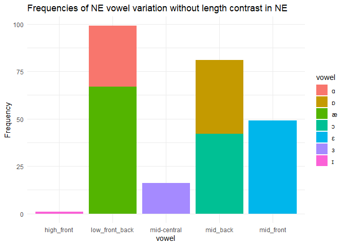<!-- --> The
results show that `[ɜ]` in NURSE for BrE, AmE, CanE and New Zealand
English is often realization as `[a]` with 99 (40%), `[ɔ]` with 81
(32%), `[ɜ]` with 16 (6.5%), and `[ɛ]` with 49 (19%). This shows that
similar variant with the inner circle English is 6.5% possible in NE
variety; however, it’s more produced as \[nas\], \[nɔs\] and \[nɛs\].
The frequent production of \[nɜs\] as \[nas\], \[nɔs\] and \[nɛs\] in NE
reveals that the variation of NURSE vowel is beyond presence or absence
of rhotics. If we shift our focus rhotics of NURSE vowel in NE, we will
eventually be discussing variant form that is 10% present in NE.

### NURSE vowel variation by `backness`

Here, we classified NURSE vowel variant that are produced as NURSE vowel
in NE as **front**, **central**, and **backness**. This classification
does not consider length contrast but identify.

Before analyzing the variation in NURSE vowel in NE, let’s create a
column (`vowel_variation`) that does not differentiate NURSE vowels by
length.

``` r
nurse_segment <- nurse_segment %>% 
  mutate(nurse_vowel_space = case_when(
    vowel %in% c("ɒ", "ɔ", "ɑ") ~ "back_vowel",
    vowel %in% c("æ", "ɛ", "ɪ") ~ "front_vowel",
    vowel %in% "ɜ" ~ "central_vowel",
    TRUE ~ "Other"
  ))

nurse_segment%>%
  select(nurse_vowel_space)%>%
  table()/246*100
```

    nurse_vowel_space
       back_vowel central_vowel   front_vowel 
        45.934959      6.504065     47.560976 

The results show the distribution of vowel production in Nigerian
English across front, central and back vowel space. Back vowels are
frequent, accounting for 45.93% of overall vowel production, whereas
front vowels were 47.56%, while the central vowel were the least common,
6.50% in NE. This distribution implies that Nigerian English has a
somewhat equal proportion of back and front vowels, with back vowels
being less common.

## Duration patterns for NURSE vowels in NE

``` r
#check the duration patterns for NURSE vowels in the data
NURSE_vowel_dur <- nurse_segment%>%
  group_by(vowel)%>%
  summarize(mean_dur_vowel = mean(duration))

NURSE_vowel_var <- nurse_segment%>%
  group_by(vowel_variation)%>%
  summarize(mean_vowel_var = mean(duration))

head(NURSE_vowel_dur)
```

    # A tibble: 6 × 2
      vowel mean_dur_vowel
      <chr>          <dbl>
    1 æ              0.126
    2 ɑ              0.141
    3 ɒ              0.125
    4 ɔ              0.113
    5 ɛ              0.130
    6 ɜ              0.125

``` r
head(NURSE_vowel_var)
```

    # A tibble: 5 × 2
      vowel_variation mean_vowel_var
      <chr>                    <dbl>
    1 high_front              0.0400
    2 low_front_back          0.131 
    3 mid-central             0.125 
    4 mid_back                0.119 
    5 mid_front               0.130 

### NURSE vowel duration by length

The duration distinguishes tense from lax vowels. The average duration
of vowel production in a NURSE context in Nigerian English is 13ms
(0.126) for `[æ]` and 14ms (0.14) for `[ɑ]`. Similarly, the mean
duration of the vowels \[ɒ\]`,`\[ɔ\]`,`\[ɛ\]\`, and \[ɜ\] range from
11ms (0.113) to 13ms (0.130). [Segment
info](https://github.com/ClassOrg-Data-Sci-2024/Sociophonetic-study-of-NURSE-vowels-in-Nigerian-English/blob/main/tidy_csv_files/segment_info.csv)
(Is duration therefore significant?)

### NURSE vowel duration by vowel space

Each category of `vowel space` represents a unique articulatory position
within the vowel space. For example, the **high_front** category has a
relatively modest mean vowel duration of 0.04 (4ms), indicating a more
limited articulatory range for high front vowels in Nigerian English. In
contrast, categories such as `low_front_back`, `mid-central`,
`mid_back`, and mid_front\` have higher average duration ranging from
0.118 (12ms) to 0.131 (13ms), implying a wider range of articulatory
positions for these vowels. Overall, the variability of vowel production
in NURSE production in Nigerian English across various vowel categories,
shedding light on the phonetic characteristics of this linguistic
context and indicating variations not only in vowels but also in
duration.

### Regression analysis of duration

Duration **does not seem** to significantly determine the variance in
NURSE vowel production in NE. The model, the results show that the
realization of NURSE vowel as low back vowel (`[ɑ]`) was statistically
significantly differ in `duration` from other other NURSE vowels
(intercept = 0.13, 95%, t(237) = 12.54, p \< .001). Meanwhile, the
average duration for `[æ]` was 8ms longer than \[a:\], though the
relationship was not statistically significant (p\>0.05). This may
insights that duration is not reliable to differentiate vowels for NURSE
production in NE. Rather, vowel height may help to differentiate NURSE
vowel phoneme.

``` r
#normalization duration around the mean before checking for the effect of duration
nurse_segment <- nurse_segment %>%
  mutate(duration.cen = center(duration, value=min(duration)))

#regression model for duration
duration_model <- lmer(duration.cen ~ 1 + vowel + (1|word), data = nurse_segment)
duration_model %>% summary()
```

    Linear mixed model fit by REML. t-tests use Satterthwaite's method [
    lmerModLmerTest]
    Formula: duration.cen ~ 1 + vowel + (1 | word)
       Data: nurse_segment

    REML criterion at convergence: -744.5

    Scaled residuals: 
        Min      1Q  Median      3Q     Max 
    -1.7734 -0.4911 -0.0898  0.4415  4.4086 

    Random effects:
     Groups   Name        Variance Std.Dev.
     word     (Intercept) 0.001740 0.04171 
     Residual             0.001439 0.03793 
    Number of obs: 246, groups:  word, 109

    Fixed effects:
                  Estimate Std. Error         df t value Pr(>|t|)    
    (Intercept)  4.248e-02  1.026e-02  2.259e+02   4.139 4.92e-05 ***
    vowelɒ      -1.260e-02  1.410e-02  2.227e+02  -0.894    0.372    
    vowelæ       8.343e-04  1.066e-02  2.307e+02   0.078    0.938    
    vowelɔ      -1.968e-02  1.401e-02  2.265e+02  -1.405    0.162    
    vowelɛ      -7.791e-04  1.221e-02  2.367e+02  -0.064    0.949    
    vowelɜ      -7.966e-03  1.528e-02  2.188e+02  -0.521    0.603    
    vowelɪ      -8.973e-02  5.730e-02  1.553e+02  -1.566    0.119    
    ---
    Signif. codes:  0 '***' 0.001 '**' 0.01 '*' 0.05 '.' 0.1 ' ' 1

    Correlation of Fixed Effects:
           (Intr) vowelɒ vowelæ vowelɔ vowelɛ vowelɜ
    vowelɒ -0.713                                   
    vowelæ -0.756  0.560                            
    vowelɔ -0.714  0.659  0.561                     
    vowelɛ -0.744  0.582  0.697  0.581              
    vowelɜ -0.575  0.450  0.530  0.492  0.572       
    vowelɪ -0.179  0.128  0.135  0.128  0.133  0.103

``` r
NURSE_context_dur <- coef(duration_model)%>%
  pluck('word')%>%
  rownames_to_column('NURSE_tokens')
  

#load the coefplot package
library(coefplot)
```

    Warning: package 'coefplot' was built under R version 4.3.3

``` r
# Create the coefficient plot
coefplot(duration_model)
```

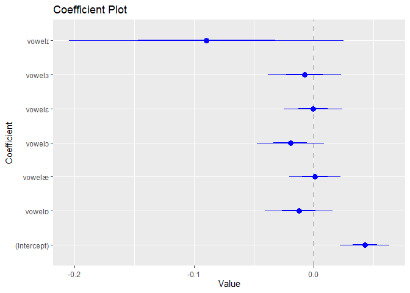<!-- -->
Similarly, I fitted the second level with `word` (as level 2) and model
did not reveal any significant relationship therefore I dropped it from
the model. The residual revealed variation across `word` and `vowel`
production as 4ms (for `word`) and 3ms (for `vowel`). It means that
duration of NURSE vowel in the variety is more variant across `word`
than `NURSE vowel`

## Effect of phonological environment on the production of NURSE vowels in NE

One of the
[hypotheses](https://github.com/ClassOrg-Data-Sci-2024/Sociophonetic-study-of-NURSE-vowels-in-Nigerian-English/blob/main/research%20hypothesis.md)
for the study identifies the effect of phonological environment on NURSE
vowel production in NE. To attempt this task, we need to create a column
`nurse_determinant` where we assign numeric to each level of the
`nurse_vowel_space` for `poisson analysis`. The column has three levels:
NURSE vowels realized as `front_vowel`, `back_vowel` and
`central_vowel`. The numeric \[`front_vowel = 0`; `back_vowel = 1`,
`central_vowel = 2`\]. This model will reveal whether there is any
relationship between `vowel space` and `words` in NE.

``` r
#Do `words` (and or `speech`) determine NURSE vowel in NE?
nurse_segment <- nurse_segment %>% 
  mutate(nurse_determinant = case_when(
    nurse_vowel_space %in% "front_vowel" ~ "0",
    nurse_vowel_space %in% "back_vowel" ~ "1",
    nurse_vowel_space %in% "central_vowel" ~ "2",
      TRUE ~ "Other"
  ))
#make the categorical column numeric to satisfy poisson assumption
nurse_segment <- nurse_segment %>%
  mutate(nurse_determinant = as.numeric(nurse_determinant))

#regression analysis for the `phonological effect` on NURSE vowel production
model_nurse_determinant <- glmer(nurse_determinant ~ 1 + (1|word), data = nurse_segment, family = poisson)
summary(model_nurse_determinant)
```

    Generalized linear mixed model fit by maximum likelihood (Laplace
      Approximation) [glmerMod]
     Family: poisson  ( log )
    Formula: nurse_determinant ~ 1 + (1 | word)
       Data: nurse_segment

         AIC      BIC   logLik deviance df.resid 
       468.5    475.5   -232.2    464.5      244 

    Scaled residuals: 
        Min      1Q  Median      3Q     Max 
    -0.7719 -0.7198  0.2818  0.5291  2.0775 

    Random effects:
     Groups Name        Variance Std.Dev.
     word   (Intercept) 0.07575  0.2752  
    Number of obs: 246, groups:  word, 109

    Fixed effects:
                Estimate Std. Error z value Pr(>|z|)    
    (Intercept)  -0.5792     0.1065  -5.438 5.39e-08 ***
    ---
    Signif. codes:  0 '***' 0.001 '**' 0.01 '*' 0.05 '.' 0.1 ' ' 1

``` r
ggplot(nurse_segment, aes(x = nurse_determinant, fill = word)) +
  geom_bar() +
  labs(x = "NURSE vowels", y = "Freq of NURSE vowels")+
   ggtitle("Frequencies of NURSE vowel determinant by word")
```

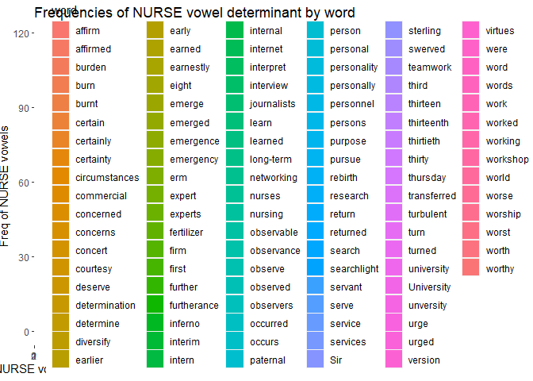<!-- --> The
model determines if `NURSE vowels` are affected by
`phonological environment` and the intercept returned significant. The
random effect for `word` indicates that the influence of `word` on vowel
production varies. The standard deviation (`SD`) for the random effect
(0.2752) estimates the degree of variability among words. Furthermore,
the fixed effect estimate for the intercept (-0.5792) indicates the log
of vowel productions when no word-specific factor is present. This
support the evidence that the production of vowels in Nigerian English
is determined by the `phonological environment` that NE speakers utter,
with various words having variable impacts on vowel formation.

The model was extended to investigate whether vowel production in
Nigerian English is influenced by the specific `word` and the
`speaker's speech style` \[`broadcast interview` vs `broadcast talk`\].
The model adds speaker identification `(id)`, indicating that the
effects on vowel production vary between words and speakers. The model
did not converge and I dropped `id` from the model.

## What information does the variation in NE NURSE vowel explain?

First, the production of NURSE vowel varies in Nigerian English. Unlike
previous studies
[link](https://www.cambridge.org/core/journals/journal-of-the-international-phonetic-association/article/what-exactly-is-a-front-rounded-vowel-an-acoustic-and-articulatory-investigation-of-the-nurse-vowel-in-south-wales-english/96F7CC3AC905D8F3DED8E011394310A3),
[also](https://journals.sagepub.com/doi/full/10.1177/00754242211025586)
in `monolingual context` and these studies explain merger/distinction or
varied rhotics; this study, therefore, shows that the more diverse a
speech community (e.g., `bilingual`, `multilingual`) is, the more
variation in **NURSE vowel** production. Previous studies on NURSE
vowels discussed categorical or gradient rhotacization and their
participants were speakers of English as L1. The production of NURSE
vowel in NE (a multi-lingual speech community) has revealed inherent
variation in the production of NURSE vowel. To this effect, researchers
on inner circle English may have to restrict their generalization that
NURSE vowels have categorical (presence or absence of \[r\]) or gradient
rhoticity. The multi-lingual speech communities have variant forms to
mean the same phoneme (as NURSE vowel) without any pragmatic
implicature.

## Formant description of NURSE vowels in NE

- What are the formant features of NURSE vowels in NE?
- What are the formant trajectories of NURSE vowels in NE?
- What insight does multiple selection of formants across time reveal?

``` r
#`nurse_aggregate.csv` has phonetic features of NURSE vowel production 
nurse_aggregate <- read_csv("C:/Users/oamon/Oluwasegun DS Project/Sociophonetic-study-of-NURSE-vowels-in-NE/Analysis/tidy_csv_files/nurse_raw_aggregated.csv",
                                     na=c("", "Na", "NA", "N/A", "n/a", "na", "-", "undefined"))
```

    Rows: 246 Columns: 29
    ── Column specification ────────────────────────────────────────────────────────
    Delimiter: ","
    chr  (4): file_name, label, color, files
    dbl (25): f0, duration_ms, group, number, cutoff, f11, f21, f31, f41, f12, f...

    ℹ Use `spec()` to retrieve the full column specification for this data.
    ℹ Specify the column types or set `show_col_types = FALSE` to quiet this message.

``` r
#head(nurse_aggregate)

#Another data frame
nurse_segment <- 
  nurse_segment %>%
 rename(
    file_name = contains("outputfile"),
    files = contains("inputfile"))
head(nurse_segment)
```

    # A tibble: 6 × 18
       ...1 id     file_name vowel interval duration start   end word  word_interval
      <dbl> <chr>  <chr>     <chr>    <dbl>    <dbl> <dbl> <dbl> <chr>         <dbl>
    1     1 bnew_… bnew_01_… ɔ            2   0.0782  37.1  37.2 worse            92
    2     2 bnew_… bnew_01_… ɔ            4   0.0994  91.4  91.5 urge            216
    3     3 bnew_… bnew_01_… ɒ            6   0.0855 159.  159.  thur…           353
    4     4 bnew_… bnew_01_… ɒ            8   0.0800 161.  161.  occu…           363
    5     5 bnew_… bnew_01_… ɑ           10   0.109  183.  183.  swer…           417
    6     6 bnew_… bnew_01_… ɒ           12   0.0964 220.  220.  work…           491
    # ℹ 8 more variables: word_start <dbl>, word_end <dbl>, previous_word <chr>,
    #   next_word <chr>, vowel_variation <chr>, nurse_vowel_space <chr>,
    #   duration.cen <dbl>, nurse_determinant <dbl>

``` r
#combined the dataframe by `file_name`
segment_aggregate <- merge(nurse_aggregate, nurse_segment %>% select(c("vowel", "word", "file_name", by = "file_name")))

#remove columns that are not needed
segment_aggregate <- segment_aggregate %>%
  select(-c("files", "label", "group", "number", "f0"))

#rename `file_name` as `id` as a concise name for vowel grouping
segment_aggregate <- 
  segment_aggregate %>%
 rename(
    id = contains("file_name"))
```

``` r
#store the new data to `my_nurse_vowel_formant` 
my_nurse_vowel_formant <- segment_aggregate %>%
    # Take the median of each vowel at each timepoint
  summarize(across(starts_with("f"), median, na.rm = TRUE), .by = vowel) %>%
  
  # Convert it into a "very tall" format
  pivot_longer(cols = starts_with("f"), names_to = "formant_percent", values_to = "hz") %>%
 separate_wider_position(formant_percent, 
                          widths=c(formant = 2, timepoint = 1))%>%
  
  # unite the columns and view
  unite(id, formant, vowel, remove = FALSE)
```

    Warning: There was 1 warning in `summarize()`.
    ℹ In argument: `across(starts_with("f"), median, na.rm = TRUE)`.
    ℹ In group 1: `vowel = "ɔ"`.
    Caused by warning:
    ! The `...` argument of `across()` is deprecated as of dplyr 1.1.0.
    Supply arguments directly to `.fns` through an anonymous function instead.

      # Previously
      across(a:b, mean, na.rm = TRUE)

      # Now
      across(a:b, \(x) mean(x, na.rm = TRUE))

``` r
# Define the formula as a function
bark_norm <- function(fi) {
  zi <- 26.81 / (1 + 1960 / fi) - 0.53
  return(zi)
}

# Example usage
#fi <- 1000  # Example value for Fi
#zi <- norm_zi(fi)
#print(zi)


my_nurse_vowel_formant <- my_nurse_vowel_formant %>%
  mutate(formant_bark_norms = sapply(hz, bark_norm))
head(my_nurse_vowel_formant)
```

    # A tibble: 6 × 6
      id    vowel formant timepoint    hz formant_bark_norms
      <chr> <chr> <chr>   <chr>     <dbl>              <dbl>
    1 f1_ɔ  ɔ     f1      1          577                5.57
    2 f2_ɔ  ɔ     f2      1         1367               10.5 
    3 f3_ɔ  ɔ     f3      1         2427               14.3 
    4 f4_ɔ  ɔ     f4      1         3422.              16.5 
    5 f1_ɔ  ɔ     f1      2          642.               6.08
    6 f2_ɔ  ɔ     f2      2         1384               10.6 

``` r
#visualization
ggplot(my_nurse_vowel_formant, aes(x = timepoint, y = formant_bark_norms, group = id, color = formant)) +
  geom_line() + 
  facet_wrap(~vowel, nrow=3)+
  ggtitle("Formant trajectories for NURSE vowels in NE at five points")+
  theme_classic()
```

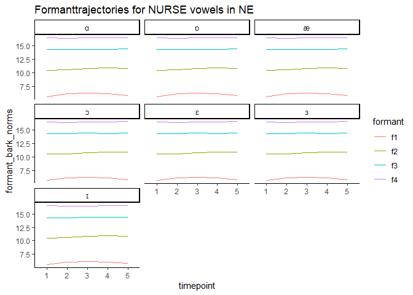<!-- -->

``` r
#wider dataframe
#table2 <- my_nurse_vowel_formant %>% 
 #   pivot_wider(names_from = formant, values_from = formant_bark_norms)
```

### Regression analysis of formant features and trajectories

``` r
#formant.log.cen is a centered around grand mean
formant_model <- lmer(formant_bark_norms ~ 1 + timepoint + (1|formant), data = my_nurse_vowel_formant)
formant_model %>% summary()
```

    Linear mixed model fit by REML. t-tests use Satterthwaite's method [
    lmerModLmerTest]
    Formula: formant_bark_norms ~ 1 + timepoint + (1 | formant)
       Data: my_nurse_vowel_formant

    REML criterion at convergence: -148.6

    Scaled residuals: 
         Min       1Q   Median       3Q      Max 
    -1.79801 -0.68481 -0.06046  0.87111  1.54022 

    Random effects:
     Groups   Name        Variance Std.Dev.
     formant  (Intercept) 21.36682 4.6224  
     Residual              0.01351 0.1162  
    Number of obs: 140, groups:  formant, 4

    Fixed effects:
                 Estimate Std. Error        df t value Pr(>|t|)    
    (Intercept)  11.71768    2.31132   3.00041   5.070   0.0148 *  
    timepoint2    0.12554    0.03106 132.00000   4.041 8.97e-05 ***
    timepoint3    0.23416    0.03106 132.00000   7.538 6.80e-12 ***
    timepoint4    0.23958    0.03106 132.00000   7.713 2.66e-12 ***
    timepoint5    0.17235    0.03106 132.00000   5.548 1.52e-07 ***
    ---
    Signif. codes:  0 '***' 0.001 '**' 0.01 '*' 0.05 '.' 0.1 ' ' 1

    Correlation of Fixed Effects:
               (Intr) tmpnt2 tmpnt3 tmpnt4
    timepoint2 -0.007                     
    timepoint3 -0.007  0.500              
    timepoint4 -0.007  0.500  0.500       
    timepoint5 -0.007  0.500  0.500  0.500

``` r
library(sjPlot)
#Estimate table that explains the independent and the dependent variables.
#formant_model %>% tab_model()
formant_model %>% plot_model()
```

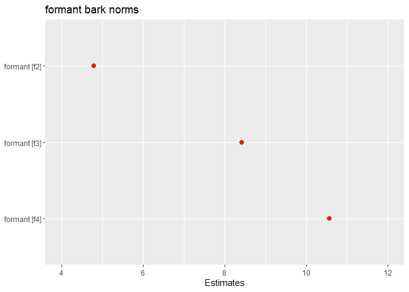<!-- -->

``` r
plot_model(formant_model, type = "pred", terms = c("timepoint", "formant"))
```

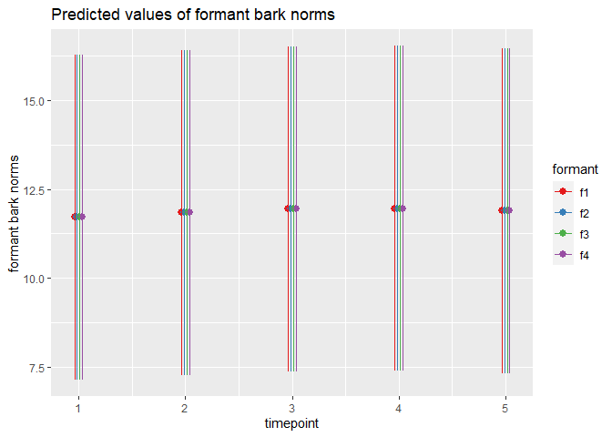<!-- --> This
analysis shows the estimates, confidence intervals (CI), and p-values
for `formant` with log-transformation. The intercept `formant 1` is
estimated to be -0.97 with a 95% confidence interval between -0.99 and
-0.96, and the p-value is \<0.001, indicating high statistical
significance. The other estimates (f2, f3, and f4) are 0.82, 1.37, and
1.70, respectively, with very narrow confidence intervals and highly
significant p-values (\<0.001). This indicates a strong positive
association between each formant and the formant levels.

The random effects analysis shows minimal variance both within and
between time points, with a variance estimate `σ^2` of 0.01 and a
variance estimate for the intercept across time points (τ00) of 0.01.
The intra-class correlation coefficient (ICC) is estimated to be 0.38,
indicating that time-point differences account for a moderate proportion
of total variance. The model fit is excellent, with a marginal R^2
`0.998` and a conditional R^2 `0.999`. This indicates that the
predictors (i.e., formant) explain a significant proportion of the
variance in the outcome variable (`formant levels`), both independently
and in conjunction with other predictors.

## Do social factors determine production of NURSE vowels in NE?

Apart from the phonetic properties [as stated in the
hypothesis](https://github.com/ClassOrg-Data-Sci-2024/Sociophonetic-study-of-NURSE-vowels-in-Nigerian-English/blob/main/research%20hypothesis.md)
that described variation in Nigerian English NURSE vowels, we expect
social factors such as `age`, `gender` and `profession` to trigger
variation in NURSE vowel production.

``` r
#load csv with social variables
nurse_social <- read_csv("C:/Users/oamon/Oluwasegun DS Project/Sociophonetic-study-of-NURSE-vowels-in-NE/Analysis/tidy_csv_files/nurse_social_var.csv",
                                     na=c("", "Na", "NA", "N/A", "n/a", "na", "-", "undefined"))
```

    Rows: 16 Columns: 7
    ── Column specification ────────────────────────────────────────────────────────
    Delimiter: ","
    chr (6): files, Gender, Ethnicity, Profession, Profession_category, Age_cate...
    dbl (1): Age

    ℹ Use `spec()` to retrieve the full column specification for this data.
    ℹ Specify the column types or set `show_col_types = FALSE` to quiet this message.

``` r
#nurse_social dataframe has only social variables and need to join `nurse_segment` to account for the effect of social variables on NURSE vowels.

#rename `files` in `nurse_social` dataframe as `id` in order to join both dataframe by `id`. 

nurse_social <- nurse_social %>%
  rename(
    id = contains("files"))
#new dataframe as `nurse_social_segment` has both `nurse_social` and `nurse_segment` merged by `id`
nurse_social_segment <- merge(nurse_segment, nurse_social, by = "id")
#to view
head(nurse_social_segment)
```

           id ...1    file_name vowel interval   duration     start       end
    1 bnew_01    1 bnew_01_0001     ɔ        2 0.07815562  37.12740  37.20556
    2 bnew_01    2 bnew_01_0002     ɔ        4 0.09937295  91.41509  91.51446
    3 bnew_01    3 bnew_01_0003     ɒ        6 0.08547874 159.16368 159.24916
    4 bnew_01    4 bnew_01_0004     ɒ        8 0.08000000 161.33000 161.41000
    5 bnew_01    5 bnew_01_0005     ɑ       10 0.10857549 182.96000 183.06858
    6 bnew_01    6 bnew_01_0006     ɒ       12 0.09639157 219.53361 219.63000
          word word_interval word_start  word_end previous_word next_word
    1    worse            92      37.07  38.28000          <NA> according
    2     urge           216      91.43  91.47384          <NA>       the
    3 thursday           353     158.90 159.29000          <NA>        on
    4 occurred           363     161.11 161.48000          <NA>     close
    5  swerved           417     182.83 183.24000      mechanic      <NA>
    6  working           491     219.40 219.91000       already      <NA>
      vowel_variation nurse_vowel_space duration.cen nurse_determinant Gender Age
    1        mid_back        back_vowel -0.009103096                 1 female  23
    2        mid_back        back_vowel  0.012114235                 1 female  23
    3        mid_back        back_vowel -0.001779976                 1 female  23
    4        mid_back        back_vowel -0.007258719                 1 female  23
    5  low_front_back        back_vowel  0.021316770                 1 female  23
    6        mid_back        back_vowel  0.009132856                 1 female  23
      Ethnicity      Profession Profession_category Age_category
    1      Igbo Radio presenter         Broadcaster      younger
    2      Igbo Radio presenter         Broadcaster      younger
    3      Igbo Radio presenter         Broadcaster      younger
    4      Igbo Radio presenter         Broadcaster      younger
    5      Igbo Radio presenter         Broadcaster      younger
    6      Igbo Radio presenter         Broadcaster      younger

### NURSE vowel production in NE by age and gender

The table (r code below) showed the production of NURSE vowels by age
groups (`older` and `younger`). 17 `older` participants produced the
vowel low back vowel while only 6 younger participants produced the same
vowel. 8 older and 10 younger participants produced NURSE vowel as
\[ɒ\]. Notably, older participants produced the vowel “æ” more
frequently than younger participants, with 41 occurrences versus only
three. These findings shed light on differences in the production of
NURSE vowels across age groups, indicating that age may influence the
production of NURSE vowel in Nigerian English.

``` r
#frequency count of the NURSE vowel production by age
nurse_freq_age <- table(nurse_social_segment$vowel, nurse_social_segment$Age_category)
head(nurse_freq_age)
```

       
        older younger
      ɑ    23       9
      ɒ    28      11
      æ    58       9
      ɔ    27      15
      ɛ    30      19
      ɜ    11       5

``` r
#percentage
nurse_age_vowel <- nurse_social_segment %>%
  select(Age_category, Gender, vowel)%>%
  table()/246*100
head(nurse_age_vowel)
```

    , , vowel = ɑ

                Gender
    Age_category     female       male
         older    1.2195122  8.1300813
         younger  2.4390244  1.2195122

    , , vowel = ɒ

                Gender
    Age_category     female       male
         older    1.6260163  9.7560976
         younger  2.4390244  2.0325203

    , , vowel = æ

                Gender
    Age_category     female       male
         older    2.0325203 21.5447154
         younger  0.8130081  2.8455285

    , , vowel = ɔ

                Gender
    Age_category     female       male
         older    0.4065041 10.5691057
         younger  1.6260163  4.4715447

    , , vowel = ɛ

                Gender
    Age_category     female       male
         older    0.8130081 11.3821138
         younger  4.0650407  3.6585366

    , , vowel = ɜ

                Gender
    Age_category     female       male
         older    0.0000000  4.4715447
         younger  2.0325203  0.0000000

    , , vowel = ɪ

                Gender
    Age_category     female       male
         older    0.4065041  0.0000000
         younger  0.0000000  0.0000000

``` r
ggplot(nurse_social_segment, aes(x = vowel, fill = Gender)) +
  geom_bar() +
  facet_wrap(vars(Age_category), ncol = 3) +
  labs(x = "NURSE vowels", y = "Freq of NURSE vowels")+
   ggtitle("Frequencies of NURSE vowel production by social group")
```

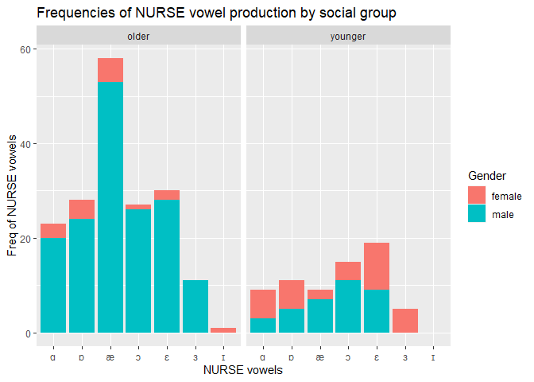<!-- -->

By gender, `NURSE vowel` was produced as `[ɑ]` by 8 females and 15
males, as \[ɒ\] by 7 females and 11 males. Males produced the vowel as
\[æ\] 38 times more frequently than females, while females produced “ɛ”
11 times more than males (18). Furthermore, “ɜ” was primarily produced
by females, with 5 instances compared to only one among male speaker.
These findings suggest that there may be gender-related variations in
the production of NURSE vowels in the sample data.

``` r
model_nurse_age_det <- glmer(nurse_determinant ~ 1 + Gender + (1|word), data = nurse_social_segment, family = poisson)
summary(model_nurse_age_det)
```

    Generalized linear mixed model fit by maximum likelihood (Laplace
      Approximation) [glmerMod]
     Family: poisson  ( log )
    Formula: nurse_determinant ~ 1 + Gender + (1 | word)
       Data: nurse_social_segment

         AIC      BIC   logLik deviance df.resid 
       469.1    479.6   -231.5    463.1      243 

    Scaled residuals: 
        Min      1Q  Median      3Q     Max 
    -0.8467 -0.7116  0.3020  0.5654  2.2050 

    Random effects:
     Groups Name        Variance Std.Dev.
     word   (Intercept) 0.08572  0.2928  
    Number of obs: 246, groups:  word, 109

    Fixed effects:
                Estimate Std. Error z value Pr(>|z|)  
    (Intercept)  -0.3946     0.1833  -2.153   0.0314 *
    Gendermale   -0.2425     0.2030  -1.195   0.2323  
    ---
    Signif. codes:  0 '***' 0.001 '**' 0.01 '*' 0.05 '.' 0.1 ' ' 1

    Correlation of Fixed Effects:
               (Intr)
    Gendermale -0.813

``` r
model_nurse_age_det %>% tab_model()
```

<table style="border-collapse:collapse; border:none;">
<tr>
<th style="border-top: double; text-align:center; font-style:normal; font-weight:bold; padding:0.2cm;  text-align:left; ">
 
</th>
<th colspan="3" style="border-top: double; text-align:center; font-style:normal; font-weight:bold; padding:0.2cm; ">
nurse determinant
</th>
</tr>
<tr>
<td style=" text-align:center; border-bottom:1px solid; font-style:italic; font-weight:normal;  text-align:left; ">
Predictors
</td>
<td style=" text-align:center; border-bottom:1px solid; font-style:italic; font-weight:normal;  ">
Incidence Rate Ratios
</td>
<td style=" text-align:center; border-bottom:1px solid; font-style:italic; font-weight:normal;  ">
CI
</td>
<td style=" text-align:center; border-bottom:1px solid; font-style:italic; font-weight:normal;  ">
p
</td>
</tr>
<tr>
<td style=" padding:0.2cm; text-align:left; vertical-align:top; text-align:left; ">
(Intercept)
</td>
<td style=" padding:0.2cm; text-align:left; vertical-align:top; text-align:center;  ">
0.67
</td>
<td style=" padding:0.2cm; text-align:left; vertical-align:top; text-align:center;  ">
0.47 – 0.97
</td>
<td style=" padding:0.2cm; text-align:left; vertical-align:top; text-align:center;  ">
<strong>0.031</strong>
</td>
</tr>
<tr>
<td style=" padding:0.2cm; text-align:left; vertical-align:top; text-align:left; ">
Gender \[male\]
</td>
<td style=" padding:0.2cm; text-align:left; vertical-align:top; text-align:center;  ">
0.78
</td>
<td style=" padding:0.2cm; text-align:left; vertical-align:top; text-align:center;  ">
0.53 – 1.17
</td>
<td style=" padding:0.2cm; text-align:left; vertical-align:top; text-align:center;  ">
0.232
</td>
</tr>
<tr>
<td colspan="4" style="font-weight:bold; text-align:left; padding-top:.8em;">
Random Effects
</td>
</tr>
<tr>
<td style=" padding:0.2cm; text-align:left; vertical-align:top; text-align:left; padding-top:0.1cm; padding-bottom:0.1cm;">
σ<sup>2</sup>
</td>
<td style=" padding:0.2cm; text-align:left; vertical-align:top; padding-top:0.1cm; padding-bottom:0.1cm; text-align:left;" colspan="3">
1.02
</td>
</tr>
<tr>
<td style=" padding:0.2cm; text-align:left; vertical-align:top; text-align:left; padding-top:0.1cm; padding-bottom:0.1cm;">
τ<sub>00</sub> <sub>word</sub>
</td>
<td style=" padding:0.2cm; text-align:left; vertical-align:top; padding-top:0.1cm; padding-bottom:0.1cm; text-align:left;" colspan="3">
0.09
</td>
<tr>
<td style=" padding:0.2cm; text-align:left; vertical-align:top; text-align:left; padding-top:0.1cm; padding-bottom:0.1cm;">
ICC
</td>
<td style=" padding:0.2cm; text-align:left; vertical-align:top; padding-top:0.1cm; padding-bottom:0.1cm; text-align:left;" colspan="3">
0.08
</td>
<tr>
<td style=" padding:0.2cm; text-align:left; vertical-align:top; text-align:left; padding-top:0.1cm; padding-bottom:0.1cm;">
N <sub>word</sub>
</td>
<td style=" padding:0.2cm; text-align:left; vertical-align:top; padding-top:0.1cm; padding-bottom:0.1cm; text-align:left;" colspan="3">
109
</td>
<tr>
<td style=" padding:0.2cm; text-align:left; vertical-align:top; text-align:left; padding-top:0.1cm; padding-bottom:0.1cm; border-top:1px solid;">
Observations
</td>
<td style=" padding:0.2cm; text-align:left; vertical-align:top; padding-top:0.1cm; padding-bottom:0.1cm; text-align:left; border-top:1px solid;" colspan="3">
246
</td>
</tr>
<tr>
<td style=" padding:0.2cm; text-align:left; vertical-align:top; text-align:left; padding-top:0.1cm; padding-bottom:0.1cm;">
Marginal R<sup>2</sup> / Conditional R<sup>2</sup>
</td>
<td style=" padding:0.2cm; text-align:left; vertical-align:top; padding-top:0.1cm; padding-bottom:0.1cm; text-align:left;" colspan="3">
0.008 / 0.085
</td>
</tr>
</table>

``` r
#model_nurse_age_det %>% plot_model()

#cat_plot(poisson.model2, pred = tension, modx = wool, geom = "line", plot.points = TRUE)
#library(jtools)
#cat_plot(model_nurse_age_det, pred = word, modx = nurse_determinant)
```

``` r
ggplot(nurse_social_segment, aes(x = vowel, fill = word)) +
  geom_bar() +
  facet_wrap(vars(Age_category), ncol = 3) +
  labs(x = "NURSE vowels", y = "Freq of NURSE vowels")+
   ggtitle("Frequencies of NURSE vowel production by social group")
```

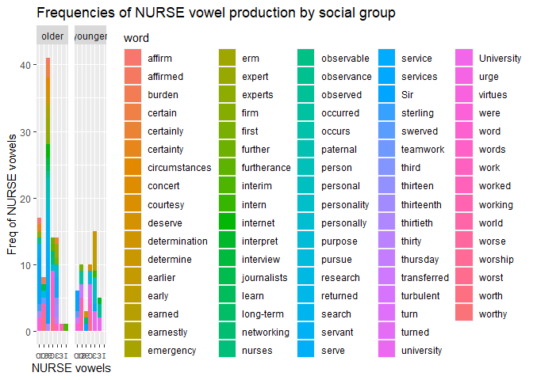<!-- -->

### Duration patterns of NURSE vowel production in NE by age and gender

``` r
nurse_social_segment %>%
  group_by(Age_category) %>%
  summarize(age_vdur = mean(duration.cen))
```

    # A tibble: 2 × 2
      Age_category age_vdur
      <chr>           <dbl>
    1 older          0.0416
    2 younger        0.0315

``` r
age_nurse_vowel <- lmer(duration.cen ~ 1 + Age_category + Gender + (1|vowel),  nurse_social_segment) 
age_nurse_vowel %>% summary()
```

    Linear mixed model fit by REML. t-tests use Satterthwaite's method [
    lmerModLmerTest]
    Formula: duration.cen ~ 1 + Age_category + Gender + (1 | vowel)
       Data: nurse_social_segment

    REML criterion at convergence: -706.7

    Scaled residuals: 
        Min      1Q  Median      3Q     Max 
    -1.6692 -0.7082 -0.1908  0.5298  5.6012 

    Random effects:
     Groups   Name        Variance  Std.Dev.
     vowel    (Intercept) 2.849e-05 0.005338
     Residual             3.011e-03 0.054874
    Number of obs: 246, groups:  vowel, 7

    Fixed effects:
                          Estimate Std. Error         df t value Pr(>|t|)  
    (Intercept)           0.019072   0.010060  95.448663   1.896    0.061 .
    Age_categoryyounger  -0.000236   0.008786 239.961635  -0.027    0.979  
    Gendermale            0.024855   0.009817 242.444748   2.532    0.012 *
    ---
    Signif. codes:  0 '***' 0.001 '**' 0.01 '*' 0.05 '.' 0.1 ' ' 1

    Correlation of Fixed Effects:
                (Intr) Ag_ctg
    Ag_ctgryyng -0.587       
    Gendermale  -0.883  0.441

``` r
age_nurse_vowel %>% tab_model()
```

<table style="border-collapse:collapse; border:none;">
<tr>
<th style="border-top: double; text-align:center; font-style:normal; font-weight:bold; padding:0.2cm;  text-align:left; ">
 
</th>
<th colspan="3" style="border-top: double; text-align:center; font-style:normal; font-weight:bold; padding:0.2cm; ">
duration cen
</th>
</tr>
<tr>
<td style=" text-align:center; border-bottom:1px solid; font-style:italic; font-weight:normal;  text-align:left; ">
Predictors
</td>
<td style=" text-align:center; border-bottom:1px solid; font-style:italic; font-weight:normal;  ">
Estimates
</td>
<td style=" text-align:center; border-bottom:1px solid; font-style:italic; font-weight:normal;  ">
CI
</td>
<td style=" text-align:center; border-bottom:1px solid; font-style:italic; font-weight:normal;  ">
p
</td>
</tr>
<tr>
<td style=" padding:0.2cm; text-align:left; vertical-align:top; text-align:left; ">
(Intercept)
</td>
<td style=" padding:0.2cm; text-align:left; vertical-align:top; text-align:center;  ">
0.02
</td>
<td style=" padding:0.2cm; text-align:left; vertical-align:top; text-align:center;  ">
-0.00 – 0.04
</td>
<td style=" padding:0.2cm; text-align:left; vertical-align:top; text-align:center;  ">
0.059
</td>
</tr>
<tr>
<td style=" padding:0.2cm; text-align:left; vertical-align:top; text-align:left; ">
Age category \[younger\]
</td>
<td style=" padding:0.2cm; text-align:left; vertical-align:top; text-align:center;  ">
-0.00
</td>
<td style=" padding:0.2cm; text-align:left; vertical-align:top; text-align:center;  ">
-0.02 – 0.02
</td>
<td style=" padding:0.2cm; text-align:left; vertical-align:top; text-align:center;  ">
0.979
</td>
</tr>
<tr>
<td style=" padding:0.2cm; text-align:left; vertical-align:top; text-align:left; ">
Gender \[male\]
</td>
<td style=" padding:0.2cm; text-align:left; vertical-align:top; text-align:center;  ">
0.02
</td>
<td style=" padding:0.2cm; text-align:left; vertical-align:top; text-align:center;  ">
0.01 – 0.04
</td>
<td style=" padding:0.2cm; text-align:left; vertical-align:top; text-align:center;  ">
<strong>0.012</strong>
</td>
</tr>
<tr>
<td colspan="4" style="font-weight:bold; text-align:left; padding-top:.8em;">
Random Effects
</td>
</tr>
<tr>
<td style=" padding:0.2cm; text-align:left; vertical-align:top; text-align:left; padding-top:0.1cm; padding-bottom:0.1cm;">
σ<sup>2</sup>
</td>
<td style=" padding:0.2cm; text-align:left; vertical-align:top; padding-top:0.1cm; padding-bottom:0.1cm; text-align:left;" colspan="3">
0.00
</td>
</tr>
<tr>
<td style=" padding:0.2cm; text-align:left; vertical-align:top; text-align:left; padding-top:0.1cm; padding-bottom:0.1cm;">
τ<sub>00</sub> <sub>vowel</sub>
</td>
<td style=" padding:0.2cm; text-align:left; vertical-align:top; padding-top:0.1cm; padding-bottom:0.1cm; text-align:left;" colspan="3">
0.00
</td>
<tr>
<td style=" padding:0.2cm; text-align:left; vertical-align:top; text-align:left; padding-top:0.1cm; padding-bottom:0.1cm;">
ICC
</td>
<td style=" padding:0.2cm; text-align:left; vertical-align:top; padding-top:0.1cm; padding-bottom:0.1cm; text-align:left;" colspan="3">
0.01
</td>
<tr>
<td style=" padding:0.2cm; text-align:left; vertical-align:top; text-align:left; padding-top:0.1cm; padding-bottom:0.1cm;">
N <sub>vowel</sub>
</td>
<td style=" padding:0.2cm; text-align:left; vertical-align:top; padding-top:0.1cm; padding-bottom:0.1cm; text-align:left;" colspan="3">
7
</td>
<tr>
<td style=" padding:0.2cm; text-align:left; vertical-align:top; text-align:left; padding-top:0.1cm; padding-bottom:0.1cm; border-top:1px solid;">
Observations
</td>
<td style=" padding:0.2cm; text-align:left; vertical-align:top; padding-top:0.1cm; padding-bottom:0.1cm; text-align:left; border-top:1px solid;" colspan="3">
246
</td>
</tr>
<tr>
<td style=" padding:0.2cm; text-align:left; vertical-align:top; text-align:left; padding-top:0.1cm; padding-bottom:0.1cm;">
Marginal R<sup>2</sup> / Conditional R<sup>2</sup>
</td>
<td style=" padding:0.2cm; text-align:left; vertical-align:top; padding-top:0.1cm; padding-bottom:0.1cm; text-align:left;" colspan="3">
0.032 / 0.041
</td>
</tr>
</table>

``` r
plot_model(age_nurse_vowel, type = "pred", terms = c("Age_category", "Gender", "vowel"))
```

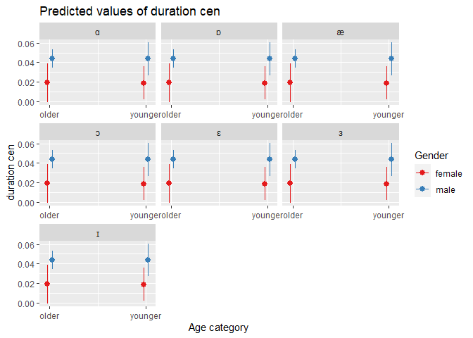<!-- -->
Hooray! Younger Nigerian English speakers have short duration for NURSE
vowel than the adult, however, the model This analysis provides
estimates, confidence intervals (CI), and p-values for predictors in a
model that investigates the relationship between duration and other
variables. The intercept, which serves as the baseline level, is
estimated at 0.01 with a 95% confidence interval of -0.02 to 0.03, and a
p-value of 0.564, indicating a lack of statistical significance.
Similarly, the estimates for age category (younger) and duration have
p-values of 0.304 and 0.564, indicating that they are not significant
predictors of duration. Gender (male) has a significant positive
correlation with duration, with an estimated coefficient of 0.05, a 95%
CI between 0.03 and 0.08, and a p-value of \<0.001. This suggests that
being male leads to longer duration.

In terms of random effects, both within-vowel variance (σ^2) and
variance between vowels (τ00) are estimated to be 0.00, indicating
minimal variability in duration. The intra-class correlation coefficient
(ICC) is estimated to be 0.02, indicating that vowel differences account
for only a small portion of total duration variance. The model includes
observations from 145 data points, but does not provide information on
marginal or conditional R^2. In summary, the findings indicate that
gender (male) is associated with longer durations, whereas age category
(younger), duration, and most vowels have no significant effect on
duration.

#### Visualization

``` r
ggplot(nurse_social_segment, aes(x = vowel, y = duration.cen, color = Gender)) +
  geom_point() +
  facet_wrap(vars(Age_category), ncol = 3) +
  labs(x = "NURSE vowels", y = "Duration of NURSE vowels")+
   ggtitle("Duration patterns NURSE vowel production by social group")
```

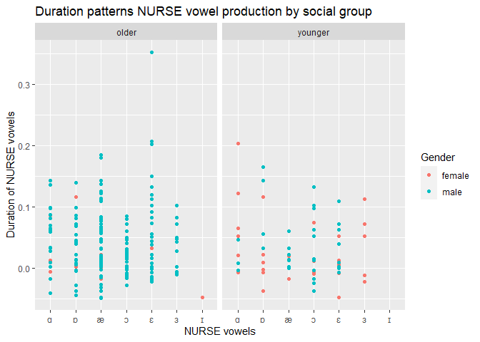<!-- -->

## NURSE vowel production by `ethnicity` (Geographical location of the speakers)

``` r
#NURSE vowel production by ethnicity
nurse_freq_ethnicity <- table(nurse_social_segment$vowel, nurse_social_segment$Ethnicity)
head(nurse_freq_ethnicity)
```

       
        Hausa Igbo Yoruba
      ɑ    12    5     13
      ɒ     5    5     29
      æ    27   10     28
      ɔ     8    7     26
      ɛ     4   11     27
      ɜ     1    0     14

``` r
#percentage
nurse_vowel_ethnicity <- nurse_social_segment %>%
  select(Ethnicity, vowel)%>%
  table()/246*100
head(nurse_vowel_ethnicity)
```

             vowel
    Ethnicity          ɑ          ɒ          æ          ɔ          ɛ          ɜ
       Hausa   4.8780488  2.0325203 10.9756098  3.2520325  1.6260163  0.4065041
       Igbo    2.0325203  2.0325203  4.0650407  2.8455285  4.4715447  0.0000000
       Yoruba  5.2845528 11.7886179 11.3821138 10.5691057 10.9756098  5.6910569
             vowel
    Ethnicity          ɪ
       Hausa   0.0000000
       Igbo    0.0000000
       Yoruba  0.4065041

``` r
#visualization
ggplot(nurse_social_segment, aes(x = vowel, fill = Ethnicity)) +
  geom_bar() +
  labs(x = "NURSE vowels", y = "Freq of NURSE vowels")+
   ggtitle("Frequencies of NURSE vowel production by ethnicity")
```

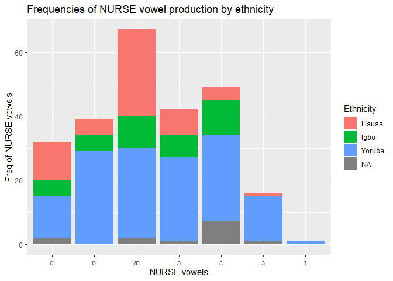<!-- -->

``` r
age_nurse_ethnicity <- lmer(duration.cen ~ 1 + Ethnicity + vowel + (1|word),  nurse_social_segment) 
age_nurse_ethnicity %>% summary()
```

    Linear mixed model fit by REML. t-tests use Satterthwaite's method [
    lmerModLmerTest]
    Formula: duration.cen ~ 1 + Ethnicity + vowel + (1 | word)
       Data: nurse_social_segment

    REML criterion at convergence: -698

    Scaled residuals: 
        Min      1Q  Median      3Q     Max 
    -1.9788 -0.4874 -0.1888  0.3519  4.2741 

    Random effects:
     Groups   Name        Variance Std.Dev.
     word     (Intercept) 0.001633 0.04041 
     Residual             0.001385 0.03722 
    Number of obs: 233, groups:  word, 107

    Fixed effects:
                      Estimate Std. Error         df t value Pr(>|t|)    
    (Intercept)      6.246e-02  1.217e-02  2.186e+02   5.132 6.32e-07 ***
    EthnicityIgbo   -6.688e-03  1.147e-02  2.228e+02  -0.583 0.560510    
    EthnicityYoruba -2.875e-02  8.296e-03  2.173e+02  -3.466 0.000637 ***
    vowelɒ          -1.127e-02  1.427e-02  2.054e+02  -0.790 0.430517    
    vowelæ          -4.568e-03  1.093e-02  2.187e+02  -0.418 0.676423    
    vowelɔ          -2.181e-02  1.426e-02  2.097e+02  -1.529 0.127845    
    vowelɛ           4.972e-04  1.269e-02  2.234e+02   0.039 0.968780    
    vowelɜ          -9.131e-03  1.642e-02  2.143e+02  -0.556 0.578832    
    vowelɪ          -8.097e-02  5.605e-02  1.484e+02  -1.445 0.150674    
    ---
    Signif. codes:  0 '***' 0.001 '**' 0.01 '*' 0.05 '.' 0.1 ' ' 1

    Correlation of Fixed Effects:
                (Intr) EthncI EthncY vowelɒ vowelæ vowelɔ vowelɛ vowelɜ
    EthnictyIgb -0.432                                                 
    EthnictyYrb -0.463  0.572                                          
    vowelɒ      -0.611  0.046 -0.076                                   
    vowelæ      -0.710  0.091  0.080  0.575                            
    vowelɔ      -0.620  0.047 -0.049  0.679  0.577                     
    vowelɛ      -0.595 -0.086 -0.096  0.595  0.680  0.591              
    vowelɜ      -0.486  0.028 -0.091  0.482  0.544  0.521  0.567       
    vowelɪ      -0.149  0.009 -0.047  0.144  0.142  0.142  0.143  0.119

``` r
age_nurse_ethnicity %>% tab_model()
```

<table style="border-collapse:collapse; border:none;">
<tr>
<th style="border-top: double; text-align:center; font-style:normal; font-weight:bold; padding:0.2cm;  text-align:left; ">
 
</th>
<th colspan="3" style="border-top: double; text-align:center; font-style:normal; font-weight:bold; padding:0.2cm; ">
duration cen
</th>
</tr>
<tr>
<td style=" text-align:center; border-bottom:1px solid; font-style:italic; font-weight:normal;  text-align:left; ">
Predictors
</td>
<td style=" text-align:center; border-bottom:1px solid; font-style:italic; font-weight:normal;  ">
Estimates
</td>
<td style=" text-align:center; border-bottom:1px solid; font-style:italic; font-weight:normal;  ">
CI
</td>
<td style=" text-align:center; border-bottom:1px solid; font-style:italic; font-weight:normal;  ">
p
</td>
</tr>
<tr>
<td style=" padding:0.2cm; text-align:left; vertical-align:top; text-align:left; ">
(Intercept)
</td>
<td style=" padding:0.2cm; text-align:left; vertical-align:top; text-align:center;  ">
0.06
</td>
<td style=" padding:0.2cm; text-align:left; vertical-align:top; text-align:center;  ">
0.04 – 0.09
</td>
<td style=" padding:0.2cm; text-align:left; vertical-align:top; text-align:center;  ">
<strong>\<0.001</strong>
</td>
</tr>
<tr>
<td style=" padding:0.2cm; text-align:left; vertical-align:top; text-align:left; ">
Ethnicity \[Igbo\]
</td>
<td style=" padding:0.2cm; text-align:left; vertical-align:top; text-align:center;  ">
-0.01
</td>
<td style=" padding:0.2cm; text-align:left; vertical-align:top; text-align:center;  ">
-0.03 – 0.02
</td>
<td style=" padding:0.2cm; text-align:left; vertical-align:top; text-align:center;  ">
0.561
</td>
</tr>
<tr>
<td style=" padding:0.2cm; text-align:left; vertical-align:top; text-align:left; ">
Ethnicity \[Yoruba\]
</td>
<td style=" padding:0.2cm; text-align:left; vertical-align:top; text-align:center;  ">
-0.03
</td>
<td style=" padding:0.2cm; text-align:left; vertical-align:top; text-align:center;  ">
-0.05 – -0.01
</td>
<td style=" padding:0.2cm; text-align:left; vertical-align:top; text-align:center;  ">
<strong>0.001</strong>
</td>
</tr>
<tr>
<td style=" padding:0.2cm; text-align:left; vertical-align:top; text-align:left; ">
vowel \[ɒ\]
</td>
<td style=" padding:0.2cm; text-align:left; vertical-align:top; text-align:center;  ">
-0.01
</td>
<td style=" padding:0.2cm; text-align:left; vertical-align:top; text-align:center;  ">
-0.04 – 0.02
</td>
<td style=" padding:0.2cm; text-align:left; vertical-align:top; text-align:center;  ">
0.430
</td>
</tr>
<tr>
<td style=" padding:0.2cm; text-align:left; vertical-align:top; text-align:left; ">
vowel \[æ\]
</td>
<td style=" padding:0.2cm; text-align:left; vertical-align:top; text-align:center;  ">
-0.00
</td>
<td style=" padding:0.2cm; text-align:left; vertical-align:top; text-align:center;  ">
-0.03 – 0.02
</td>
<td style=" padding:0.2cm; text-align:left; vertical-align:top; text-align:center;  ">
0.676
</td>
</tr>
<tr>
<td style=" padding:0.2cm; text-align:left; vertical-align:top; text-align:left; ">
vowel \[ɔ\]
</td>
<td style=" padding:0.2cm; text-align:left; vertical-align:top; text-align:center;  ">
-0.02
</td>
<td style=" padding:0.2cm; text-align:left; vertical-align:top; text-align:center;  ">
-0.05 – 0.01
</td>
<td style=" padding:0.2cm; text-align:left; vertical-align:top; text-align:center;  ">
0.128
</td>
</tr>
<tr>
<td style=" padding:0.2cm; text-align:left; vertical-align:top; text-align:left; ">
vowel \[ɛ\]
</td>
<td style=" padding:0.2cm; text-align:left; vertical-align:top; text-align:center;  ">
0.00
</td>
<td style=" padding:0.2cm; text-align:left; vertical-align:top; text-align:center;  ">
-0.02 – 0.03
</td>
<td style=" padding:0.2cm; text-align:left; vertical-align:top; text-align:center;  ">
0.969
</td>
</tr>
<tr>
<td style=" padding:0.2cm; text-align:left; vertical-align:top; text-align:left; ">
vowel \[ɜ\]
</td>
<td style=" padding:0.2cm; text-align:left; vertical-align:top; text-align:center;  ">
-0.01
</td>
<td style=" padding:0.2cm; text-align:left; vertical-align:top; text-align:center;  ">
-0.04 – 0.02
</td>
<td style=" padding:0.2cm; text-align:left; vertical-align:top; text-align:center;  ">
0.579
</td>
</tr>
<tr>
<td style=" padding:0.2cm; text-align:left; vertical-align:top; text-align:left; ">
vowel \[ɪ\]
</td>
<td style=" padding:0.2cm; text-align:left; vertical-align:top; text-align:center;  ">
-0.08
</td>
<td style=" padding:0.2cm; text-align:left; vertical-align:top; text-align:center;  ">
-0.19 – 0.03
</td>
<td style=" padding:0.2cm; text-align:left; vertical-align:top; text-align:center;  ">
0.150
</td>
</tr>
<tr>
<td colspan="4" style="font-weight:bold; text-align:left; padding-top:.8em;">
Random Effects
</td>
</tr>
<tr>
<td style=" padding:0.2cm; text-align:left; vertical-align:top; text-align:left; padding-top:0.1cm; padding-bottom:0.1cm;">
σ<sup>2</sup>
</td>
<td style=" padding:0.2cm; text-align:left; vertical-align:top; padding-top:0.1cm; padding-bottom:0.1cm; text-align:left;" colspan="3">
0.00
</td>
</tr>
<tr>
<td style=" padding:0.2cm; text-align:left; vertical-align:top; text-align:left; padding-top:0.1cm; padding-bottom:0.1cm;">
τ<sub>00</sub> <sub>word</sub>
</td>
<td style=" padding:0.2cm; text-align:left; vertical-align:top; padding-top:0.1cm; padding-bottom:0.1cm; text-align:left;" colspan="3">
0.00
</td>
<tr>
<td style=" padding:0.2cm; text-align:left; vertical-align:top; text-align:left; padding-top:0.1cm; padding-bottom:0.1cm;">
ICC
</td>
<td style=" padding:0.2cm; text-align:left; vertical-align:top; padding-top:0.1cm; padding-bottom:0.1cm; text-align:left;" colspan="3">
0.54
</td>
<tr>
<td style=" padding:0.2cm; text-align:left; vertical-align:top; text-align:left; padding-top:0.1cm; padding-bottom:0.1cm;">
N <sub>word</sub>
</td>
<td style=" padding:0.2cm; text-align:left; vertical-align:top; padding-top:0.1cm; padding-bottom:0.1cm; text-align:left;" colspan="3">
107
</td>
<tr>
<td style=" padding:0.2cm; text-align:left; vertical-align:top; text-align:left; padding-top:0.1cm; padding-bottom:0.1cm; border-top:1px solid;">
Observations
</td>
<td style=" padding:0.2cm; text-align:left; vertical-align:top; padding-top:0.1cm; padding-bottom:0.1cm; text-align:left; border-top:1px solid;" colspan="3">
233
</td>
</tr>
<tr>
<td style=" padding:0.2cm; text-align:left; vertical-align:top; text-align:left; padding-top:0.1cm; padding-bottom:0.1cm;">
Marginal R<sup>2</sup> / Conditional R<sup>2</sup>
</td>
<td style=" padding:0.2cm; text-align:left; vertical-align:top; padding-top:0.1cm; padding-bottom:0.1cm; text-align:left;" colspan="3">
0.086 / 0.580
</td>
</tr>
</table>

``` r
ggplot(nurse_social_segment, aes(x = vowel, y = duration.cen, color = Gender)) +
  geom_boxplot() +
  facet_wrap(vars(Ethnicity), ncol = 3) +
  labs(x = "NURSE vowels", y = "Duration of NURSE vowels")+
   ggtitle("Duration patterns NURSE vowel production by Ethnicity")
```

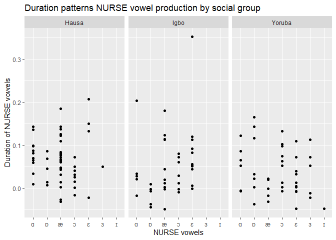<!-- -->

## NURSE vowel determinant by ethinicity

``` r
nurse_ethn_det <- glmer(nurse_determinant ~ 1 + Ethnicity + (1|word), data = nurse_social_segment, family = poisson)
summary(nurse_ethn_det)
```

    Generalized linear mixed model fit by maximum likelihood (Laplace
      Approximation) [glmerMod]
     Family: poisson  ( log )
    Formula: nurse_determinant ~ 1 + Ethnicity + (1 | word)
       Data: nurse_social_segment

         AIC      BIC   logLik deviance df.resid 
       446.1    459.9   -219.0    438.1      229 

    Scaled residuals: 
        Min      1Q  Median      3Q     Max 
    -0.8387 -0.6935  0.3214  0.3890  2.0179 

    Random effects:
     Groups Name        Variance Std.Dev.
     word   (Intercept) 0.02449  0.1565  
    Number of obs: 233, groups:  word, 107

    Fixed effects:
                    Estimate Std. Error z value Pr(>|z|)    
    (Intercept)     -0.76379    0.20235  -3.775  0.00016 ***
    EthnicityIgbo   -0.06287    0.31408  -0.200  0.84133    
    EthnicityYoruba  0.38008    0.22159   1.715  0.08630 .  
    ---
    Signif. codes:  0 '***' 0.001 '**' 0.01 '*' 0.05 '.' 0.1 ' ' 1

    Correlation of Fixed Effects:
                (Intr) EthncI
    EthnictyIgb -0.593       
    EthnictyYrb -0.838  0.555

``` r
plot_model(nurse_ethn_det, type = "pred", terms = c("Ethnicity", "word"))
```

    Warning in RColorBrewer::brewer.pal(n, pal): n too large, allowed maximum for palette Set1 is 9
    Returning the palette you asked for with that many colors

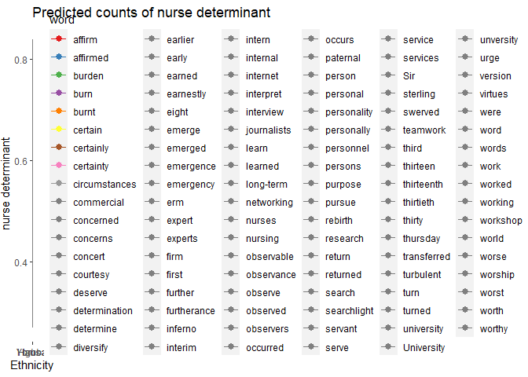<!-- -->

# Session info

``` r
sessionInfo()
```

    R version 4.3.2 (2023-10-31 ucrt)
    Platform: x86_64-w64-mingw32/x64 (64-bit)
    Running under: Windows 11 x64 (build 22631)

    Matrix products: default


    locale:
    [1] LC_COLLATE=English_United States.utf8 
    [2] LC_CTYPE=English_United States.utf8   
    [3] LC_MONETARY=English_United States.utf8
    [4] LC_NUMERIC=C                          
    [5] LC_TIME=English_United States.utf8    

    time zone: America/New_York
    tzcode source: internal

    attached base packages:
    [1] stats     graphics  grDevices utils     datasets  methods   base     

    other attached packages:
     [1] sjPlot_2.8.15      coefplot_1.2.8     performance_0.10.8 lmerTest_3.1-3    
     [5] lme4_1.1-35.1      Matrix_1.6-5       misty_0.6.1        lubridate_1.9.3   
     [9] forcats_1.0.0      stringr_1.5.1      dplyr_1.1.4        purrr_1.0.2       
    [13] readr_2.1.5        tidyr_1.3.1        tibble_3.2.1       ggplot2_3.4.4     
    [17] tidyverse_2.0.0   

    loaded via a namespace (and not attached):
     [1] tidyselect_1.2.0    sjlabelled_1.2.0    farver_2.1.1       
     [4] fastmap_1.1.1       TH.data_1.1-2       bayestestR_0.13.1  
     [7] sjstats_0.18.2      digest_0.6.34       timechange_0.3.0   
    [10] estimability_1.4.1  lifecycle_1.0.4     survival_3.5-7     
    [13] magrittr_2.0.3      compiler_4.3.2      rlang_1.1.3        
    [16] tools_4.3.2         utf8_1.2.4          useful_1.2.6.1     
    [19] yaml_2.3.8          knitr_1.45          labeling_0.4.3     
    [22] bit_4.0.5           RColorBrewer_1.1-3  plyr_1.8.9         
    [25] multcomp_1.4-25     withr_3.0.0         numDeriv_2016.8-1.1
    [28] datawizard_0.9.1    grid_4.3.2          fansi_1.0.6        
    [31] xtable_1.8-4        colorspace_2.1-0    emmeans_1.10.0     
    [34] scales_1.3.0        MASS_7.3-60         insight_0.19.8     
    [37] cli_3.6.1           mvtnorm_1.2-4       rmarkdown_2.25     
    [40] crayon_1.5.2        generics_0.1.3      rstudioapi_0.15.0  
    [43] modelr_0.1.11       reshape2_1.4.4      tzdb_0.4.0         
    [46] parameters_0.21.3   minqa_1.2.6         splines_4.3.2      
    [49] parallel_4.3.2      effectsize_0.8.6    vctrs_0.6.5        
    [52] boot_1.3-28.1       sandwich_3.1-0      hms_1.1.3          
    [55] bit64_4.0.5         glue_1.7.0          nloptr_2.0.3       
    [58] codetools_0.2-19    stringi_1.8.3       gtable_0.3.4       
    [61] ggeffects_1.3.4     munsell_0.5.0       pillar_1.9.0       
    [64] htmltools_0.5.7     R6_2.5.1            vroom_1.6.5        
    [67] evaluate_0.23       lattice_0.21-9      haven_2.5.4        
    [70] highr_0.10          backports_1.4.1     snakecase_0.11.1   
    [73] broom_1.0.5         Rcpp_1.0.12         nlme_3.1-163       
    [76] xfun_0.41           zoo_1.8-12          sjmisc_2.8.9       
    [79] pkgconfig_2.0.3    
